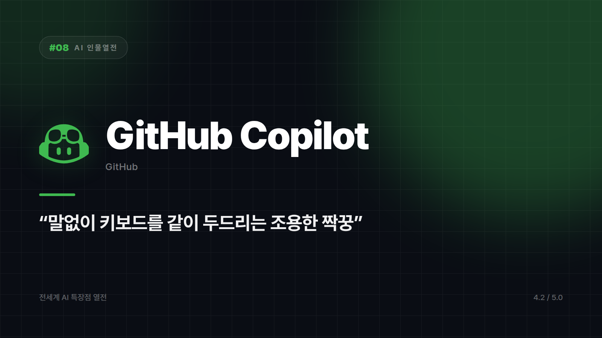

# 08. GitHub Copilot — 옆자리에서 계속 자동완성 쳐주는 페어프로그래머

---

이 녀석과는 대화를 별로 하지 않는다. 그게 특징이다.

다른 AI들은 창을 하나 더 띄우고, 질문을 쓰고, 답을 읽고, 코드를 복사해 온다. Copilot은 그 과정이 통째로 없다. 그냥 코드를 치기 시작하면 "어, 이렇게 하려는 거지?" 하며 다음 줄을 슥 채워놓는다. 가끔은 내가 아직 생각도 안 한 다음 줄까지 먼저 쳐놓는데, 그게 맞으면 소름이고 틀리면 조용히 지운다. 키보드를 같이 두드리는 조용한 짝꿍에 가깝다.

전 세계 코드가 모여 있는 GitHub에 아예 눌러앉아 사는 AI이고, IDE 안에서 실시간으로 코드를 완성해주는 원조 페어프로그래머이기도 하다.

## 흐름을 안 끊는다는 것

VS Code, JetBrains처럼 개발자가 실제로 코드를 짜는 화면 안에서 바로 작동한다. 창을 갈아타지 않아도 된다는 건 생각보다 큰 차이다. 맥락 전환 한 번에 집중력이 어디까지 흩어지는지는 겪어본 사람만 안다.

보일러플레이트, 테스트 케이스, 흔한 패턴은 몇 글자만 쳐도 알아서 완성된다. "이거 손으로 다 치기 귀찮은데" 싶은 순간을 제일 먼저 알아채는 쪽이다. for문 하나 시작했을 뿐인데 이미 마음을 읽고 반복문 세 개를 미리 채워놓는 걸 보면, 사생활이 없는 동료를 둔 기분이 잠깐 들기도 한다.

최근에는 레포지토리 맥락까지 참고한다. 이슈, PR, 코드베이스 구조를 보고 제안하는 기능이 붙으면서 단순 자동완성에서 조금씩 멀어지고 있다. 자동완성기라기보다 이 프로젝트를 대충 알고 있는 동료 쪽으로 이동하는 중이다.

## 안 어울리는 자리

처음부터 끝까지 대화하며 설계를 논의하고 싶다면 채팅형 AI가 낫다. 애초에 말을 섞는 도구가 아니다. 코드가 아니라 문서와 기획이 주 업무인 사람에게도 활용도가 확 떨어진다.

말없이 옆에서 타자만 도와주는데, 하루가 끝나고 보면 그게 제일 큰 도움이었던 날이 있다. 퇴근하고 나서야 "어? 오늘 얘랑 한마디도 안 했네" 하고 깨닫는, 그런 종류의 짝꿍이다.

코딩 흐름을 얼마나 안 끊는지로 매기면 ⭐️⭐️⭐️⭐️ (4.2/5) — 코딩 흐름 방해 없는 자동완성 최강자, 대화형 설계 논의는 약함.

---

본문에 그림이 들어가면 좋을 자리는 아래와 같다. 실제 이미지는 아직 넣지 않았다.

〔이미지 자리 — 본문에서 1번째 특장점을 설명하는 대목〕

〔이미지 자리 — 본문에서 2번째 특장점을 설명하는 대목〕

〔이미지 자리 — 본문에서 3번째 특장점을 설명하는 대목〕

〔이미지 자리 — 총평 문단 바로 위〕

## 이미지 생성 프롬프트

1. Two characters typing side by side at one long keyboard in comfortable silence, a smooth glowing line of code flowing across a shared screen between them, flat vector illustration style, soft rounded shapes, minimal color palette, no text or logos in the image, 16:9 composition.
2. A character typing the start of a line at a keyboard while a second line of code completes itself automatically just ahead of the blinking cursor, flat vector illustration style, soft rounded shapes, minimal color palette, no text or logos in the image, 4:3 composition.
3. A character starting one small repeated block shape, with identical blocks instantly stacking up beside it on their own, flat vector illustration style, soft rounded shapes, minimal color palette, no text or logos in the image, 4:3 composition.
4. A character standing before a large open folder structure of interconnected file icons, calmly tracing threads across all of them at once, flat vector illustration style, soft rounded shapes, minimal color palette, no text or logos in the image, 4:3 composition.
5. Two characters at the end of the day, one with a small surprised expression realizing they exchanged no words all day, a warmly glowing code screen between them, flat vector illustration style, soft rounded shapes, minimal color palette, no text or logos in the image, 4:3 composition.
