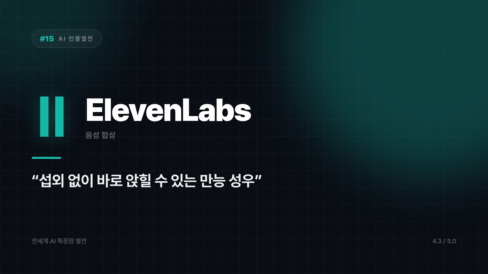

# 15. ElevenLabs — 목소리 자체를 복제해버리는 만능 성우

---

"이거 사람이 읽은 거 아니야?"

ElevenLabs로 만든 음성을 처음 들은 사람들이 제일 많이 하는 말이다. 성우 뽑는 오디션에 몰래 끼워넣어도 티가 안 날 것 같다는 말까지 나온다. 유튜버, 오디오북 제작자, 팟캐스터 사이에서 이 반응이 반복되면서 이름이 알려졌다.

섭외 없이 바로 스튜디오에 앉힐 수 있는 성우. 그 자리를 노리고 만들어진 서비스다.

## 로봇 목소리와는 체급이 다르다

기계음 특유의 어색함이 거의 없다. 억양이 붙고, 감정이 실리고, 숨소리가 들어갈 자리에 들어간다. 심지어 문장 끝에서 살짝 숨을 고르는 타이밍까지 챙기는데, 정작 사람 성우도 가끔 까먹는 디테일이다. 오디오북이나 내레이션, 광고 더빙처럼 듣는 품질이 곧 결과물의 품질인 작업에서 차이가 크게 벌어진다.

음성 클로닝도 대표 기능이다. 짧은 샘플만으로 특정 목소리를 복제해서, 이후 어떤 텍스트든 그 목소리로 읽게 만들 수 있다. 1인 크리에이터가 자기 목소리를 늘려 쓰는 수단이 된다.

여러 언어를 자연스러운 발음과 억양으로 소화한다는 점도 빼놓기 어렵다. 다국어 콘텐츠나 더빙 작업의 문턱이 확 낮아졌다.

## 이 도구만 유독 주의사항이 길다

타인의 목소리를 동의 없이 복제하는 건 윤리적으로도 법적으로도 문제가 된다. 권한 확인은 선택이 아니라 전제다. 기술이 좋을수록 이 문장이 중요해진다.

기술적으로 안 맞는 자리도 있다. 완전히 즉흥적인 라이브 상호작용, 실시간 방송 애드리브 같은 건 이쪽 무대가 아니다.

그 선만 지키면 쓸 곳은 많다. 유튜브 내레이션과 오디오북, 팟캐스트 음성 제작, 다국어 더빙과 현지화, 안내 멘트나 튜토리얼처럼 반복되는 녹음 작업까지.

섭외비 걱정 없이 언제든 부를 수 있는 성우. 매니저도 없고, 스케줄 조율도 필요 없고, 밤 열두 시에 불러도 군말 없다. 그 편리함의 대가를 누가 치르게 되는지는 쓰는 사람이 정한다.

목소리 품질 하나만 놓고 매기면 ⭐️⭐️⭐️⭐️ (4.3/5) — 음성 품질·클로닝 기술 최상위권, 윤리적 사용 책임은 사용자 몫.

---

본문에 그림이 들어가면 좋을 자리는 아래와 같다. 실제 이미지는 아직 넣지 않았다.

〔이미지 자리 — 본문에서 1번째 특장점을 설명하는 대목〕

〔이미지 자리 — 본문에서 2번째 특장점을 설명하는 대목〕

〔이미지 자리 — 본문에서 3번째 특장점을 설명하는 대목〕

〔이미지 자리 — 총평 문단 바로 위〕

## 이미지 생성 프롬프트

1. A character standing at a microphone in a small home studio, smooth sound waves flowing outward, a translucent clone silhouette standing quietly beside them, flat vector illustration style, soft rounded shapes, minimal color palette, no text or logos in the image, 16:9 composition.
2. A character speaking into a microphone, a visible sound waveform in front of them with one small natural pause gently marked within it, flat vector illustration style, soft rounded shapes, minimal color palette, no text or logos in the image, 4:3 composition.
3. A character speaking into a microphone while an identical translucent echo figure speaks the exact same waveform beside them, flat vector illustration style, soft rounded shapes, minimal color palette, no text or logos in the image, 4:3 composition.
4. A character surrounded by several small flag icons, the same smooth sound waveform flowing evenly through each one, flat vector illustration style, soft rounded shapes, minimal color palette, no text or logos in the image, 4:3 composition.
5. A character standing alone at a microphone at midnight with no one else around, a small warning sign placed quietly nearby, flat vector illustration style, soft rounded shapes, minimal color palette, no text or logos in the image, 4:3 composition.
