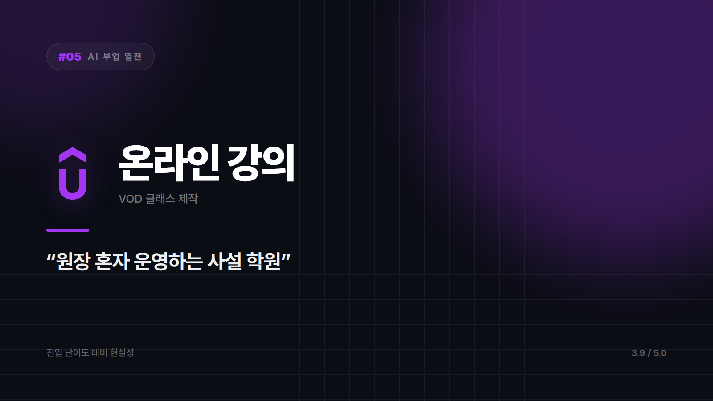

# 05. 온라인 강의 제작 — 한 번 강의하고 계속 수강료 받는 사설 학원

---

할 줄 아는 것을 영상 커리큘럼으로 묶어 파는 일이다. 앞 편의 전자책과 형제 관계인데, 단가가 한참 위고 그만큼 품이 든다. 원장 혼자 운영하는 사설 학원 같은 것이다. 수업을 한 번만 녹화해두면 학생이 몇 명이 오든 같은 수업이 돌아간다. 대신 커리큘럼이 부실하면 환불 요청이 학원 문 앞에 줄을 선다.

## 자릿수가 하나 더 붙는다

전자책이 몇천 원에서 몇만 원 사이라면 강의는 자릿수가 하나 더 올라간다. 똑같이 100명을 모아도 결과가 아예 다르다. 이 차이 하나 때문에 전자책을 한 권 내본 사람들이 결국 강의 쪽을 기웃거리게 된다. 다만 새벽 두 시에 조명 세팅해놓고 텅 빈 방에 대고 "안녕하세요 여러분!" 하고 인사하는 어색함은 누구도 대신해주지 않는다.

준비 작업에서 AI가 덜어주는 몫도 크다. 커리큘럼 설계, 대본, 슬라이드, 자막, 퀴즈와 과제까지. 강의 만들 때 시간을 제일 많이 잡아먹던 게 정확히 이 구간이었다.

그리고 플랫폼이 학생을 데려다준다. 자체 채널이 하나도 없어도 강의 플랫폼에 올려두면 그쪽 트래픽으로 첫 수강생이 붙는다. 팔 곳이 없어서 못 팔던 사람에게는 이게 결정적이다.

## 대신 오래 걸린다

제대로 만들면 몇 주에서 몇 달이 걸린다. 중도 포기율이 높은 이유가 여기 있다. 의욕이 가장 뜨거운 시점과 강의가 완성되는 시점 사이의 거리가 너무 멀다.

플랫폼이 가져가는 몫도 작지 않고, 대규모 할인 행사가 열리면 가격이 거기에 끌려다니는 일이 잦다. 내가 정한 가격이 내 가격이 아닌 순간들이 생긴다.

기대치도 전자책보다 높다. 검증 가능한 실력이 사실상 전제 조건이고, 어설프면 후기에서 곧바로 걸러진다. 얼굴이나 목소리를 완전히 감춘 채로 만들기도 어려운 포맷이다.

디자인이든 개발이든 마케팅이든, 실무에서 쌓은 기술이 분명한 사람에게 맞는다. 남을 가르쳐본 적이 있거나 설명하는 걸 좋아하면 더 잘 맞는다. 한두 달쯤 집중할 시간을 낼 수 있어야 한다는 조건도 붙는다. 가르칠 주제가 아직 뚜렷하지 않다면 순서상 전자책이 먼저고, 노출이 절대 불가능한 상황이라면 이 종목은 접어두는 게 낫다. 완강률 통계를 처음 본 강사들은 대개 한 번 좌절한다. 결제 버튼을 누르는 것과 실제로 끝까지 보는 것이 완전히 다른 행동이라는 걸 그제서야 깨닫는다.

만드는 데 가장 오래 걸리지만 만들어두면 가장 오래 번다. 실력은 있는데 판로가 없던 사람에게는 이만한 답이 없다.

⭐️⭐️⭐️⭐ (3.9/5) — 진입 난이도는 높은 편이나, 넘고 나면 수익 구조가 가장 안정적이다.

---

본문에 그림이 들어가면 좋을 자리는 아래와 같다. 실제 이미지는 아직 넣지 않았다.

〔이미지 자리 — 본문에서 1번째 이유를 설명하는 대목〕

〔이미지 자리 — 본문에서 2번째 이유를 설명하는 대목〕

〔이미지 자리 — 본문에서 3번째 이유를 설명하는 대목〕

〔이미지 자리 — 총평 문단 바로 위〕

## 이미지 생성 프롬프트

1. A small one-room private academy with a single teacher figure standing in front of a camera, several small student avatar icons watching from a screen on the wall, flat vector illustration style, soft rounded shapes, minimal color palette, no text or logos in the image, 16:9 composition
2. Two stacked coin piles side by side, one small and one much taller, showing a jump in price between two kinds of digital products, flat vector illustration style, soft rounded shapes, minimal color palette, no text or logos in the image, 4:3 composition
3. A teacher figure at a desk surrounded by floating organized cards representing a curriculum outline, slides, and quiz sheets, with a small robot assistant arranging them, flat vector illustration style, soft rounded shapes, minimal color palette, no text or logos in the image, 4:3 composition
4. A lone figure sitting in a small room at night in front of a ring light and camera, speaking toward an empty chair across from them, flat vector illustration style, soft rounded shapes, minimal color palette, no text or logos in the image, 4:3 composition
5. A long winding staircase with many small figures starting at the bottom and only a few reaching a platform at the top, flat vector illustration style, soft rounded shapes, minimal color palette, no text or logos in the image, 4:3 composition
