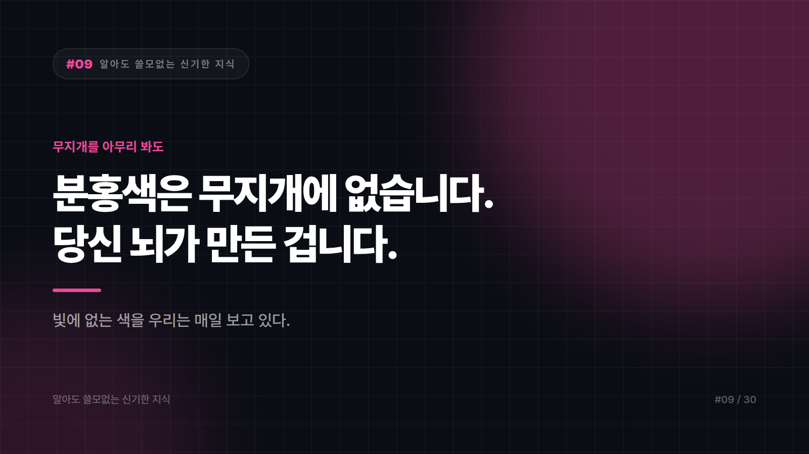

# 09. 분홍색은 무지개에 없습니다. 당신 뇌가 만든 겁니다.

---

무지개를 떠올려 보세요. 빨강, 주황, 노랑, 초록, 파랑, 남색, 보라.

분홍색이 어디 있나요?

없습니다. 한 칸도요.

빛의 스펙트럼은 파장이 긴 빨강에서 짧은 보라까지 쭉 이어진 띠입니다. 그 띠 어디에도 분홍색(마젠타 계열)에 해당하는 파장은 없습니다.

그런데 우리는 분홍색을 봅니다. 매일요.

## 이게 어떻게 가능하냐면

사람 눈에는 색을 감지하는 세포가 세 종류 있습니다. 대략 빨강 쪽, 초록 쪽, 파랑 쪽에 반응하는 센서예요.

뇌는 이 세 신호의 조합을 보고 색을 판단합니다. 노란 빛이 들어오면 빨강 센서와 초록 센서가 함께 반응하고, 뇌는 "아, 노랑"이라고 결론 내립니다.

그런데 스펙트럼의 양쪽 끝, 그러니까 빨강 센서와 파랑 센서만 동시에 반응하는 상황이 생기면 문제가 됩니다. 그 둘 사이에는 초록이 끼어 있는데, 초록 센서는 조용하거든요.

띠 위에서 답을 찾을 수 없는 조합입니다.

그래서 뇌는 없는 색을 하나 지어냅니다. 그게 분홍, 자주, 마젠타 계열이에요.

분홍은 빛의 색이 아니라 판단의 결과입니다. 물리학이 아니라 뇌가 만든 색이죠.

## 근데 파란색 쪽도 사연이 있습니다

하늘은 왜 파랄까요?

햇빛이 대기를 통과할 때, 공기 분자는 파장이 짧은 빛을 더 잘 흩뿌립니다. 짧은 쪽이 파랑·보라 계열이라 하늘 전체가 푸르게 물드는 거죠. 이걸 산란이라고 합니다.

해질 무렵에 하늘이 붉어지는 것도 같은 원리입니다. 해가 낮게 걸리면 빛이 대기를 훨씬 길게 통과하게 되고, 그 긴 여정 동안 파란빛은 다 흩어져 옆으로 새버립니다. 남는 건 끝까지 직진한 붉은빛뿐이에요.

노을은 새로 생긴 색이 아닙니다. 파란색이 다 빠져나간 뒤에 남은 찌꺼기죠.

## 여기서 첫 번째 반전

방금 "짧은 파장이 더 잘 흩어진다"고 했습니다.

그럼 보라가 파랑보다 파장이 더 짧은데, 하늘은 왜 보라색이 아닐까요?

우선 햇빛 자체에 보라 성분이 파랑만큼 강하지 않습니다. 그리고 사람 눈이 보라에 상대적으로 둔합니다. 대기 상층에서 걸러지는 부분도 있고요.

그러니까 하늘의 색은 하늘만 정한 게 아닙니다. 우리 눈의 성능도 절반쯤 지분이 있어요. 다른 눈을 가진 생물에게 이 하늘은 다른 색일 겁니다.

## 두 번째 반전

그럼 바다는 왜 파랄까요?

"하늘이 비쳐서요"라고 답하셨다면, 절반만 맞습니다. 반사도 영향을 주지만 그게 주된 이유는 아니에요.

물은 그 자체로 색이 있습니다. 물 분자가 붉은 계열의 빛을 잘 흡수하거든요.

컵에 담긴 물은 투명해 보이죠. 두께가 얇아서 그렇습니다. 물이 깊어질수록 붉은빛은 위쪽에서 먼저 잡아먹히고, 아래로 갈수록 파란 계열만 남습니다.

그래서 깊은 물에서 찍은 사진은 전부 푸르뎅뎅합니다. 카메라가 이상한 게 아니라 빨간색이 거기까지 내려가지 못한 거예요.

하늘이 파란 건 파란빛이 흩어져서입니다. 바다가 파란 건 빨간빛이 흡수돼서고요.

같은 색, 완전히 다른 이유. 세상에서 제일 흔한 두 개의 파랑은 사실 남남입니다.

## 그래서 이걸 알면 뭐가 좋냐면

아무 쓸모 없습니다.

분홍이 뇌가 만든 색이라는 걸 안다고 분홍이 덜 예뻐지지 않고, 노을의 원리를 안다고 사진이 잘 나오지도 않습니다. 바다가 파란 이유를 설명하기 시작하면 같이 간 사람이 먼저 자리를 뜰 확률이 높습니다.

다만 오늘 하늘을 한 번 올려다보시면, 그 색의 절반은 하늘 것이고 절반은 당신 눈의 것이라는 생각이 드실 겁니다. 역시 쓸모는 없습니다.

---

본문에 그림이 들어가면 좋을 자리는 아래와 같다. 실제 이미지는 아직 넣지 않았다.

〔이미지 자리 — 본문에서 1번째 논점을 설명하는 대목〕

〔이미지 자리 — 본문에서 2번째 논점을 설명하는 대목〕

〔이미지 자리 — 본문에서 3번째 논점을 설명하는 대목〕

〔이미지 자리 — 마지막 문단 바로 위〕

## 이미지 생성 프롬프트

1. A rainbow arc missing a gap where pink or magenta should be, with a glowing brain icon above stitching a pink strand into the gap by itself, flat vector illustration style, a surprising fun-fact visualized playfully, minimal color palette, no text in the image, 16:9 composition.
2. A simple diagram of three color-sensing eye cone icons (red, green, blue) where only the red and blue ones light up simultaneously while the green one stays dark, and a small brain icon nearby inventing a new pink swatch, flat vector illustration style, a surprising fun-fact visualized playfully, minimal color palette, no text in the image, 4:3 composition.
3. A sunset sky illustration where blue light particles scatter away sideways into the distance while only red-orange light rays continue straight toward the viewer, flat vector illustration style, a surprising fun-fact visualized playfully, minimal color palette, no text in the image, 4:3 composition.
4. A clear blue daytime sky with a small eye icon in the corner, subtly tinted to suggest the sky's color depends partly on the eye viewing it, flat vector illustration style, a surprising fun-fact visualized playfully, minimal color palette, no text in the image, 4:3 composition.
5. A cross-section of deep ocean water where red light rays fade out near the surface and only blue light continues down into the depths, flat vector illustration style, a surprising fun-fact visualized playfully, minimal color palette, no text in the image, 4:3 composition.
