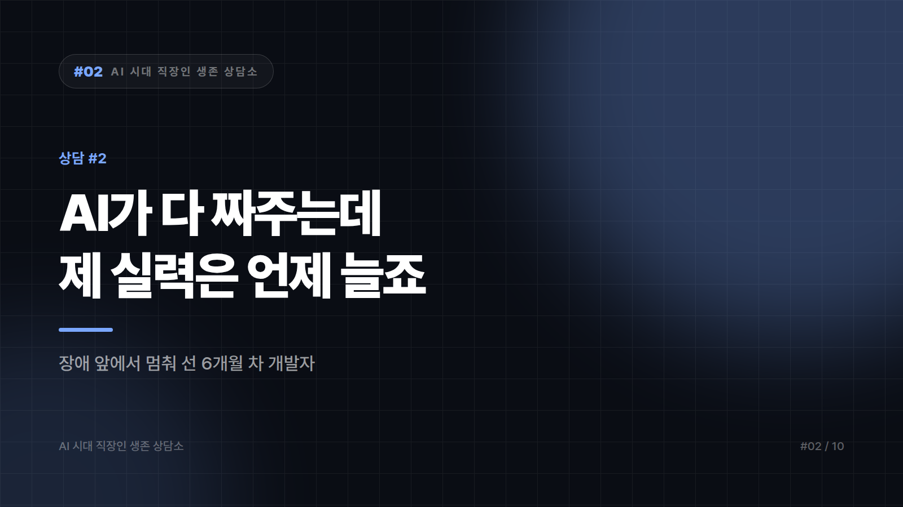

# 02. "AI가 다 짜주는데, 제 실력은 언제 늘죠?"

---

> 입사 6개월 된 스물여섯 백엔드 개발자입니다.
>
> 부끄러운 이야기인데, 제가 지난 6개월간 짠 코드 중에 처음부터 끝까지 제 머리에서 나온 건 거의 없습니다. 기능 하나 맡으면 AI에게 설명하고, 나온 코드를 붙이고, 에러가 나면 에러를 다시 붙여넣습니다. 돌아갑니다. 리뷰도 통과합니다. 사수는 "빠르다"고 칭찬합니다.
>
> 그런데 지난달 장애가 났을 때, 제가 짠 모듈인데도 어디서 터졌는지 못 찾았습니다. 결국 사수가 20분 만에 잡았습니다. 그날 이후로 무섭습니다. 저는 개발자가 되고 있는 게 맞나요? 아니면 AI 출력물 붙여넣는 사람이 되고 있나요?
>
> — 판교, 백엔드 6개월 차

---

"돌아갑니다. 리뷰도 통과합니다." 이 두 문장 바로 뒤에 "무섭습니다"가 붙어 있는 편지는 이미 문제를 절반쯤 푼 편지입니다. 대부분은 칭찬받는 동안 무서워하지 않습니다. 그 감각이 지금 당신이 가진 것 중 제일 비싼 물건입니다.

## 생산은 배웠고 진단은 못 배웠습니다

코드를 만드는 일은 AI가 대신해도 티가 나지 않습니다. 장애는 다릅니다. 만드는 일이 아니라 읽는 일이라서 그렇습니다. 읽는 근육은 붙여넣기로 붙지 않습니다. 지난 6개월간 출력만 늘고 입력은 그대로였던 셈입니다.

당장 해볼 만한 건 설명해보기입니다. PR 올리기 전에 혼잣말로 3분쯤 설명합니다. 이 함수가 왜 여기 있는지, 이 조건문이 빠지면 무슨 일이 나는지. 말문이 막히는 줄이 나오면 거기가 구멍입니다. 하루 10분도 안 걸리는데 구멍의 위치를 매일 알려줍니다.

하루에 하나쯤은 AI를 끄고 써보는 것도 방법입니다. 전부 끄라는 얘기가 아니라 가장 작은 작업 하나만입니다. 유틸 함수 하나, 테스트 케이스 하나. 시간은 세 배 걸리고 결과물은 더 못생겼을 겁니다. 그게 정상입니다.

지난달 그 장애도 그냥 넘기기엔 아깝습니다. 사수에게 가서 물어보면 됩니다. 어디부터 보셨는지, 로그 어느 줄에서 감을 잡으셨는지. 정답이 아니라 탐색 순서를 물어야 남는 게 있습니다. 그 순서를 메모에 쌓으면 석 달쯤 뒤엔 당신만의 디버깅 체크리스트가 생깁니다. 이건 AI에게 물어도 잘 안 나옵니다. 이 시스템의 로그는 이 회사에만 있으니까요.

AI에게 코드를 받을 때 질문을 하나 더 얹는 습관도 값이 쌉니다. 왜 이렇게 짰는지, 이 방식의 단점은 뭔지. 답을 그대로 믿으라는 게 아니라 의심하는 각도를 훔쳐 오기 위해서입니다. AI 결과물을 체계적으로 의심하는 방법은 [AI가 틀렸는지 30초 만에 알아채는 법](../series6_AI실무가이드/10_검증하는법.md)에 30분짜리 실습으로 정리돼 있습니다.

## 실력보다 먼저 걱정할 것

여기서 판을 한 번 뒤집겠습니다. 정말 걸리는 건 실력이 안 느는 일이 아니라 책임이 어디 있느냐입니다.

장애가 나면 회사가 부르는 건 코드를 만든 존재가 아니라 이름이 적힌 사람입니다. 커밋에는 당신 이름이 박히고, 사고가 나도 AI는 소환되지 않습니다. 지금 구조가 그렇습니다. 만드는 즐거움은 도구가 가져가고 책임은 온전히 당신에게 남습니다. 이 비대칭을 견디는 방법이 읽을 줄 아는 것 하나뿐이라, 실력은 자존심 문제가 아니라 방어 수단에 가깝습니다.

6개월 차가 AI를 쓰는 게 잘못이라는 말은 하지 않겠습니다. 안 쓰고 버티는 게 미덕인 시절은 지났고, 앞으로 신입에게 요구되는 속도는 지금 당신이 내는 속도가 기준이 될 가능성이 큽니다. 다만 속도가 기본값이 되면 차이는 다른 데서 생깁니다. 5년 뒤 또래가 전부 빠를 때 남는 건 이 시스템을 이해하느냐입니다. 사수가 20분 만에 원인을 찾은 그 능력 말입니다.

몇 년 뒤 개발자라는 직무가 어떤 모양일지는 저도 단언하지 못합니다. 그건 아무도 확실히 모릅니다. 확실한 건 하나, 읽을 줄 아는 사람은 어느 모양에서도 쓸모가 있다는 것 정도입니다.

칭찬받는 중에 무서워할 줄 아는 6개월 차는 흔치 않습니다. 빠른 건 이미 하셨으니 느린 걸 하나만 끼워 넣으면 됩니다. 하루 한 개, 맨손으로. 6개월 뒤에 또 장애가 나면 그때는 당신이 20분 만에 찾을 겁니다.

---

본문에 그림이 들어가면 좋을 자리는 아래와 같다. 실제 이미지는 아직 넣지 않았다.

〔이미지 자리 — 본문에서 1번째 논점을 설명하는 대목〕

〔이미지 자리 — 본문에서 2번째 논점을 설명하는 대목〕

〔이미지 자리 — 본문에서 3번째 논점을 설명하는 대목〕

〔이미지 자리 — 마지막 문단 바로 위〕

## 이미지 생성 프롬프트

1. (대표 이미지) A young backend developer in his mid-twenties sitting alone at a desk late at night, multiple monitors showing code, a faint worried expression as he stares at an error log, cool blue monitor glow mixed with warm ambient office light, flat vector illustration style, warm muted color palette, no text in the image, 16:9 composition.
2. A split-screen style scene of a developer typing fast with a glowing AI assistant icon on one monitor, contrasted with the same developer looking confused at a tangled wiring diagram representing a system outage, flat vector illustration style, warm muted color palette, no text in the image, 4:3 composition.
3. A young developer talking quietly to himself in front of a screen, small speech bubble with a question mark, practicing explaining code out loud, flat vector illustration style, warm muted color palette, no text in the image, 4:3 composition.
4. A senior developer and a junior developer looking together at a glowing server log on a monitor, the senior pointing at one line, mentorship moment, flat vector illustration style, warm muted color palette, no text in the image, 4:3 composition.
5. A young developer writing a small piece of code by hand in a notebook next to a closed laptop, calm and focused, morning light, flat vector illustration style, warm muted color palette, no text in the image, 4:3 composition.
