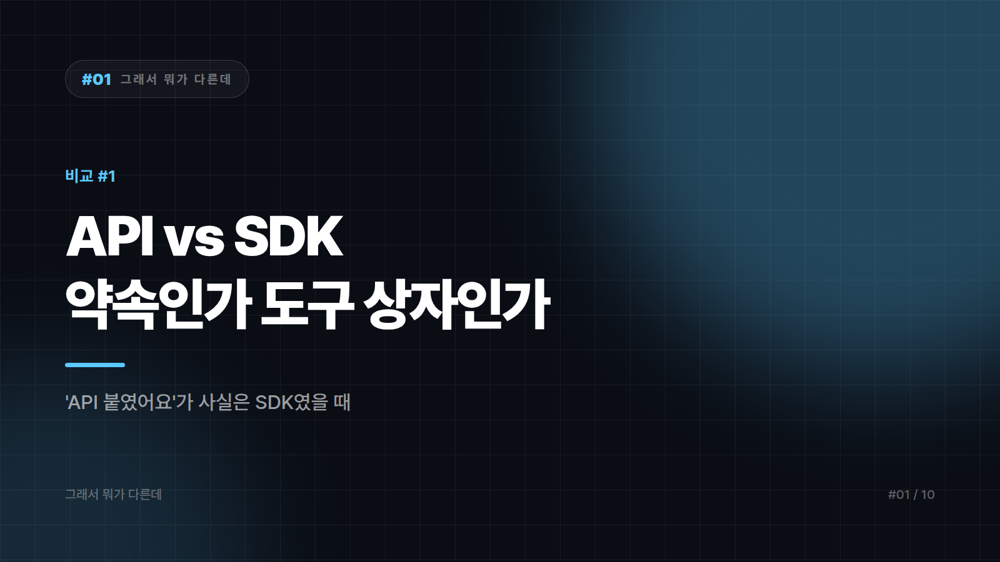

# 01. API vs SDK — "API 붙였어요"라고 말했는데 사실은 SDK를 깔았을 때

---

개발자 옆자리에서 이 두 단어를 하루에 열 번쯤 듣는다. 그런데 "API 좀 붙여주세요"라고 말한 사람에게 "그거 SDK 쓰시면 돼요"라는 답이 돌아오면 대화가 묘하게 멈춘다. 둘 다 남이 만든 기능을 가져다 쓰는 일이라 대충 같은 말처럼 들리기 때문이다. 같은 말이 아니다. 하나는 약속이고, 하나는 도구 상자다.

## 메뉴판과 밀키트

API(Application Programming Interface)는 프로그램끼리 주고받는 규칙과 창구 그 자체다. 이 주소로 이런 형식을 보내면 이런 형식으로 답해준다는 계약서에 가깝다. SDK(Software Development Kit)는 그 API를 특정 언어나 환경에서 편하게 쓰라고 누군가 미리 포장해둔 개발 키트다. 라이브러리, 예제 코드, 문서, 디버깅 도구가 한 묶음으로 들어있다.

식당으로 옮겨보면 이렇다. API는 메뉴판과 주문 창구다. 뭘 시킬 수 있고 어떻게 말해야 하는지가 정해져 있다. SDK는 그 식당이 집에서도 해 드시라며 내놓은 밀키트다. 재료와 양념과 조리 설명서가 다 들어있지만, 결국 그 안에서 만드는 건 같은 메뉴다. 다만 밀키트치고 상자가 유난히 크다 싶으면 열어보라. 정작 필요한 건 소스 한 봉지인데 옆에 안 쓰는 향신료 세트가 통째로 딸려 있는 경우가 있다. `npm install` 한 번에 의존성 수백 개가 줄줄이 딸려 내려오는 그 익숙한 장면이다.

## 한쪽이 다른 쪽을 감싼다

API는 규격이고 SDK는 그 규격을 쓰기 위한 물건이다. 그래서 API는 문서와 엔드포인트, 함수 시그니처의 형태로 존재하고, SDK는 설치하는 패키지 파일의 형태로 존재한다. 웹 API는 대체로 언어를 가리지 않지만 SDK는 파이썬용, iOS용처럼 언어와 플랫폼마다 따로 나온다.

없을 때의 무게도 다르다. API가 없으면 연동 자체가 불가능하다. SDK가 없으면 불편할 뿐, 직접 호출로 대체할 수 있다. SDK 안에는 API 호출 코드가 들어있기 때문이다. "SDK 없이 API만 쓴다"는 성립하지만 "API 없이 SDK만 쓴다"는 보통 성립하지 않는다.

또 하나 짚어둘 게 있다. API는 웹 위에서만 사는 개념이 아니다. 운영체제 API, 라이브러리의 함수 API처럼 네트워크와 무관한 API도 많다. API를 서버에 요청 보내는 일로 이해하게 된 건 웹 API가 워낙 흔해서 생긴 착시다.

## 이름이 기능을 못 따라갈 때

범인은 회사들의 홍보 문구다. 대부분의 서비스가 "우리 API를 쓰세요"라고 말하면서 정작 첫 화면에서 내미는 건 `pip install ○○`, `npm install ○○` 같은 SDK 설치 명령어다. 개발자가 실제로 만지는 건 SDK인데 부르는 이름은 API이니, 두 단어가 한 덩어리로 붙어버린다.

경계가 정말로 흐릿한 경우도 있다. 어떤 회사의 SDK는 얇은 함수 몇 개가 전부라 사실상 래퍼 라이브러리에 가깝고, 어떤 API 클라이언트는 인증과 재시도와 캐시까지 다 처리해서 SDK라 불러도 될 만큼 두툼하다. 이 구간에서는 이름이 내용을 정확히 반영하지 못한다. 이름보다 안에 뭐가 들었나를 보는 게 맞다.

## 골라야 할 자리에 서면

SDK가 제공되고 그 언어를 쓰고 있다면 SDK를 쓴다. 인증 토큰 갱신, 재시도, 에러 타입 같은 귀찮은 일을 대신 해주는데 굳이 직접 짜서 버그를 새로 만들 이유가 없다. 지원 SDK가 없는 언어이거나 의존성을 최소로 유지해야 하는 상황이라면 API를 직접 호출한다. HTTP 요청 하나 보내는 게 전부인 경우도 많다.

동작이 이상해서 원인을 파야 할 때는 얘기가 달라진다. 그때는 API 문서까지 내려가는 편이 빠르다. SDK는 편의를 위해 뭔가를 숨기고 있고, 문제는 대개 그 숨겨진 곳에서 난다. 밀키트 봉지에는 "3분이면 완성"이라고만 적혀 있지, 정작 눌어붙었을 때 불 세기를 몇으로 했는지는 알려주지 않는다.

API는 무엇을 할 수 있는가를 정하고, SDK는 그걸 얼마나 편하게 할 것인가를 정한다. 기획서에 옮겨 적을 일이 생기면 그냥 "○○ 연동"이라고 쓰는 게 가장 사고가 안 난다.

---

본문에 그림이 들어가면 좋을 자리는 아래와 같다. 실제 이미지는 아직 넣지 않았다.

〔이미지 자리 — 본문에서 1번째 논점을 설명하는 대목〕

〔이미지 자리 — 본문에서 2번째 논점을 설명하는 대목〕

〔이미지 자리 — 본문에서 3번째 논점을 설명하는 대목〕

〔이미지 자리 — 마지막 문단 바로 위〕

## 이미지 생성 프롬프트

1. A split-screen scene: on the left, a minimalist restaurant order counter with a menu board and a hand passing an order slip through a service window; on the right, a sealed home meal-kit box with visible ingredient pouches and a recipe card on a kitchen counter, flat vector illustration style, split-composition showing two contrasting concepts side by side, minimal color palette, no text in the image, 16:9 composition.
2. A restaurant order counter with a simple menu board on one side, and beside it an oversized meal-kit box with one small needed sauce pouch next to a pile of unnecessary spice packets spilling out, flat vector illustration style, split-composition showing two contrasting concepts side by side, minimal color palette, no text in the image, 4:3 composition.
3. A small blueprint document representing a contract or interface, nested inside a larger labeled toolbox crate with gears and a shipping label, showing one object wrapped inside a bigger one, flat vector illustration style, split-composition showing two contrasting concepts side by side, minimal color palette, no text in the image, 4:3 composition.
4. A storefront sign above a doorway next to a computer terminal displaying a download/install icon, the signage and the terminal screen visually mismatched to suggest a naming confusion, flat vector illustration style, split-composition showing two contrasting concepts side by side, minimal color palette, no text in the image, 4:3 composition.
5. A signpost at a fork in a road: one path leads directly to a server tower icon, the other path passes through an archway shaped like a toolbox before reaching the same tower, with a small figure standing at the fork, flat vector illustration style, split-composition showing two contrasting concepts side by side, minimal color palette, no text in the image, 4:3 composition.
