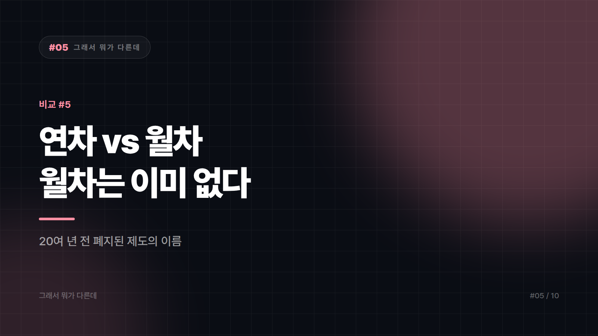

# 05. 연차 vs 월차 — 아직도 "월차 쓸게요"라고 말한다면

---

회사 단체 대화방에서 내일 월차입니다라는 메시지를 본다. 아무도 지적하지 않는다. 다들 무슨 뜻인지 알아들으니까. 그런데 인사팀 시스템에 들어가 보면 월차라는 항목은 없다. 차감되는 건 연차다.

이 단어는 실제로 존재했다가 사라진 제도의 유령이다. 폐지된 지 20년이 넘었는데 회사 단체 대화방엔 매일 출몰하는, 의외로 근태가 좋은 유령이다. 사람들이 헷갈리는 게 당연한, 흔치 않은 사례다.

## 한쪽은 이미 없어졌다

연차유급휴가는 일정 기간 성실히 근무한 대가로 1년 단위로 산정해 부여되는 유급휴가다. 현행 근로기준법상 법정 유급휴가는 사실상 이것으로 일원화되어 있다. 월차유급휴가는 과거 근로기준법에 있던 월 단위 휴가 제도로, 한 달을 개근하면 하루가 생기는 방식이었다. 2003년 근로기준법 개정에서 폐지되어 연차로 통합됐다. 지금은 법정 제도로 존재하지 않는다.

그러니까 이 비교는 둘 중 뭐가 나은가를 묻는 대결이 아니다. 한쪽은 이미 없어졌다가 결론이다.

현행 제도의 뼈대만 짚으면 이렇다. 1년 이상 근무하고 그 기간 80퍼센트 이상 출근한 근로자에게는 15일의 연차가 발생한다. 근속 3년 이상부터는 2년마다 1일씩 가산되고 총 25일이 한도다. 입사 1년 미만인 사람은 1개월 개근할 때마다 1일씩 생긴다. 사람들이 이걸 월차라고 부르는 가장 큰 이유가 바로 이 조항이다. 이름은 월차처럼 생겼지만 법적 성격은 연차다.

전제도 하나 있다. 연차유급휴가 규정은 상시 근로자 5인 이상 사업장에 적용된다. 5인 미만 사업장은 적용 대상이 아니고, 회사가 자체 규정으로 별도의 휴가를 줄 수는 있다.

휴가 일수와 요건, 수당 관련 규정은 법 개정과 판례로 바뀔 수 있다. 실제 분쟁이나 정산이 걸린 사안이라면 시행 시점의 최신 법령과 회사 취업규칙을 확인하거나 노무 전문가에게 문의하는 게 맞다. 이 글은 개념 정리이지 법률 자문이 아니다.

## 말이 제도보다 오래 산다

제도가 사라진 지 20년이 넘었는데 단어는 남았다. 폐지 당시 이미 직장인이던 세대가 후배들에게 그대로 물려줬고, 후배들은 그게 옛 제도 이름인 줄도 모른 채 배웠다.

앞에서 말한 1년 미만 조항도 착각을 거든다. 신입사원 입장에서는 실제로 한 달에 하루씩 휴가가 생기니 아 이게 월차구나 하고 자연스럽게 결론을 내린다. 틀린 관찰은 아닌데 이름이 틀렸다.

반차와 섞이기도 한다. 반차는 연차 하루를 반으로 쪼개 쓰는 것인데, 근로기준법에 규정된 법정 개념이 아니라 회사 취업규칙과 노사 합의로 운영하는 관행이다. 그래서 회사마다 반차 인정 여부와 시간 기준, 반반차 허용 여부가 제각각이다. 우리 회사는 반차가 없다는 말이 위법이 아닐 수 있는 이유다. 반반차까지 만들어달라고 하면 그다음엔 십오분차를 요구하는 사람이 나올까 봐, 인사팀이 미리 선을 긋는 것일 수도 있다.

## 어디서는 정확히, 어디서는 편하게

휴가원이나 근태 정정 요청, 퇴직 정산 문의처럼 기록으로 남는 자리에서는 연차라고 쓰는 게 맞다. 나중에 다툼이 생겼을 때 단어 하나가 근거가 된다. 반대로 동료끼리 하는 말은 굳이 교정할 필요가 없다. 월차 쓸게는 이제 사실상 하루 쉴게라는 뜻의 생활 표현이고, 의사소통이 되는데 매번 지적하는 건 피곤하다.

입사 1년 차라면 내 연차가 지금 며칠인지 직접 세어두는 편이 좋다. 월 단위로 붙는 휴가가 남았는데 모르고 소멸시키는 경우가 실제로 많다. 연차 일수가 이상하게 느껴질 때는 취업규칙부터 확인한다. 회사가 법정 기준보다 더 주는 건 문제가 없지만 덜 주는 건 문제가 된다.

월차는 없어진 제도의 이름이고, 지금 당신이 쓰는 건 전부 연차다.

---

본문에 그림이 들어가면 좋을 자리는 아래와 같다. 실제 이미지는 아직 넣지 않았다.

〔이미지 자리 — 본문에서 1번째 논점을 설명하는 대목〕

〔이미지 자리 — 본문에서 2번째 논점을 설명하는 대목〕

〔이미지 자리 — 본문에서 3번째 논점을 설명하는 대목〕

〔이미지 자리 — 마지막 문단 바로 위〕

## 이미지 생성 프롬프트

1. A split-composition illustration: on the left a translucent ghost figure labeled conceptually as an outdated concept floating through an office chat room on a phone screen; on the right a solid calendar icon with one day marked and a checkmark, representing the currently valid leave system, flat vector illustration style, split-composition showing two contrasting concepts side by side, minimal color palette, no text in the image, 16:9 composition.
2. A dusty old law book with a torn-out page floating away as a ghost, next to a modern clean calendar with days accumulating one by one across a year, flat vector illustration style, split-composition showing two contrasting concepts side by side, minimal color palette, no text in the image, 4:3 composition.
3. An older office worker whispering an old term into a young new employee's ear, the words drifting like a ghost that has outlived the paper record it came from, flat vector illustration style, split-composition showing two contrasting concepts side by side, minimal color palette, no text in the image, 4:3 composition.
4. A single day box on a calendar being split neatly in half by a pair of scissors, representing a half-day off, with a small notebook of company rules beside it, flat vector illustration style, split-composition showing two contrasting concepts side by side, minimal color palette, no text in the image, 4:3 composition.
5. A formal document with an official stamp on one side, and on the other side two coworkers chatting casually with a speech bubble containing a simple calendar icon, showing two different registers of the same word, flat vector illustration style, split-composition showing two contrasting concepts side by side, minimal color palette, no text in the image, 4:3 composition.
