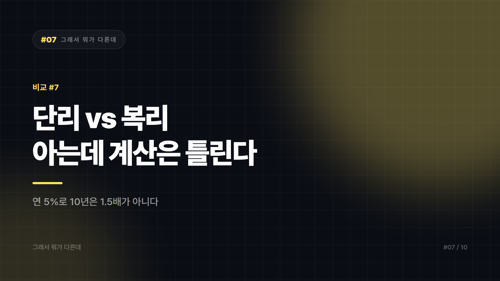

# 07. 단리 vs 복리 — "이자에 이자가 붙는다"를 다들 아는데, 왜 계산은 틀릴까

---

복리를 모르는 사람은 거의 없다. 아인슈타인이 어쩌고 하는 인용구까지 외우는 사람도 많다. 참고로 그 인용문의 출처는 확인된 바 없다. 그런데 연 5퍼센트 복리로 10년이 실제로 얼마가 되는지 물어보면 대부분 원금의 1.5배쯤이라고 답한다. 실제로는 약 1.63배다.

차이가 작아 보이지만 이 오차는 기간이 길어질수록 걷잡을 수 없이 벌어진다. 사람의 직관은 곱셈이 반복되는 상황을 잘 처리하지 못한다. 그래서 복리는 아는 개념인데 계산은 틀리는 희한한 자리에 놓여 있다.

## 덧셈이냐 거듭제곱이냐

단리는 이자를 언제나 최초 원금에 대해서만 계산한다. 매 기간 붙는 이자 금액이 일정하다. 복리는 앞 기간에 붙은 이자를 원금에 합쳐서 그 합계에 다시 이자를 계산한다. 매 기간 붙는 이자 금액이 계속 커진다.

식으로 쓰면 단리 원리금은 원금 × (1 + 이율 × 기간)이고, 복리 원리금은 원금 × (1 + 이율)^기간이다. 갈림길은 덧셈이냐 거듭제곱이냐다. 단리는 직선으로 늘고 복리는 곡선으로 휜다.

## 곡선은 늦게 온다

100만 원을 연 5퍼센트로 넣었다고 해보자. 세금과 수수료는 빼고 순수하게 계산한 값이다.

1년 뒤에는 양쪽 다 105만 원으로 차이가 없다. 5년이면 단리 125만 원, 복리는 약 127.6만 원이라 차이가 3만 원이 채 안 된다. 10년에 가면 150만 원 대 약 162.9만 원. 여기서도 뭐 이 정도야 싶은 크기다. 그런데 20년이면 200만 원 대 약 265.3만 원이 되고, 30년이면 250만 원 대 약 432.2만 원이 된다. 차이 금액만 원금의 1.8배를 넘는다.

봐야 할 건 금액이 아니라 그 차이가 벌어지는 속도다. 복리의 위력은 초반에 거의 안 보이고 후반에 몰려서 온다. 헬스장 1년 등록하고 두 달 만에 그만두는 사람과 같은 곡선이다. 정작 몸이 좋아지는 구간은 그만둔 다음부터 시작되는데 말이다. 많은 사람이 중간에 포기하는 이유가 여기 있다.

암산용 도구 하나. 72를 연 수익률로 나누면 원금이 대략 두 배가 되는 데 걸리는 햇수가 나온다. 연 6퍼센트면 72 나누기 6이니 약 12년이다. 이 숫자 하나만 외워두면 술자리에서 아는 척하기 딱 좋다. 다만 정확한 값이 아니라 어림값이니, 그걸 근거로 은행에 대출 상담을 갔다간 직원이 계산기를 다시 두드리게 만든다. 어림값이지만 감을 잡는 데는 충분하고, 복리에서만 성립한다.

## 계산이 어긋나는 자리들

복리 상품이라는 말부터 조심해야 한다. 광고는 복리를 강조하지만 정작 중요한 건 복리로 굴러가는 횟수다. 같은 연 이율이어도 월복리냐 연복리냐에 따라 결과가 달라진다. 만기 일시 지급형 예금이라면 중간에 이자가 재투자될 일이 없으니 애초에 단리 구조다.

적금 이자를 예금처럼 계산하는 실수도 흔하다. 이건 단리냐 복리냐 이전의 문제다. 적금은 매달 넣은 돈이 각각 다른 기간 동안만 예치된다. 첫 달에 넣은 돈은 12개월치, 마지막 달에 넣은 돈은 1개월치 이자만 받는다. 그래서 연 5퍼센트 적금에 매달 10만 원씩 넣어도 이자가 총 납입액의 5퍼센트가 아니라 그 절반 근처가 된다. 은행이 속이는 게 아니라 구조가 원래 그렇다(그 정확한 계산 구조는 [예금 vs 적금](08_예금_vs_적금.md)에서 다뤘다).

복리가 저축의 친구이기만 한 것도 아니다. 대출과 연체 이자에서는 정확히 같은 곡선이 반대 방향으로 작동한다. 고금리 대출에서 이자가 원금에 붙는 구조라면 앞에서 본 그 곡선이 내 부채에 적용된다.

실질 수익이 이자율만으로 정해지지 않는다는 점도 빼놓을 수 없다. 이자소득에는 세금이 붙고, 물가가 오르면 돈의 구매력은 줄어든다. 명목 5퍼센트가 실질 5퍼센트는 아니다. 세율과 금융소득 관련 과세 기준은 제도 개정으로 달라질 수 있으므로 실제 수익을 계산할 때는 시행 시점의 최신 기준을 확인해야 한다.

## 기간이 결정한다

한두 해 굴릴 단기 자금이라면 단리냐 복리냐는 거의 신경 쓸 필요가 없다. 짧은 기간에는 차이가 미미하고, 이 구간에서는 그냥 이율 자체가 높은 쪽이 이긴다. 반대로 10년 이상 묵힐 돈이라면 복리 구조인지, 이자가 재투자되는지를 반드시 확인해야 한다. 여기서는 1퍼센트포인트 차이가 나중에 수백만 원 차이로 돌아온다.

배당이나 이자를 받는 상품이라면 그걸 다시 넣는지가 복리를 만든다. 복리는 상품의 속성이기 이전에 행동의 결과다. 받은 이자를 써버리면 그 순간 단리가 된다. 빚이 있다면 복리 계산을 먼저 빚에 적용해보는 것도 방법이다. 연 15퍼센트 대출을 갚는 건 연 15퍼센트 수익을 확정으로 얻는 것과 같은데, 그만한 투자처를 찾는 것보다 이쪽이 쉽다.

단리와 복리의 차이는 이율이 아니라 시간이 만든다. 그래서 이 싸움은 얼마를 넣느냐보다 얼마나 버티느냐로 결판난다.

*이 글은 계산 구조에 대한 설명이며 특정 상품 투자 권유가 아니다.*

---

본문에 그림이 들어가면 좋을 자리는 아래와 같다. 실제 이미지는 아직 넣지 않았다.

〔이미지 자리 — 본문에서 1번째 논점을 설명하는 대목〕

〔이미지 자리 — 본문에서 2번째 논점을 설명하는 대목〕

〔이미지 자리 — 본문에서 3번째 논점을 설명하는 대목〕

〔이미지 자리 — 마지막 문단 바로 위〕

## 이미지 생성 프롬프트

1. A split-composition illustration: on the left a straight diagonal line rising steadily on a simple growth chart; on the right a curved line starting flat and sweeping sharply upward late in the chart, both lines growing from the same starting coin stack, flat vector illustration style, split-composition showing two contrasting concepts side by side, minimal color palette, no text in the image, 16:9 composition.
2. A single coin stack splitting into two growth paths, one a straight ramp rising at a constant angle, the other a curve that stays low for a long stretch before bending sharply upward, flat vector illustration style, split-composition showing two contrasting concepts side by side, minimal color palette, no text in the image, 4:3 composition.
3. A row of small coin stacks growing at identical steady increments across early years, contrasted with a matching row where the increments become visibly larger and larger toward the later years, flat vector illustration style, split-composition showing two contrasting concepts side by side, minimal color palette, no text in the image, 4:3 composition.
4. A person at a gym holding a membership card walking away disappointed after two months, while in the background a faint outline shows the body transformation that would have appeared much later if they had stayed, flat vector illustration style, split-composition showing two contrasting concepts side by side, minimal color palette, no text in the image, 4:3 composition.
5. A single coin balanced on a seesaw, with a savings jar rising on one side and a debt weight rising even faster on the other side, showing the same curve working for and against a person, flat vector illustration style, split-composition showing two contrasting concepts side by side, minimal color palette, no text in the image, 4:3 composition.
