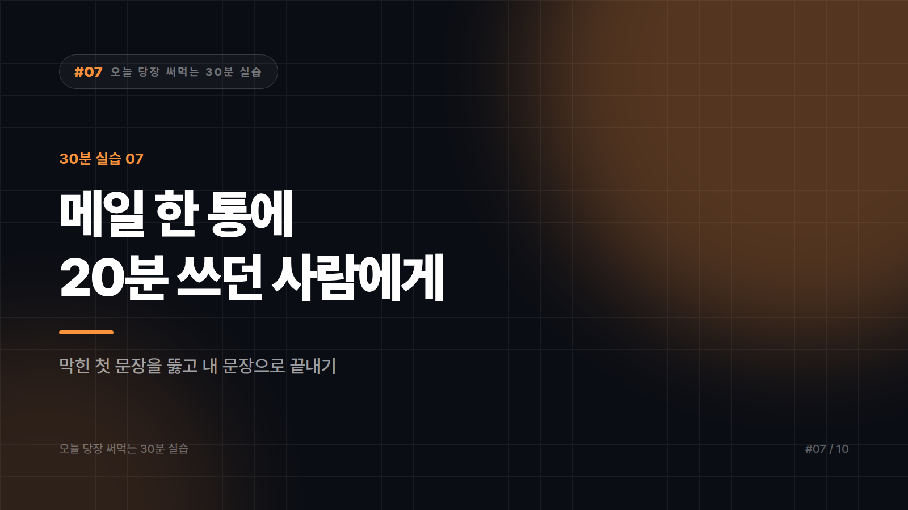

# 07. 메일 한 통에 20분 쓰던 사람을 위한 처방

> 소요 시간 30분 · 준비물 쓰기 싫어서 미뤄둔 메일 하나 · 난이도 ★☆☆☆☆

---

거절 메일, 사과 메일, 독촉 메일, 상사에게 나쁜 소식 전하는 메일. 내용은 세 줄이면 끝나는데 첫 문장에서 20분이 증발한다. 이 실습은 그 시간을 3분으로 줄이는 법이다.

주의할 게 하나 있다. AI가 써준 메일을 그대로 보내는 건 이 실습의 목표가 아니다. 그렇게 하면 받는 사람이 귀신같이 알아챈다. 목표는 막힌 첫 문장을 뚫고 내 문장으로 마무리하는 것이다.

---

## STEP 1 — 요점만 반말로 적는다 (5분)

메일이 어려운 건 내용이 어려워서가 아니라 격식을 차리려니 시작을 못 하는 것이다. 그러니 격식을 나중으로 미루자.

메모장에 이렇게만 적는다.

```
납품 일정 못 맞춤. 2주 밀림.
부품 수급 문제. 우리 잘못 맞음.
대안: 일부 먼저 보내고 나머지 2주 뒤.
상대방 화날 것. 그래도 솔직히 말해야 함.
```

이게 메일의 재료 전부다. 여기까지 3분이면 된다.

---

## STEP 2 — 관계와 톤을 지정해서 던진다 (10분)

이제 이 메모를 메일로 바꾼다. 중요한 건 받는 사람과의 관계를 구체적으로 알려주는 것이다. 이걸 빼면 어디에도 안 어울리는 무난한 메일이 나온다.

```
아래 내용으로 업무 메일을 써주세요.

[받는 사람] 3년 거래한 협력사 담당 과장. 평소 관계는 좋은 편.
[상황] 우리 쪽 귀책으로 납품이 2주 지연됨.
[목표] 사실을 숨기지 않되, 관계를 유지하고 대안으로 합의 이끌기.
[톤] 정중하되 과하게 굽신대지 않기. 변명처럼 읽히지 않게.
[길이] 본문 12줄 이내.

[전할 내용]
- 납품 2주 지연
- 원인은 부품 수급 문제, 우리 책임
- 대안: 완성분 우선 출고, 잔여분 2주 후

제목도 3가지 안으로 제안해주세요.
```

결과를 가르는 건 목표와 톤 두 줄이다. 이게 없으면 형식만 갖춘 빈 메일이 나온다.

---

## STEP 3 — 반대로 읽어본다 (10분)

여기가 다른 사람과 차이를 만드는 단계다. 보내기 전에 받는 사람의 입장에서 검토시킨다.

```
이 메일을 받는 사람 입장에서 읽어주세요.

1) 읽고 나서 기분이 어떨 것 같나요?
2) 변명이나 책임 회피로 읽힐 수 있는 문장이 있나요?
3) 상대가 바로 되물을 만한 질문은 무엇인가요?
   (그 질문이 예상된다면 메일에 미리 답을 넣는 게 낫습니다)
4) 나중에 문제가 됐을 때 불리하게 해석될 수 있는 표현이 있나요?
```

4번이 특히 중요하다. 업무 메일은 기록으로 남는다. 최대한 노력하겠습니다 같은 표현이 나중에 약속으로 해석될 수 있다. 지키지 못할 표현은 미리 걸러내자.

---

## STEP 4 — 내 문장으로 바꾼다 (5분)

이 단계를 건너뛰면 앞의 25분이 역효과가 난다.

AI가 쓴 메일은 대체로 매끄럽지만 어딘가 남의 말투다. 최소한 두 군데는 손보자. 하나는 첫 문장과 마지막 문장이다. 가장 기억에 남는 두 곳이니 내가 평소 쓰는 말투로 바꾼다. 다른 하나는 어색한 관용구다. 다름이 아니오라, 귀사의 무궁한 발전을 같은 표현은 평소에 안 쓰면 빼는 게 낫다.

그리고 소리 내어 한 번 읽어보자. 입에 안 붙는 문장이 있으면 그게 남의 문장이다.

---

## 자주 쓰는 상황은 템플릿으로

같은 유형의 메일을 반복해서 쓴다면 STEP 2의 형식을 저장해두자.

```
[받는 사람]
[상황]
[목표]
[톤]
[길이]
[전할 내용]
-
```

거절, 독촉, 일정 조율, 사과, 협조 요청. 이 다섯 가지만 템플릿으로 만들어두면 대부분의 업무 메일이 여기 들어온다.

---

## 자주 나오는 실수

여기서부터는 남 얘기가 아니라 필자도 겪어본 사례들이다. 받은 메일을 그대로 붙여넣어 답장을 시키는 경우가 많다. 상대방의 메일에는 그쪽 회사 정보와 담당자 연락처, 계약 조건이 들어 있을 수 있다. 보안 정책을 확인하고 필요한 부분만 발췌하거나 가명 처리하자.

확인 없이 보내는 것도 흔하다. 날짜와 금액, 담당자 이름, 첨부파일 언급에 AI가 그럴듯하게 채워 넣은 정보가 섞일 수 있다. 숫자와 고유명사는 눈으로 확인하는 게 안전하다.

사과 메일을 지나치게 매끄럽게 쓰는 것도 문제다. 사과는 유창할수록 진심이 덜 느껴진다. 사과 메일만큼은 다듬는 걸 줄이고 직접 쓰는 비중을 늘리는 편이 낫다.

---

## 완료 체크리스트

- [ ] 격식 없이 요점부터 메모로 적었다
- [ ] 받는 사람과의 관계, 목표, 톤을 지정했다
- [ ] 받는 사람 입장에서 읽어보게 했다
- [ ] 첫 문장과 마지막 문장을 내 말투로 바꿨다
- [ ] 날짜·금액·이름을 눈으로 확인했다

---


본문에 그림이 들어가면 좋을 자리는 아래와 같다. 실제 이미지는 아직 넣지 않았다.

〔이미지 자리 — 본문에서 1번째 논점을 설명하는 대목〕

〔이미지 자리 — 본문에서 2번째 논점을 설명하는 대목〕

〔이미지 자리 — 본문에서 3번째 논점을 설명하는 대목〕

〔이미지 자리 — 마지막 문단 바로 위〕

## 이미지 생성 프롬프트

1. 대표 이미지 — A person staring at a blank email compose window on a laptop for a long time, a clock above their head showing twenty minutes passing, cursor blinking on an empty first line. flat vector illustration style, someone working at a laptop with AI tools, minimal color palette, no text in the image, 16:9 composition
2. 첫 번째 이미지 자리 (요점만 반말로 적는다) — A sticky note with short blunt bullet-point fragments being jotted down quickly next to a laptop, contrasted with a stiff formal letter icon set aside for later. flat vector illustration style, someone working at a laptop with AI tools, minimal color palette, no text in the image, 4:3 composition
3. 두 번째 이미지 자리 (관계와 톤을 지정해서 던진다) — A laptop screen showing labeled input fields — a relationship icon, a target/goal icon, a tone dial icon — feeding into a forming email draft. flat vector illustration style, someone working at a laptop with AI tools, minimal color palette, no text in the image, 4:3 composition
4. 세 번째 이미지 자리 (반대로 읽어본다) — A person switching seats to sit on the other side of a laptop screen, reading their own sent email from the recipient's point of view, a thought bubble showing a raised eyebrow of doubt. flat vector illustration style, someone working at a laptop with AI tools, minimal color palette, no text in the image, 4:3 composition
5. 네 번째 이미지 자리 (내 문장으로 바꾼다) — An email draft on a laptop screen with the first and last lines highlighted and being rewritten by a hand-holding pen icon, while a generic stiff phrase fades out beside it. flat vector illustration style, someone working at a laptop with AI tools, minimal color palette, no text in the image, 4:3 composition
