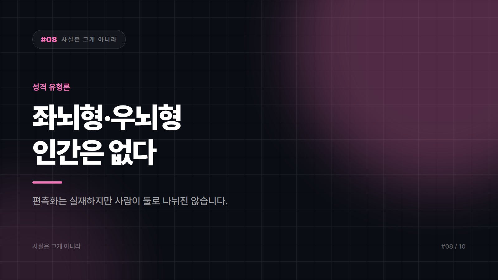

# 08. 나는 우뇌형 인간이라서? — 좌뇌·우뇌 성격론

---

좌뇌형은 논리적이고 이성적이며 우뇌형은 창의적이고 감성적이라는 구분. 어느 쪽 뇌를 주로 쓰는지 알려준다는 테스트가 주기적으로 유행한다. 우뇌 개발을 내건 학습지도 있었고, 회의 자리에서 저는 우뇌형이라 숫자는 약해요라는 농담도 흔하다.

좌우 반구에 기능 차이가 있는 건 맞다. 그런데 그 사실에서 사람이 두 유형으로 나뉜다는 결론은 나오지 않는다.

## 맞는 부분과 건너뛴 부분

먼저 맞는 쪽부터. 반구마다 상대적으로 더 크게 관여하는 기능이 있다. 언어 처리는 많은 사람에게서 좌반구 쪽에 더 치우쳐 있고, 공간 정보나 얼굴 인식 같은 기능에서는 우반구의 관여가 두드러진다고 알려져 있다. 이걸 편측화라고 부른다.

문제는 그다음 도약이다. 기능이 한쪽에 치우친다는 말과 사람마다 주로 쓰는 뇌가 있다는 말은 전혀 다른 이야기다. 한쪽 반구를 전반적으로 더 많이 쓰는 사람 유형이 있다는 근거는 없다. 창의성이나 논리력처럼 큰 능력은 애초에 한쪽 반구에 담기지 않는다. 여러 영역이 양쪽에 걸쳐 함께 작동해서 나오는 결과다.

두 반구는 굵은 신경다발로 촘촘히 연결되어 쉴 새 없이 정보를 주고받는다. 분리된 두 사람이 머릿속에 사는 구조가 아니다.

## 진짜 연구가 잘못 옮겨질 때

출발점에는 실재하는 연구가 있었다. 뇌전증 치료를 위해 두 반구를 잇는 연결을 끊은 환자들을 관찰한 연구는 실재하고 중요하다. 다만 그 결과는 연결이 끊긴 특수한 상태에 대한 것이었다. 연결이 멀쩡한 사람에게 그대로 옮겨진 순간 의미가 달라졌다.

이분법이 강력하다는 점도 작용했다. 논리 대 감성, 이성 대 직관. 이 대립은 사람들이 원래 좋아하던 구도였고, 여기에 뇌라는 물리적 근거가 붙자 갑자기 과학처럼 보였다. 성격이 다르다보다 뇌 구조가 다르다가 훨씬 그럴듯하게 들린다.

변명과 자랑을 동시에 제공한다는 점도 빼놓을 수 없다. 우뇌형이라 계산은 약하다는 말은 약점을 성격이 아니라 타고난 구조 탓으로 돌려주면서 창의적이라는 칭찬까지 딸려 온다. 이익이 두 배인 이름표는 잘 버려지지 않는다. 여기에 우뇌를 깨운다는 교재와 학원까지 세워지면 개념은 근거보다 오래 산다.

## 이름표를 내려놓으면

어느 쪽 뇌형인가를 묻는 테스트는 오락으로 보는 게 맞다. 뇌를 측정하는 게 아니라 자기보고 취향을 묻는 문항일 뿐이다. 뇌 과학적으로라는 수식어가 붙은 주장일수록 한 번 더 보는 편이 낫다. 뇌를 언급하면 설명이 더 믿음직하게 들리는 효과가 실제로 있다.

창의성은 타고난 반구가 아니라 축적된 재료에서 나온다. 많이 보고 많이 해보고 서로 다른 분야를 붙여보는 쪽이 훨씬 현실적인 경로다.

반구마다 잘하는 일은 있어도 좌뇌형이나 우뇌형 인간은 없다. 실재하는 편측화가 성격 유형론으로 번역되면서 원래 내용과 무관해진 사례다. 이런 유형론의 가장 큰 비용은 틀렸다는 것보다, 시도하지 않을 근거를 하나 만들어준다는 데 있다.

---

본문에 그림이 들어가면 좋을 자리는 아래와 같다. 실제 이미지는 아직 넣지 않았다.

〔이미지 자리 — 본문에서 1번째 논점을 설명하는 대목〕

〔이미지 자리 — 본문에서 2번째 논점을 설명하는 대목〕

〔이미지 자리 — 본문에서 3번째 논점을 설명하는 대목〕

〔이미지 자리 — 마지막 문단 바로 위〕

## 이미지 생성 프롬프트

1. A brain diagram with the left and right hemispheres tinted in slightly different colors but joined by a thick, glowing bundle of connecting fibers at the center, questioning the myth of a dominant "left-brain" or "right-brain" personality, flat vector illustration style, a common myth being visually debunked or questioned, minimal color palette, no text in the image, 16:9 composition.
2. A brain diagram with the left hemisphere lightly tinted and showing a speech-bubble icon and the right hemisphere lightly tinted and showing a face-recognition icon, both hemispheres linked by a thick bundle of glowing connecting fibers at the center, flat vector illustration style, a common myth being visually debunked or questioned, minimal color palette, no text in the image, 4:3 composition.
3. A brain diagram showing the corpus callosum bundle cleanly severed on one side labeled as a rare medical case, contrasted with an intact, richly connected brain diagram on the other side representing typical people, flat vector illustration style, a common myth being visually debunked or questioned, minimal color palette, no text in the image, 4:3 composition.
4. A person standing at a fork in a path, one side marked by a gear-and-ruler icon and the other by a heart-and-paintbrush icon, with a small storefront selling "brain type" courses standing right at the fork, flat vector illustration style, a common myth being visually debunked or questioned, minimal color palette, no text in the image, 4:3 composition.
5. A person's head shown as a container filling evenly from both sides with many small mixed objects — books, images, musical notes, tools — representing creativity built from accumulated material rather than one hemisphere, flat vector illustration style, a common myth being visually debunked or questioned, minimal color palette, no text in the image, 4:3 composition.
