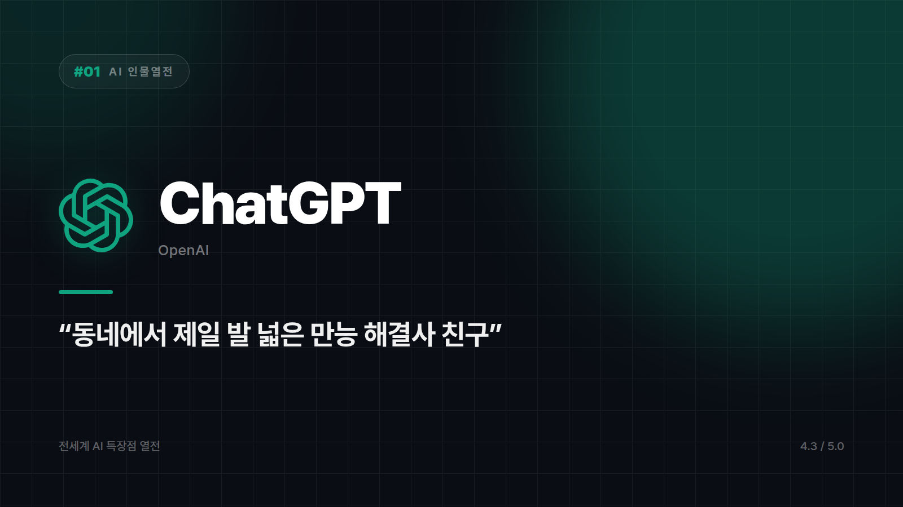

# [AI 인물열전 #1] ChatGPT — "일단 뭐든 물어봐, 형이 다 해줄게" 스타일의 동네 만능 해결사

*시리즈: 전세계 AI 특장점 열전 | 1/5 | 오늘의 주인공: ChatGPT (OpenAI)*

---

동네에 그런 친구 하나쯤 있다. 뭘 물어봐도 "아 그거? 나 알아" 하고 답부터 내놓는 친구. 보통 그런 친구는 반쯤 틀리기 마련인데, 이 친구는 신기하게도 웬만하면 맞는다.

코딩 물어보면 코딩해준다. 여행 계획 물어보면 일정을 짠다. 갑자기 그림 그려달라고 해도 그려준다. 엑셀 수식도 만들고, 다이어트 식단도 짜준다. 몇 번 시켜보다 보면 질문이 바뀐다. "얘 뭘 할 수 있지?"가 아니라 "얘 대체 뭘 못하지?"

"AI 챗봇"이라는 말 자체를 사람들 머릿속에 심어놓은 게 이 녀석이다. 에이전트 시대를 열어젖힌 원조이기도 하고.

## 혼자 잘하는 게 아니라 판을 깔았다

ChatGPT의 진짜 힘은 채팅창 바깥에 있다. 어느 순간부터 이건 대화 상대가 아니라 플랫폼이 됐다. 다른 서비스와 붙는 커스텀 GPT, 각종 앱 통합까지 얹히면서, 남들이 모델 성능을 따라잡는 동안 이쪽은 이미 생태계를 깔아놓은 상태가 됐다. 스마트폰 앱스토어를 처음 만든 회사의 포지션에 가깝다.

능력치 분포도 특이하다. 텍스트, 이미지, 음성, 코드를 두루 잘한다. 한 과목만 파는 덕후형이 아니라 전 과목 평균 90점을 찍는 모범생 쪽이다. 개별 영역에서 1등은 아닐 수 있다. 대신 "이건 어디다 물어보지?"라는 고민 자체가 사라진다. 도구를 고르느라 쓰는 시간이 생각보다 아깝다는 걸 아는 사람이라면 이게 왜 강점인지 안다.

그리고 사용자가 압도적으로 많다. 많이 쓰인다는 건 그만큼 실전에서 얻어맞았다는 얘기다. 세상에서 제일 많이 두들겨 맞은 AI답게, 어지간한 엣지 케이스는 이미 한 번씩 겪어본 티가 난다.

## 켜야 할 때, 끄고 다른 걸 켜야 할 때

뭘 물어봐야 할지조차 모르겠을 때 일단 열어보기 좋다. 여러 작업을 한 대화창에서 왔다갔다 처리하고 싶을 때도 그렇고, 반복 업무를 커스텀 GPT로 묶어두고 싶을 때도 어울린다.

반대로 긴 코드베이스를 통째로 붙잡고 씨름하는 딥한 개발 작업이라면 코딩에 특화된 도구가 나을 수 있다. 지금 이 순간의 실시간 정보가 생명인 작업도 마찬가지다. 그런 쪽에 강한 AI는 따로 있는데, 그건 뒤에 나온다.

## 총평

뭘 시켜도 일단 해내는 만능 직원. 다만 만능이라는 말과 전문가라는 말은 다르다.

⭐️⭐️⭐️⭐️ (4.3/5) — 범용성 최고, 생태계 최강, 그래서 늘 첫 번째로 켜게 되는 앱.

---

*다음 편 예고: [AI 인물열전 #2] Claude — "일 잘하는데 예의도 바른 그 동료" 편.*

---

본문에 그림이 들어가면 좋을 자리는 아래와 같다. 실제 이미지는 아직 넣지 않았다.

〔이미지 자리 — 본문에서 1번째 특장점을 설명하는 대목〕

〔이미지 자리 — 본문에서 2번째 특장점을 설명하는 대목〕

〔이미지 자리 — 본문에서 3번째 특장점을 설명하는 대목〕

〔이미지 자리 — 총평 문단 바로 위〕
