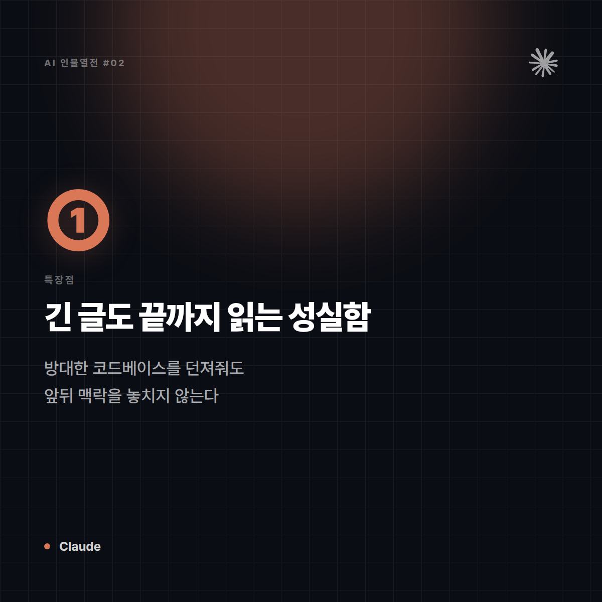
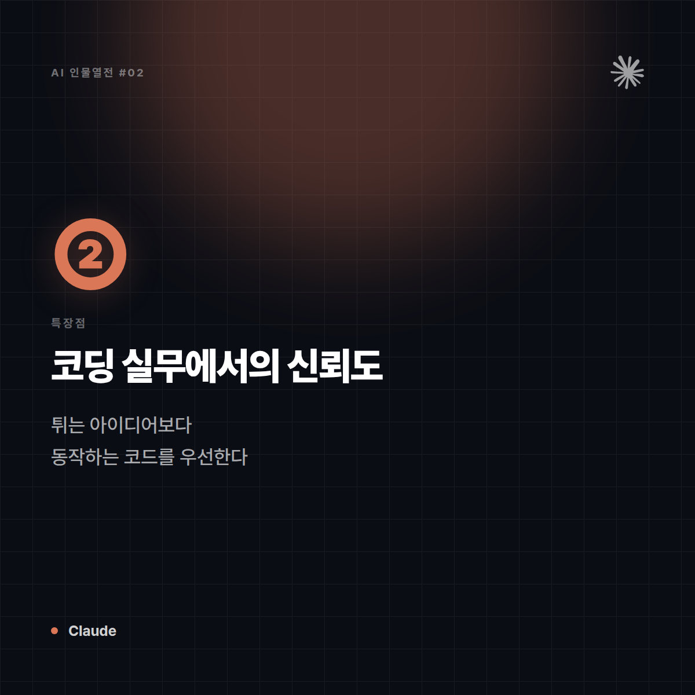
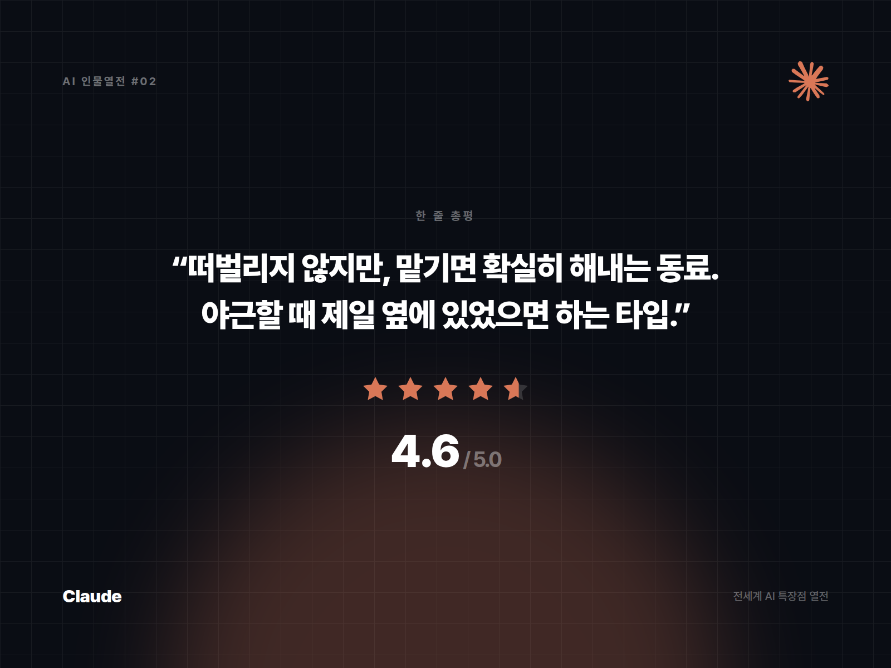

# [AI 인물열전 #2] Claude — "일 잘하는데 예의도 바른 그 동료" 스타일의 모범생 개발자

*시리즈: 전세계 AI 특장점 열전 | 2/5 | 오늘의 주인공: Claude (Anthropic)*

---

## 한 줄 소개

"AI 안전"을 회사 이름에 박아넣은 Anthropic이 만든 AI. 코딩 잘하기로 소문나서 개발자들 사이에서 은근히 "제일 믿고 맡기는 AI" 취급을 받는 중.

## 이 녀석은 이런 애다

비유하자면 Claude는 **팀에서 제일 꼼꼼하고 예의 바른 시니어 개발자**다. 시키지도 않았는데 코드 리뷰까지 해주고, "이 부분은 이렇게 하면 위험할 수 있어요"라고 조곤조곤 짚어준다. 화려하게 떠벌리진 않는데, 막상 결과물을 까보면 은근히 제일 깔끔하다. 회식 자리보단 회의실에서 빛나는 타입.

## 특장점 3가지

**1. 긴 글도 끝까지 읽고 기억하는 성실함 (긴 컨텍스트 처리)**
방대한 코드베이스나 긴 문서를 통째로 던져줘도 앞뒤 맥락을 놓치지 않고 따라간다. 마치 500페이지짜리 보고서를 한 번에 정독하고 목차까지 외우는 후배 같은 느낌 — 중간에 "어, 그거 뭐였죠?"라고 되묻지 않는다.

**2. 코딩 실무에서의 신뢰도**
실제 개발자 커뮤니티에서 "복잡한 리팩토링, 버그 수정, 코드 리뷰"를 맡길 때 자주 언급되는 이름이 Claude다. 튀는 아이디어보다 '동작하는 코드', '읽기 쉬운 코드'를 우선시하는 성향이 있어서, 프로덕션 코드를 맡기기에 마음이 놓인다.

**3. 조심스러움 = 신뢰 가능성**
과감하게 확신에 찬 오답을 던지기보다, 불확실하면 불확실하다고 말하는 편. 재미는 좀 덜할 수 있어도, "이거 잘못되면 큰일나는" 업무용 작업에는 이 성격이 오히려 최고의 장점이 된다.

## 이럴 때 쓰면 좋다

- 긴 코드베이스를 붙잡고 리팩토링·디버깅해야 할 때
- 법률/재무처럼 "틀리면 곤란한" 문서를 검토·요약해야 할 때
- 협업 도구처럼 실제 파일을 읽고 수정하는 에이전트 작업을 맡길 때

## 이럴 땐 살짝 비추

- 화끈하고 자극적인 밈/농담을 원할 때 (성격상 살짝 얌전한 편)
- 실시간 트렌드나 방금 터진 뉴스를 물어볼 때 (실시간성보단 꼼꼼함이 강점인 타입)

## 한 줄 총평

**"떠벌리지 않지만, 맡기면 확실히 해내는 그 동료. 야근할 때 제일 옆에 있었으면 하는 타입."**

⭐️⭐️⭐️⭐️⭐️ (4.6/5) — 코딩·문서 작업 신뢰도 최상위권, 대신 텐션은 스스로 챙겨야 함.

---

*다음 편 예고: [AI 인물열전 #3] Gemini — "구글 검색창이 갑자기 말을 하기 시작했다" 편에서 계속됩니다.*


---

## 🖼 이미지 (5장)

아래 이미지는 이 포스팅 전용으로 제작한 실제 이미지 파일입니다. 원본은 `images/02_Claude/` 폴더에 있습니다.

**대표 썸네일 (1600×900)**


**특장점 ① 카드 (1200×1200)**



**특장점 ② 카드 (1200×1200)**



**특장점 ③ 카드 (1200×1200)**


**총평 · 별점 카드 (1600×1200)**



---

## 🎨 이미지 생성 프롬프트 (5장)

아래 5개 프롬프트는 Midjourney, DALL·E, Stable Diffusion 등 이미지 생성 도구에 바로 사용할 수 있도록 작성했습니다. (공식 로고·스크린샷이 아닌, 포스팅 톤에 맞춘 창작 일러스트용입니다.)

**1. 대표 썸네일 — 캐릭터 비유 일러스트**
```
Editorial character illustration personifying Claude as "꼼꼼하고 예의 바른 시니어 개발자 동료",
warm terracotta and cream, calm trustworthy tone, flat vector illustration with soft shadows,
tech-editorial magazine style, clean negative space for title text, 16:9 aspect ratio, no text, no logo
```

**2. 특장점 ① — 방대한 문서를 끝까지 정독하는 긴 컨텍스트 처리**
```
Conceptual infographic-style illustration representing "방대한 문서를 끝까지 정독하는 긴 컨텍스트 처리" for an AI tool review article,
warm terracotta and cream, calm trustworthy tone, minimalist vector icons and abstract shapes, no text, no logo, square 1:1 aspect ratio
```

**3. 특장점 ② — 복잡한 리팩토링을 믿고 맡기는 코딩 신뢰도**
```
Conceptual infographic-style illustration representing "복잡한 리팩토링을 믿고 맡기는 코딩 신뢰도" for an AI tool review article,
warm terracotta and cream, calm trustworthy tone, minimalist vector icons and abstract shapes, no text, no logo, square 1:1 aspect ratio
```

**4. 특장점 ③ — 불확실하면 불확실하다 말하는 조심스러운 신중함**
```
Conceptual infographic-style illustration representing "불확실하면 불확실하다 말하는 조심스러운 신중함" for an AI tool review article,
warm terracotta and cream, calm trustworthy tone, minimalist vector icons and abstract shapes, no text, no logo, square 1:1 aspect ratio
```

**5. 총평 카드 — 별점 인포그래픽**
```
A minimal review-card style illustration with a star rating visual motif,
warm terracotta and cream, calm trustworthy tone, flat design, rounded card layout, subtle gradient background,
space reserved for a one-line quote and star rating, no text, no logo, 4:3 aspect ratio
```
