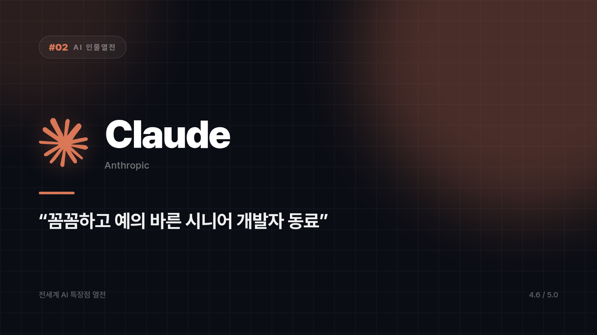

# [AI 인물열전 #2] Claude — "일 잘하는데 예의도 바른 그 동료" 스타일의 모범생 개발자

*시리즈: 전세계 AI 특장점 열전 | 2/5 | 오늘의 주인공: Claude (Anthropic)*

---

회식 자리에서는 존재감이 없다. 목소리가 제일 작고, 농담도 제일 늦게 웃는다. 그런데 다음 날 회의실에 들어가면 얘기가 달라진다. 아무도 안 시켰는데 코드 리뷰를 해와 있고, "이 부분은 이렇게 하면 위험할 수 있어요"를 조곤조곤 짚는다.

Claude는 그런 타입이다. 회사 이름에 아예 "AI 안전"을 박아넣은 Anthropic이 만들었고, 개발자들 사이에서는 은근히 "제일 믿고 맡기는 AI" 취급을 받는다. 화려하게 떠벌리지 않는데 결과물을 까보면 제일 깔끔한 쪽이다.

## 던져준 건 끝까지 읽는다

제일 먼저 체감되는 건 지구력이다. 방대한 코드베이스나 긴 문서를 통째로 넘겨도 앞뒤 맥락을 놓치지 않고 따라간다. 500페이지짜리 보고서를 한 번에 정독하고 목차까지 외워 온 후배 같은 느낌이랄까. 중간에 "어, 그게 뭐였죠?"로 되돌아오는 일이 적다.

그래서 복잡한 리팩토링이나 버그 수정, 코드 리뷰를 맡길 때 개발자 커뮤니티에서 자주 언급되는 이름이 됐다. 튀는 아이디어보다 동작하는 코드, 읽기 쉬운 코드를 먼저 고르는 성향이 있다. 프로덕션에 올라갈 코드를 맡길 때 이 성향은 꽤 큰 안심으로 돌아온다.

성격도 한몫한다. 확신에 찬 오답을 시원하게 던지기보다, 불확실하면 불확실하다고 말하는 쪽이다. 재미로 치면 확실히 손해다. 대신 틀리면 곤란해지는 일에서는 이 조심스러움이 곧 신뢰가 된다.

## 맡기기 좋은 일, 아쉬운 일

- 긴 코드베이스를 붙잡고 리팩토링하거나 디버깅할 때
- 법률·재무처럼 틀리면 곤란한 문서를 검토하고 요약할 때
- 실제 파일을 읽고 고치는 에이전트 작업을 통째로 넘길 때

아쉬운 쪽은 취향 문제에 가깝다. 화끈하고 자극적인 밈이나 농담을 기대하면 성격상 좀 얌전하다. 실시간 트렌드나 방금 터진 뉴스를 캐묻기에도 어울리는 타입은 아니다. 이쪽은 속도보다 꼼꼼함으로 먹고사는 사람이다.

## 그래서

떠벌리지 않는데 맡기면 해낸다. 야근할 때 옆자리에 있었으면 하는 사람이 있다면 대체로 이런 사람이다.

⭐️⭐️⭐️⭐️⭐️ (4.6/5) — 코딩·문서 작업 신뢰도 최상위권, 대신 텐션은 스스로 챙겨야 함.

---

*다음 편 예고: [AI 인물열전 #3] Gemini — "구글 검색창이 갑자기 말을 하기 시작했다" 편.*

---

본문에 그림이 들어가면 좋을 자리는 아래와 같다. 실제 이미지는 아직 넣지 않았다.

〔이미지 자리 — 본문에서 1번째 특장점을 설명하는 대목〕

〔이미지 자리 — 본문에서 2번째 특장점을 설명하는 대목〕

〔이미지 자리 — 본문에서 3번째 특장점을 설명하는 대목〕

〔이미지 자리 — 총평 문단 바로 위〕
