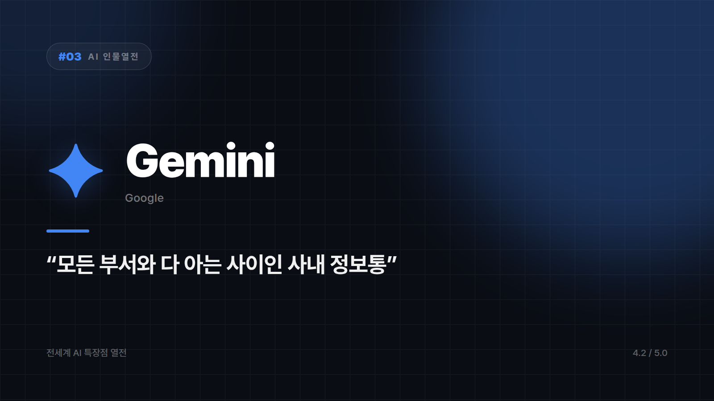

# Gemini — "구글 검색창이 갑자기 말을 하기 시작했다" 스타일의 정보통

*시리즈: 전세계 AI 특장점 열전 | 3/20 | 오늘의 주인공: Gemini (Google) · 2026년 하반기 기준*

---

"그거 어디 있더라?"

사무실에서 이 말을 뱉는 순간 바로 옆에서 "아, 지난주 목요일 메일에 첨부돼 있던데요, 그리고 어제 캘린더 보니까 3시에 그 얘기로 미팅도 잡혀 있으시던데"가 날아온다면 기분이 묘할 것이다. 고맙기도 하고, 약간 서늘하기도 하고. 내 일정을 나보다 잘 아는 사람을 만난 기분이다.

Gemini는 그 동료다. 메일함을 꿰고 있고, 캘린더를 알고, 어제 본 유튜브 영상이 뭐였는지까지 은근슬쩍 파악하고 있다. 검색엔진 세계를 20년 넘게 지배한 회사가 만들었으니 당연하다면 당연한데, 그 정보력이 실제로 쓸모 있다는 게 이 캐릭터의 진짜 무서운 점이다.

## 남들이 파일을 달라고 할 때, 이쪽은 이미 들고 있다

지메일, 드라이브, 캘린더, 문서 도구를 이미 쓰고 있는 사람이라면 그 데이터를 넘나드는 감각이 확실히 다르다. 다른 AI가 "그 파일 좀 붙여주세요"라고 할 때 Gemini는 이미 손에 들고 있다. 남들이 서류 찾으러 캐비닛 뒤지는 동안 이쪽은 이미 프린트까지 해서 클립으로 집어놓은 수준이다. 연동이라는 말이 기능 목록이 아니라 체감으로 오는 몇 안 되는 경우다.

검색 엔진 DNA도 그대로 남아 있다. 웹에 흩어진 정보를 엮어 답을 만드는 쪽으로 감각이 좋아서, "요즘 이거 어때?"처럼 최신성이 걸린 질문에 특히 강하다.

멀티모달도 빼놓기 어렵다. 텍스트만이 아니라 이미지, 영상, 오디오를 한 번에 이해하고 엮어낸다. 세계 최대 영상 플랫폼을 가진 회사답게 '영상을 이해하는 AI' 자리에서 존재감이 크다.

## 단, 전제가 하나 있다

이 모든 장점이 구글 생태계 위에 서 있다. 지메일도 안 쓰고 드라이브도 안 쓰는 사람에게는 시너지의 절반이 사라진다. 문체의 개성이 승부처인 긴 창작 글쓰기도 이쪽의 주종목은 아니다.

그래도 구글 워크스페이스로 하루를 사는 사람이라면 이야기가 다르다. 흩어진 자료를 한 번에 훑어야 할 때, 웹 기반 리서치가 필요할 때, 형식이 뒤섞인 자료를 통째로 분석해야 할 때 — 이 셋만 해도 켤 이유는 충분하다.

내 데이터를 이미 다 알고 있는 동료. 편한데 가끔 서늘하다. 유튜브 시청기록까지 알고 있다는 걸 깨닫는 순간, 고마움과 사생활 침해 사이 어딘가에서 표정이 애매해진다.

구글 생태계 안에서 산다는 전제로 점수를 매기면 ⭐️⭐️⭐️⭐️ (4.2/5) — 구글 생태계 사용자에게는 대체 불가, 정보 연결력 최강.

---

*다음 편 예고: [AI 인물열전 #4] Grok — "필터링 없이 할 말 다 하는 그 친구" 편.*

---

본문에 그림이 들어가면 좋을 자리는 아래와 같다. 실제 이미지는 아직 넣지 않았다.

〔이미지 자리 — 본문에서 1번째 특장점을 설명하는 대목〕

〔이미지 자리 — 본문에서 2번째 특장점을 설명하는 대목〕

〔이미지 자리 — 본문에서 3번째 특장점을 설명하는 대목〕

〔이미지 자리 — 총평 문단 바로 위〕
