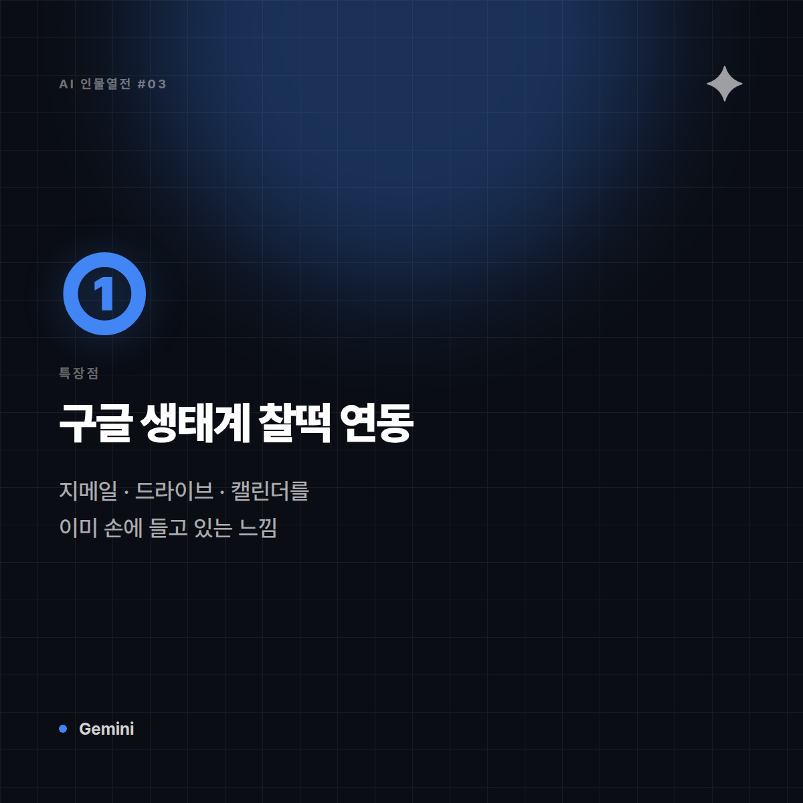
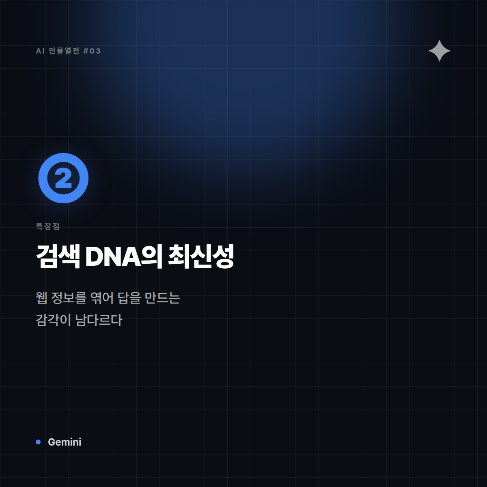
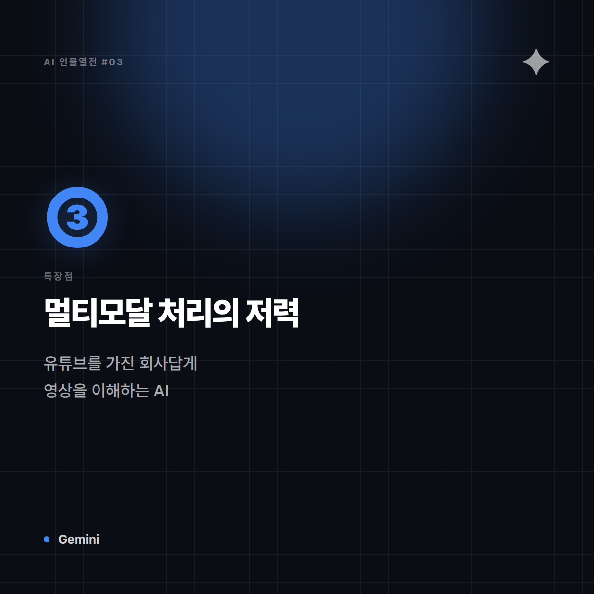
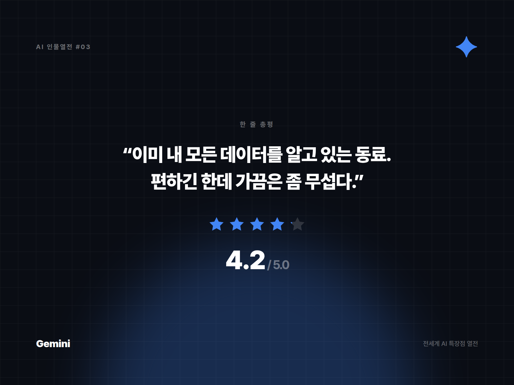

# [AI 인물열전 #3] Gemini — "구글 검색창이 갑자기 말을 하기 시작했다" 스타일의 정보통

*시리즈: 전세계 AI 특장점 열전 | 3/5 | 오늘의 주인공: Gemini (Google)*

---

## 한 줄 소개

검색엔진 세계를 20년 넘게 지배해온 구글이 만든 AI. 유튜브, 지메일, 구글독스, 안드로이드까지 — 여러분 일상 곳곳에 이미 스며들어 있는 그 회사가 만든 만큼, '연결력'이 남다르다.

## 이 녀석은 이런 애다

비유하자면 Gemini는 **회사에서 모든 부서와 다 아는 사이인 정보통 동료**다. 메일함도 훤히 꿰고 있고, 캘린더도 알고, 어제 봤던 유튜브 영상 내용까지 은근슬쩍 알고 있다. "그거 어디 있더라?" 하면 바로바로 찾아준다. 무서운 건 이 정보력이 실제로 매우 유용하다는 것.

## 특장점 3가지

**1. 구글 생태계와의 찰떡 연동**
지메일, 구글 드라이브, 캘린더, 문서 도구까지 이미 쓰고 있는 사람이라면 그 데이터를 자연스럽게 넘나들며 활용할 수 있다. 다른 AI가 "어디서 그 파일 좀 갖다주세요" 할 때, Gemini는 이미 손에 들고 있는 느낌.

**2. 정보 검색·최신성에 강한 뿌리**
검색 엔진 DNA를 그대로 물려받아서, 웹 정보를 엮어 답을 만드는 감각이 남다르다. "요즘 이거 어때?"류의 질문에 특히 강하다.

**3. 멀티모달 처리의 저력**
텍스트뿐 아니라 이미지, 영상, 오디오까지 한 번에 이해하고 엮어내는 능력이 뛰어나다. 유튜브라는 세계 최대 영상 플랫폼을 보유한 회사답게, '영상을 이해하는 AI'라는 포지션에서 존재감이 크다.

## 이럴 때 쓰면 좋다

- 구글 워크스페이스(지메일, 드라이브, 캘린더)와 연동된 업무를 자동화하고 싶을 때
- 최신 정보나 웹 기반 리서치가 필요한 질문을 할 때
- 이미지·영상 등 여러 형식이 섞인 자료를 한 번에 분석해야 할 때

## 이럴 땐 살짝 비추

- 구글 생태계를 아예 안 쓰는 사람이라면 시너지가 반감
- 아주 깊고 긴 창작 글쓰기처럼 '문체의 개성'이 중요한 작업

## 한 줄 총평

**"이미 내 모든 데이터를 알고 있는 동료. 편하긴 한데 가끔은 좀 무섭다."**

⭐️⭐️⭐️⭐️ (4.2/5) — 구글 생태계 사용자에게는 대체 불가, 정보 연결력 최강.

---

*다음 편 예고: [AI 인물열전 #4] Grok — "필터링 없이 할 말 다 하는 그 친구" 편에서 계속됩니다.*


---

## 🖼 이미지 (5장)

아래 이미지는 이 포스팅 전용으로 제작한 실제 이미지 파일입니다. 원본은 `images/03_Gemini/` 폴더에 있습니다.

**대표 썸네일 (1600×900)**


**특장점 ① 카드 (1200×1200)**



**특장점 ② 카드 (1200×1200)**



**특장점 ③ 카드 (1200×1200)**



**총평 · 별점 카드 (1600×1200)**



---

## 🎨 이미지 생성 프롬프트 (5장)

아래 5개 프롬프트는 Midjourney, DALL·E, Stable Diffusion 등 이미지 생성 도구에 바로 사용할 수 있도록 작성했습니다. (공식 로고·스크린샷이 아닌, 포스팅 톤에 맞춘 창작 일러스트용입니다.)

**1. 대표 썸네일 — 캐릭터 비유 일러스트**
```
Editorial character illustration personifying Gemini as "모든 부서와 다 아는 사이인 사내 정보통",
google multicolor accents on white, bright informative tone, flat vector illustration with soft shadows,
tech-editorial magazine style, clean negative space for title text, 16:9 aspect ratio, no text, no logo
```

**2. 특장점 ① — 지메일·드라이브·캘린더와의 찰떡 연동**
```
Conceptual infographic-style illustration representing "지메일·드라이브·캘린더와의 찰떡 연동" for an AI tool review article,
google multicolor accents on white, bright informative tone, minimalist vector icons and abstract shapes, no text, no logo, square 1:1 aspect ratio
```

**3. 특장점 ② — 검색엔진 DNA에서 나온 최신 정보 감각**
```
Conceptual infographic-style illustration representing "검색엔진 DNA에서 나온 최신 정보 감각" for an AI tool review article,
google multicolor accents on white, bright informative tone, minimalist vector icons and abstract shapes, no text, no logo, square 1:1 aspect ratio
```

**4. 특장점 ③ — 텍스트·이미지·영상을 넘나드는 멀티모달 저력**
```
Conceptual infographic-style illustration representing "텍스트·이미지·영상을 넘나드는 멀티모달 저력" for an AI tool review article,
google multicolor accents on white, bright informative tone, minimalist vector icons and abstract shapes, no text, no logo, square 1:1 aspect ratio
```

**5. 총평 카드 — 별점 인포그래픽**
```
A minimal review-card style illustration with a star rating visual motif,
google multicolor accents on white, bright informative tone, flat design, rounded card layout, subtle gradient background,
space reserved for a one-line quote and star rating, no text, no logo, 4:3 aspect ratio
```
