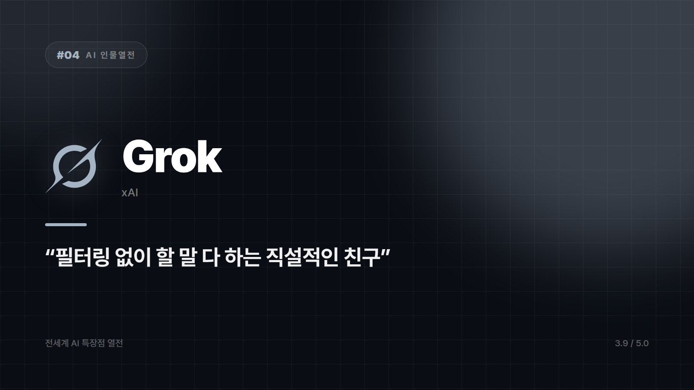

# [AI 인물열전 #4] Grok — "필터링 없이 할 말 다 하는 그 친구" 스타일의 실시간 트렌드 마스터

*시리즈: 전세계 AI 특장점 열전 | 4/20 | 오늘의 주인공: Grok (xAI)*

---

## 먼저 안 맞는 자리부터

임원 보고용 문서를 쓴다면 이 녀석은 아니다. 격식 차린 문장, 조심스럽게 다듬은 표현, 검증된 학술 근거가 필요한 작업이라면 다른 창을 켜는 게 낫다. 성격이 그렇게 생겨먹었다.

그걸 알고 나면 나머지가 다 장점으로 보인다.

## 지금 이 순간을 중계한다

Grok은 일론 머스크의 xAI가 만들었고, X(구 트위터)에 실시간으로 꽂혀 있다. 다른 AI들이 "제 지식은 특정 시점까지입니다"라고 물러설 때, 이쪽은 "어 그거 방금 전에 이런 얘기 나왔던데?"로 받는다. 지금 인터넷에서 무슨 일이 벌어지는지 제일 빨리 캐치하는 캐릭터다.

"야 방금 그거 봤어?"를 제일 먼저 던지는 친구를 떠올리면 된다. 실시간 여론이나 트렌드 파악에서는 독보적이다.

화법도 확실히 다르다. 형식을 덜 차리고, 유머와 풍자를 섞어 답한다. 업무용 AI들이 공손하게 정리해줄 때 이쪽은 농담을 한 번 얹는다. 대화하는 재미를 챙기고 싶을 때 존재감이 산다.

민감한 주제에 대해서도 비교적 직설적으로 들어가는 편이다. 여러 관점을 빠르게 훑어보고 싶은 사람에게는 매력 포인트가 된다. 이 지점은 평가가 갈린다. 누군가에게는 이게 최대 장점이고, 누군가에게는 정확히 같은 이유로 못 쓸 물건이다.

## 그래서 언제 켜나

SNS에서 뭐가 터졌는지 빠르게 확인하고 싶을 때. 딱딱하지 않은 톤으로 떠들고 싶을 때. 최신 이슈를 두고 사람들이 어떻게 갈리는지 스캔하고 싶을 때. 셋 다 회의실보다는 회식 자리에 가까운 용도다.

눈치 안 보고 할 말 하는 캐릭터. 그런 사람이 늘 그렇듯 호불호가 분명하다.

⭐️⭐️⭐️½ (3.9/5) — 실시간성과 개성은 최강, 격식 있는 업무엔 호불호.

---

*다음 편 예고: [AI 인물열전 #5] DeepSeek — "가성비로 승부하는 다크호스" 편.*

---

본문에 그림이 들어가면 좋을 자리는 아래와 같다. 실제 이미지는 아직 넣지 않았다.

〔이미지 자리 — 본문에서 1번째 특장점을 설명하는 대목〕

〔이미지 자리 — 본문에서 2번째 특장점을 설명하는 대목〕

〔이미지 자리 — 본문에서 3번째 특장점을 설명하는 대목〕

〔이미지 자리 — 총평 문단 바로 위〕
