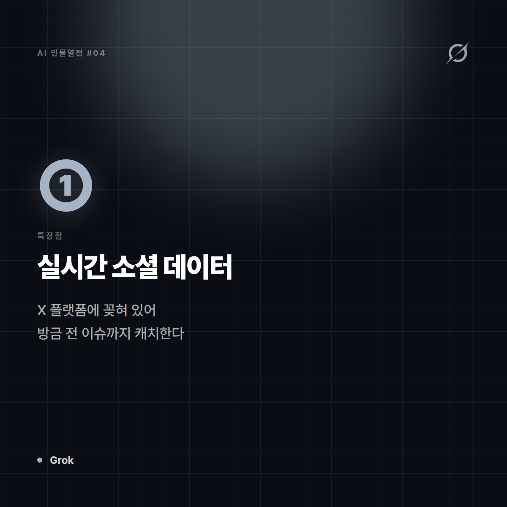
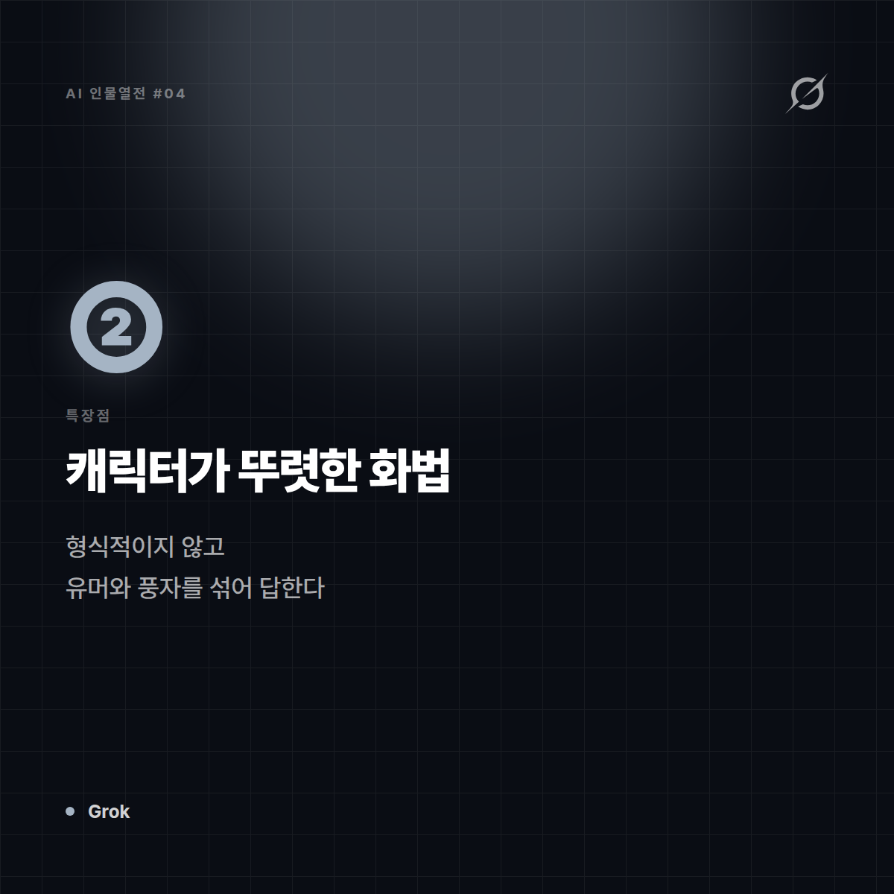
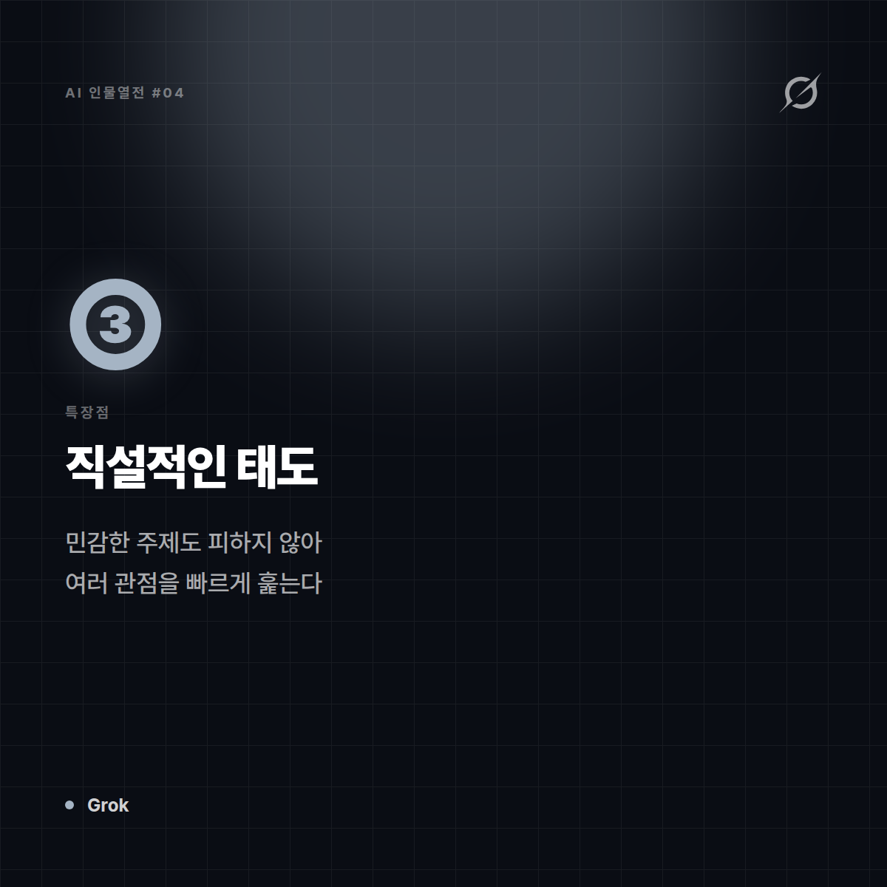
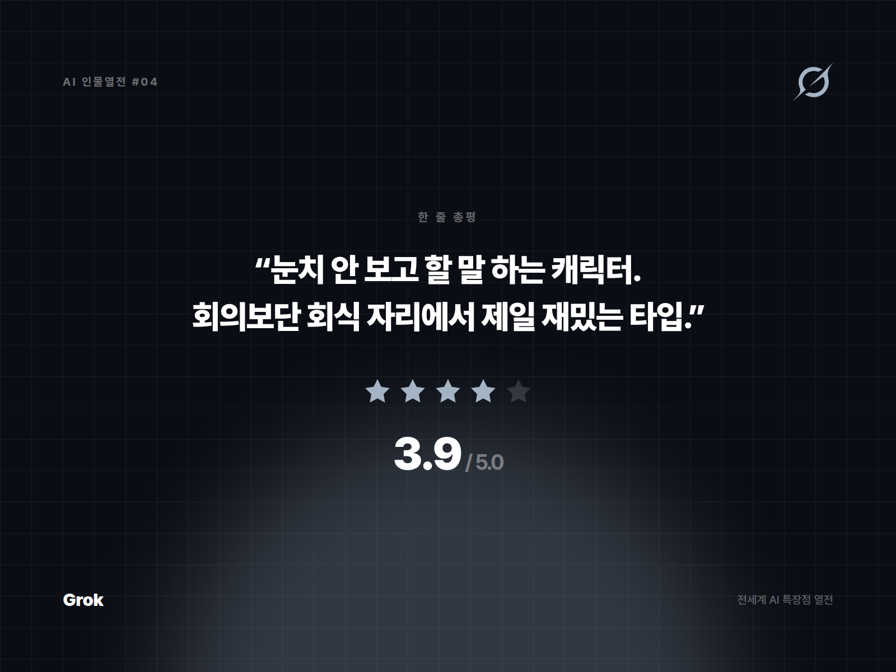

# [AI 인물열전 #4] Grok — "필터링 없이 할 말 다 하는 그 친구" 스타일의 실시간 트렌드 마스터

*시리즈: 전세계 AI 특장점 열전 | 4/5 | 오늘의 주인공: Grok (xAI)*

---

## 한 줄 소개

일론 머스크의 xAI가 만든 AI로, X(구 트위터) 플랫폼에 실시간으로 꽂혀 있다는 게 최대 특징. "지금 이 순간 인터넷에서 뭔 일이 벌어지고 있나"를 제일 빨리 캐치하는 녀석.

## 이 녀석은 이런 애다

비유하자면 Grok은 **SNS 실시간 인기글을 실시간으로 중계해주는 친구**다. "야 방금 그 얘기 봤어?"를 제일 먼저 던지는 타입. 답변도 다른 AI들보다 좀 더 직설적이고 유머러스한 편이라, 딱딱한 보고서보단 캐주얼한 대화에 어울린다.

## 특장점 3가지

**1. 실시간 소셜 데이터 접근성**
X 플랫폼의 실시간 게시물 흐름에 접근할 수 있다는 건, 다른 AI들이 "제 지식은 특정 시점까지입니다"라고 할 때 Grok은 "어, 그거 방금 전에 이런 얘기 나왔던데?"라고 답할 수 있다는 뜻. 실시간 여론이나 트렌드 파악에 독보적.

**2. 캐릭터가 뚜렷한 화법**
지나치게 형식적이지 않고, 유머와 풍자를 섞어 답하는 스타일이 자리잡혀 있다. 딱딱한 업무 AI보다는 "대화하는 재미"를 챙기고 싶을 때 존재감이 산다.

**3. 논쟁적 주제에 대한 상대적으로 낮은 방어적 태도**
민감한 주제에 대해서도 비교적 직설적으로 접근하는 편이라, 다양한 관점을 빠르게 훑어보고 싶은 사용자에게는 매력 포인트가 된다. (물론 이건 사람에 따라 호불호가 갈리는 지점이기도 하다.)

## 이럴 때 쓰면 좋다

- "지금 인터넷/SNS에서 뭐가 화제인지" 빠르게 캐치하고 싶을 때
- 딱딱하지 않은 캐주얼한 톤으로 대화하고 싶을 때
- 최신 이슈에 대한 여러 의견을 빠르게 스캔하고 싶을 때

## 이럴 땐 살짝 비추

- 아주 보수적이고 공식적인 톤의 비즈니스 문서를 작성해야 할 때
- 정제되고 검증된 학술적 근거가 반드시 필요한 작업

## 한 줄 총평

**"눈치 안 보고 할 말 하는 캐릭터. 회의보단 회식 자리에서 제일 재밌는 타입."**

⭐️⭐️⭐️½ (3.9/5) — 실시간성과 개성은 최강, 격식 있는 업무엔 호불호.

---

*다음 편 예고: [AI 인물열전 #5] DeepSeek — "가성비로 승부하는 다크호스" 편에서 계속됩니다.*


---

## 🖼 이미지 (5장)

아래 이미지는 이 포스팅 전용으로 제작한 실제 이미지 파일입니다. 원본은 `images/04_Grok/` 폴더에 있습니다.

**대표 썸네일 (1600×900)**


**특장점 ① 카드 (1200×1200)**



**특장점 ② 카드 (1200×1200)**



**특장점 ③ 카드 (1200×1200)**



**총평 · 별점 카드 (1600×1200)**



---

## 🎨 이미지 생성 프롬프트 (5장)

아래 5개 프롬프트는 Midjourney, DALL·E, Stable Diffusion 등 이미지 생성 도구에 바로 사용할 수 있도록 작성했습니다. (공식 로고·스크린샷이 아닌, 포스팅 톤에 맞춘 창작 일러스트용입니다.)

**1. 대표 썸네일 — 캐릭터 비유 일러스트**
```
Editorial character illustration personifying Grok as "필터링 없이 할 말 다 하는 직설적인 친구",
bold black and electric blue, edgy energetic tone, flat vector illustration with soft shadows,
tech-editorial magazine style, clean negative space for title text, 16:9 aspect ratio, no text, no logo
```

**2. 특장점 ① — X 플랫폼 실시간 소셜 데이터 접근성**
```
Conceptual infographic-style illustration representing "X 플랫폼 실시간 소셜 데이터 접근성" for an AI tool review article,
bold black and electric blue, edgy energetic tone, minimalist vector icons and abstract shapes, no text, no logo, square 1:1 aspect ratio
```

**3. 특장점 ② — 유머와 풍자가 섞인 개성 있는 화법**
```
Conceptual infographic-style illustration representing "유머와 풍자가 섞인 개성 있는 화법" for an AI tool review article,
bold black and electric blue, edgy energetic tone, minimalist vector icons and abstract shapes, no text, no logo, square 1:1 aspect ratio
```

**4. 특장점 ③ — 논쟁적 주제도 피하지 않는 직설적 태도**
```
Conceptual infographic-style illustration representing "논쟁적 주제도 피하지 않는 직설적 태도" for an AI tool review article,
bold black and electric blue, edgy energetic tone, minimalist vector icons and abstract shapes, no text, no logo, square 1:1 aspect ratio
```

**5. 총평 카드 — 별점 인포그래픽**
```
A minimal review-card style illustration with a star rating visual motif,
bold black and electric blue, edgy energetic tone, flat design, rounded card layout, subtle gradient background,
space reserved for a one-line quote and star rating, no text, no logo, 4:3 aspect ratio
```
