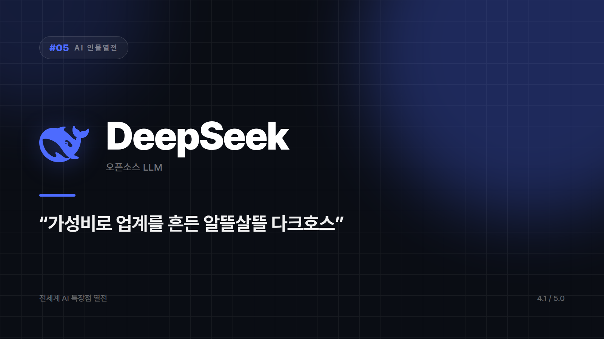

# DeepSeek — "가성비로 업계를 흔든 다크호스" 스타일의 반란군

*시리즈: 전세계 AI 특장점 열전 | 5/20 | 오늘의 주인공: DeepSeek · 2026년 하반기 기준*

---

정장 입은 사람들만 모인 자리에 혼자 청바지 입고 들어온 신입이 있다. 다들 속으로 '쟤 뭐야' 하는데, 발표를 시켜보니 제일 멀쩡하다. 심지어 PPT도 제일 깔끔하다. DeepSeek이 등장했을 때 업계 반응이 대충 그랬다. "이 정도 성능을 이 비용에?"

중국발 오픈소스 AI다. 화려한 마케팅 대신 결과물로 승부하는 쪽이고, 아예 모델 가중치를 공개해버려서 "궁금하면 뜯어봐"라는 배짱까지 얹었다. "어차피 비슷한 거 왜 비싸게 사?"를 몸으로 증명하는 알뜰살뜰한 후배 캐릭터.

제일 먼저 눈에 들어오는 건 비용이다. 동급 성능과 견줬을 때 훨씬 싼 구조로 업계에 충격을 줬는데, 스타트업이나 개인 개발자에게는 이게 가장 현실적인 메리트다. 성능 그래프보다 카드 명세서가 먼저 보이는 사람들이 있다. API 요금 청구서를 열었다가 자릿수를 두 번 세어보게 만드는 다른 모델들 옆에서, 이쪽은 영수증을 봐도 마음이 편하다.

가중치를 공개했다는 점도 크다. 원하는 방식으로 파인튜닝하거나 온프레미스로 올려 돌릴 수 있는 길이 열려 있다. 클라우드 API 한 군데에 목줄을 매기 싫은 개발자에게는 단비다.

거기에 추론 특화 모델까지 있다. 복잡한 논리 작업에서 크고 비싼 모델들과 견줄 만한 결과를 내면서, 비쌀수록 좋다는 공식이 항상 참은 아니라는 걸 보여줬다.

## 다만 싸다고 다 되는 건 아니다

데이터 거버넌스나 컴플라이언스에 민감한 조직이라면 도입 전에 데이터 처리 정책을 반드시 들여다봐야 한다. 이건 취향 문제가 아니라 검토 항목이다. 세련된 생태계와 플러그인 연동이 중요한 엔터프라이즈 워크플로우에서도 아직 아쉬운 구석이 남는다.

반대로 비용을 최대한 눌러야 하는 개인·스타트업 프로젝트, 자체 서버에 올려 만지고 싶은 환경, 무거운 추론 작업의 가성비 옵션이 필요할 때라면 후보에서 빠질 이유가 없다.

화려하진 않은데 판을 흔들었다. 지갑 얇은 개발자들에게는 그게 곧 히어로다. 명품 매장 옆에 조용히 문 연 알뜰마트가 매출로 다 이겨버린 셈인데, 정작 알뜰마트 사장은 인터뷰도 잘 안 한다.

지갑 사정을 최우선에 놓고 채점하면 ⭐️⭐️⭐️⭐️ (4.1/5) — 가성비·오픈성 최강, 생태계 성숙도는 아직 추격 중.

---

*이어지는 편부터는 대화형 AI를 떠나 Canva, Midjourney, GitHub Copilot 같은 실무 특화 도구들로 넘어갑니다.*

*다음 편 예고: Canva — 손 빠른 디자인 대행업체 알바생 편.*

---

본문에 그림이 들어가면 좋을 자리는 아래와 같다. 실제 이미지는 아직 넣지 않았다.

〔이미지 자리 — 본문에서 1번째 특장점을 설명하는 대목〕

〔이미지 자리 — 본문에서 2번째 특장점을 설명하는 대목〕

〔이미지 자리 — 본문에서 3번째 특장점을 설명하는 대목〕

〔이미지 자리 — 총평 문단 바로 위〕
