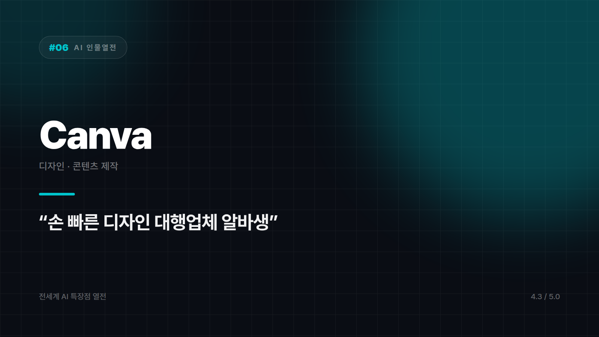

# Canva (Magic Studio) — "디자인 1도 몰라도 되는" 만능 디자인 대행업체

*시리즈: 전세계 AI 특장점 열전 | 6/20 | 오늘의 주인공: Canva · 2026년 하반기 기준*

---

오후 네 시 반. 내일 아침에 올릴 카드뉴스가 아직 흰 화면이다. 디자이너는 다른 프로젝트에 붙어 있고, 포토샵은 깔려 있지만 마지막으로 연 게 재작년이다. 아이콘 위치도 가물가물하다.

이럴 때 열게 되는 게 Canva다.

원래는 "디자인 몰라도 누구나 예쁘게 만드는 툴"로 유명했는데, Magic Studio라는 AI 기능이 붙으면서 체급이 달라졌다. 지금은 마케터, 소상공인, 1인 크리에이터의 은근한 필수템 자리에 앉아 있다.

## 손 빠른 알바생 한 명이 상주하는 셈

문구만 던지면 SNS 게시물, 프레젠테이션, 포스터 시안을 여러 개 뽑아준다. 빈 화면 공포증을 없애는 데 이만한 무기가 없다. "일단 뭐라도 하나만 던져줘"라고 하면 정말로 뭐라도 대여섯 개를 던져주는데, 그중 하나는 늘 묘하게 마음에 든다. 마음에 안 들면 다음 시안을 보면 되고, 어차피 첫 시안부터 완벽할 거라 기대하고 여는 도구도 아니다.

배경 제거, 사진 보정, 오브젝트 지우기 같은 것도 클릭 몇 번이면 끝난다. 포토샵으로 이걸 배우는 데 쓸 시간에 이미 결과물이 나와 있다.

제일 큰 무기는 따로 있다. 디자인 전공자가 아니어도 협업 툴 다루듯 결과물을 만들 수 있다는 점이다. 팀 전체가 "디자인 못해도 되는" 상태가 되면 일하는 방식 자체가 바뀐다. 브랜드 템플릿을 잡아두고 반복 콘텐츠를 찍어낼 때 특히 그렇다.

## 여기까지는 안 된다

전문 디자이너의 미학까지 기대하면 곤란하다. 고급 브랜드 아이덴티티나 정교한 타이포그래피가 승부처인 하이엔드 작업은 여전히 사람의 영역이다. 완전히 독창적인 아트워크가 필요한 창작 프로젝트라면 Midjourney 같은 생성형 이미지 AI 쪽이 어울린다.

Canva가 파는 건 예술성이 아니라 속도다. 그리고 오후 네 시 반에 필요한 건 대개 예술성이 아니다.

디자인 실력이 없어도 있는 척할 수 있게 해주는 존재. 마감 직전에 이 고마움을 알게 된다. 상사가 "오, 이거 누가 만들었어요?"라고 물으면 "그냥 좀 만졌어요" 하고 웃을 수 있게 해주는 그 존재.

마감 앞두고 얼마나 빨리 뽑아낼 수 있는지로 매기면 ⭐️⭐️⭐️⭐️ (4.3/5) — 실무 속도 최강, 예술성보다 생산성에 올인.

---

*다음 편 예고: [AI 인물열전 #7] Midjourney — "예술가 영혼을 장착한 그림쟁이" 편.*

---

본문에 그림이 들어가면 좋을 자리는 아래와 같다. 실제 이미지는 아직 넣지 않았다.

〔이미지 자리 — 본문에서 1번째 특장점을 설명하는 대목〕

〔이미지 자리 — 본문에서 2번째 특장점을 설명하는 대목〕

〔이미지 자리 — 본문에서 3번째 특장점을 설명하는 대목〕

〔이미지 자리 — 총평 문단 바로 위〕
