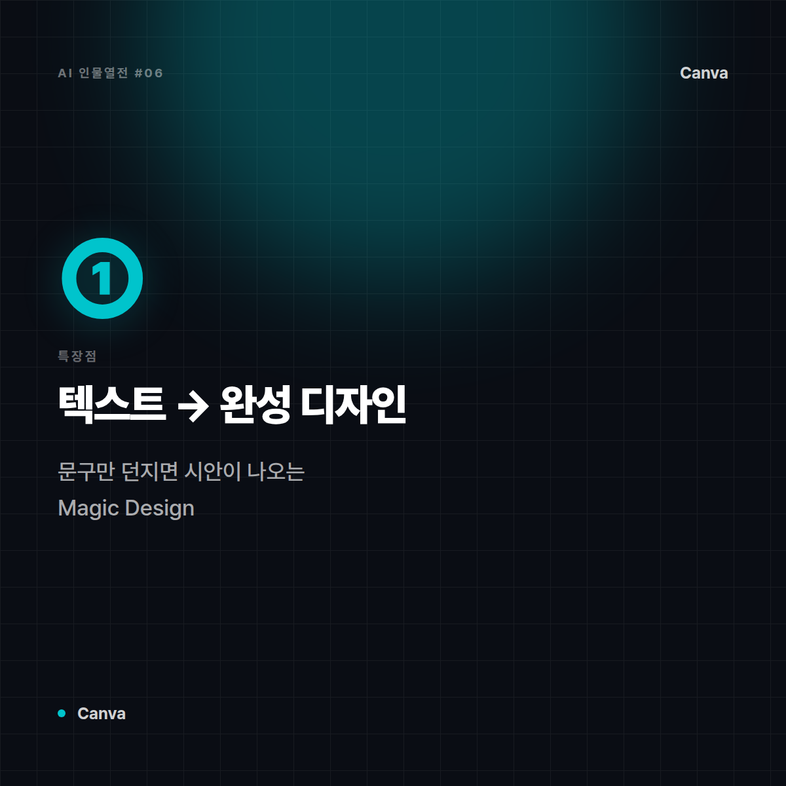
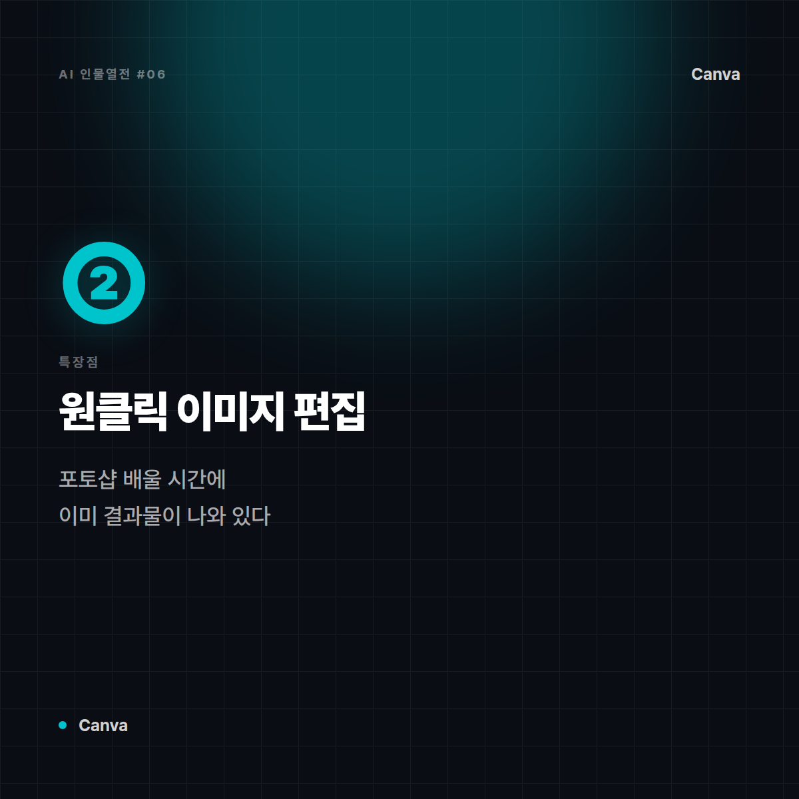
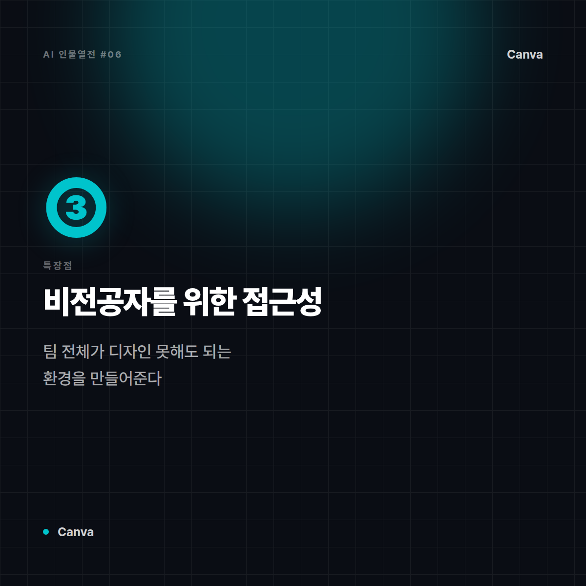
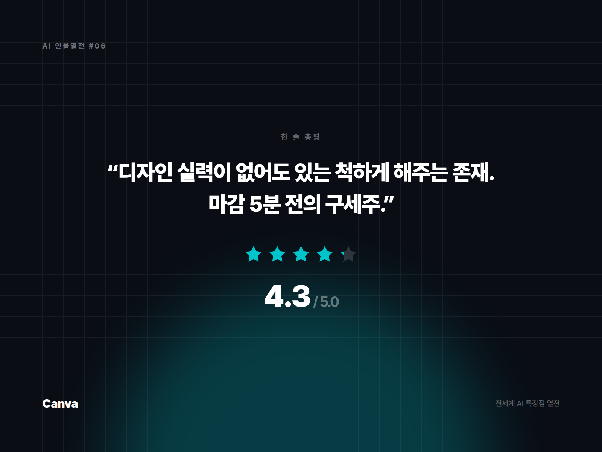

# [AI 인물열전 #6] Canva (Magic Studio) — "디자인 1도 몰라도 되는" 만능 디자인 대행업체

*시리즈: 전세계 AI 특장점 열전 | 6/5 (실무 특화편 시작) | 오늘의 주인공: Canva*

---

## 한 줄 소개

원래는 "디자인 몰라도 누구나 예쁘게 만들 수 있는 툴"로 유명했던 Canva가, AI 기능(Magic Studio)을 붙이면서 완전히 다른 체급이 됐다. 마케터, 소상공인, 1인 크리에이터들의 은근한 필수템.

## 이 녀석은 이런 애다

비유하자면 Canva는 **동네에서 제일 손 빠른 디자인 대행업체 알바생**이다. "이거 SNS 카드뉴스로 만들어줘", "배경 좀 없애줘", "이 문구를 더 예쁘게 배치해줘" 하면 몇 초 만에 뚝딱 만들어낸다. 전문 디자이너의 미학까진 아니어도, "당장 오늘 올려야 하는" 실무 속도에서는 최강이다.

## 특장점 3가지

**1. 텍스트 프롬프트 → 완성된 디자인 (Magic Design)**
문구만 던지면 SNS 게시물, 프레젠테이션, 포스터 등 완성된 디자인 시안을 여러 개 뽑아준다. "빈 화면 공포증"을 없애주는 가장 강력한 무기.

**2. 배경 제거·이미지 편집의 원클릭화**
배경 제거, 사진 보정, 오브젝트 제거 같은 작업을 클릭 몇 번으로 끝낸다. 포토샵 배울 시간에 이미 결과물이 나와 있다.

**3. 비전공자를 위한 압도적 접근성**
디자인 전공자가 아니어도, 협업 툴 다루듯 자연스럽게 결과물을 만들어낼 수 있다는 게 최대 무기. 팀 전체가 '디자인 못해도 되는' 환경을 만들어준다.

## 이럴 때 쓰면 좋다

- 소셜미디어 콘텐츠, 발표 자료, 마케팅 소재를 빠르게 뽑아야 할 때
- 디자이너 없이 팀 내에서 비주얼 결과물을 자체 제작해야 할 때
- 브랜드 템플릿을 유지하면서 반복 콘텐츠를 대량 생산해야 할 때

## 이럴 땐 살짝 비추

- 고퀄리티 브랜드 아이덴티티, 정교한 타이포그래피가 생명인 하이엔드 디자인 작업
- 완전히 독창적인 아트워크가 필요한 창작 프로젝트 (이럴 땐 Midjourney 같은 생성형 이미지 AI가 더 어울림)

## 한 줄 총평

**"디자인 실력이 없어도 있는 척할 수 있게 해주는 고마운 존재. 마감 5분 전의 구세주."**

⭐️⭐️⭐️⭐️ (4.3/5) — 실무 속도 최강, 예술성보다 생산성에 올인.

---

*다음 편 예고: [AI 인물열전 #7] Midjourney — "예술가 영혼을 장착한 그림쟁이" 편에서 계속됩니다.*


---

## 🖼 이미지 (5장)

아래 이미지는 이 포스팅 전용으로 제작한 실제 이미지 파일입니다. 원본은 `images/06_Canva/` 폴더에 있습니다.

**대표 썸네일 (1600×900)**


**특장점 ① 카드 (1200×1200)**



**특장점 ② 카드 (1200×1200)**



**특장점 ③ 카드 (1200×1200)**



**총평 · 별점 카드 (1600×1200)**



---

## 🎨 이미지 생성 프롬프트 (5장)

아래 5개 프롬프트는 Midjourney, DALL·E, Stable Diffusion 등 이미지 생성 도구에 바로 사용할 수 있도록 작성했습니다. (공식 로고·스크린샷이 아닌, 포스팅 톤에 맞춘 창작 일러스트용입니다.)

**1. 대표 썸네일 — 캐릭터 비유 일러스트**
```
Editorial character illustration personifying Canva as "손 빠른 디자인 대행업체 알바생",
pastel purple and turquoise, playful creative tone, flat vector illustration with soft shadows,
tech-editorial magazine style, clean negative space for title text, 16:9 aspect ratio, no text, no logo
```

**2. 특장점 ① — 문구만 던지면 시안이 나오는 Magic Design**
```
Conceptual infographic-style illustration representing "문구만 던지면 시안이 나오는 Magic Design" for an AI tool review article,
pastel purple and turquoise, playful creative tone, minimalist vector icons and abstract shapes, no text, no logo, square 1:1 aspect ratio
```

**3. 특장점 ② — 클릭 한 번으로 끝나는 배경 제거·보정**
```
Conceptual infographic-style illustration representing "클릭 한 번으로 끝나는 배경 제거·보정" for an AI tool review article,
pastel purple and turquoise, playful creative tone, minimalist vector icons and abstract shapes, no text, no logo, square 1:1 aspect ratio
```

**4. 특장점 ③ — 비전공자도 쓰는 압도적 접근성**
```
Conceptual infographic-style illustration representing "비전공자도 쓰는 압도적 접근성" for an AI tool review article,
pastel purple and turquoise, playful creative tone, minimalist vector icons and abstract shapes, no text, no logo, square 1:1 aspect ratio
```

**5. 총평 카드 — 별점 인포그래픽**
```
A minimal review-card style illustration with a star rating visual motif,
pastel purple and turquoise, playful creative tone, flat design, rounded card layout, subtle gradient background,
space reserved for a one-line quote and star rating, no text, no logo, 4:3 aspect ratio
```
