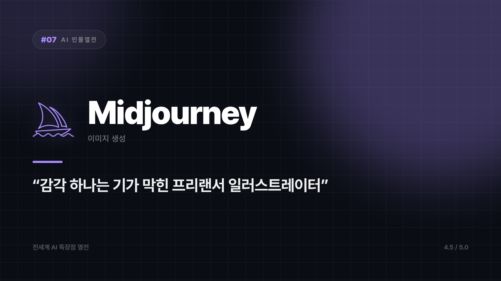

# Midjourney — "예술가 영혼을 장착한" 비주얼 끝판왕

*시리즈: 전세계 AI 특장점 열전 | 7/20 | 오늘의 주인공: Midjourney · 2026년 하반기 기준*

---

"비 오는 새벽, 도시, 좀 쓸쓸하게."

이 정도만 던져도 뭔가를 알아듣고 뽑아오는 쪽이 있다. 말수는 적은데 감각 하나는 기가 막힌 프리랜서 일러스트레이터. Midjourney가 그 캐릭터다.

디스코드 채널에서 시작해 지금은 독립 웹 플랫폼까지 갖췄고, 이미지 생성 AI 중 "그림체가 예쁘다"는 말을 가장 많이 듣는 이름이 됐다. 크리에이터들이 조용히 애용하는 쪽에 가깝다.

## 때깔에 진심이다

같은 프롬프트를 넣어도 '그림 같은 그림'이 나온다는 평가를 꾸준히 받아왔다. 콘셉트 아트, 무드보드, 브랜드 비주얼처럼 분위기가 결과물의 8할인 작업에서 특히 그렇다.

감으로만 찍는 도구도 아니다. `--style`, `--ar`, `--chaos` 같은 파라미터로 분위기를 꽤 정밀하게 조율할 수 있어서, 손에 익으면 원하는 톤앤매너를 겨냥해서 뽑아낼 수 있다. 처음엔 복불복 같다가 어느 순간부터 조종이 되는 종류의 도구다.

커뮤니티도 자산이다. 사용자들이 쌓아온 프롬프트와 결과물이 워낙 많아서, 특정 화풍이나 무드를 재현하는 노하우가 커뮤니티 차원에서 빠르게 돌고 쌓인다.

## 대신 글자는 못 쓴다

이미지 안에 텍스트를 정확히 넣어야 하는 작업, 그러니까 인포그래픽이나 문구가 들어간 배너라면 이쪽은 은근히 힘들어한다. 배경만 지우거나 특정 오브젝트만 손보는 식의 정밀 편집도 주종목이 아니다. 그건 다른 도구가 할 일이다.

반대로 블로그나 아티클의 대표 이미지처럼 감성이 필요한 자리, 사진이 아니라 그림이어야 하는 자리라면 대안을 찾기 어렵다. 이 시리즈의 대표 이미지들이 그렇게 나왔다.

말수는 적어도 그림으로 다 말하는 아티스트. 글자만 빼고.

⭐️⭐️⭐️⭐️⭐️ (4.5/5) — 비주얼 완성도 최상위권, 실용성보다 예술성에 특화.

---

*다음 편 예고: [AI 인물열전 #8] GitHub Copilot — "옆자리에서 계속 자동완성 쳐주는 페어프로그래머" 편.*

---

본문에 그림이 들어가면 좋을 자리는 아래와 같다. 실제 이미지는 아직 넣지 않았다.

〔이미지 자리 — 본문에서 1번째 특장점을 설명하는 대목〕

〔이미지 자리 — 본문에서 2번째 특장점을 설명하는 대목〕

〔이미지 자리 — 본문에서 3번째 특장점을 설명하는 대목〕

〔이미지 자리 — 총평 문단 바로 위〕
