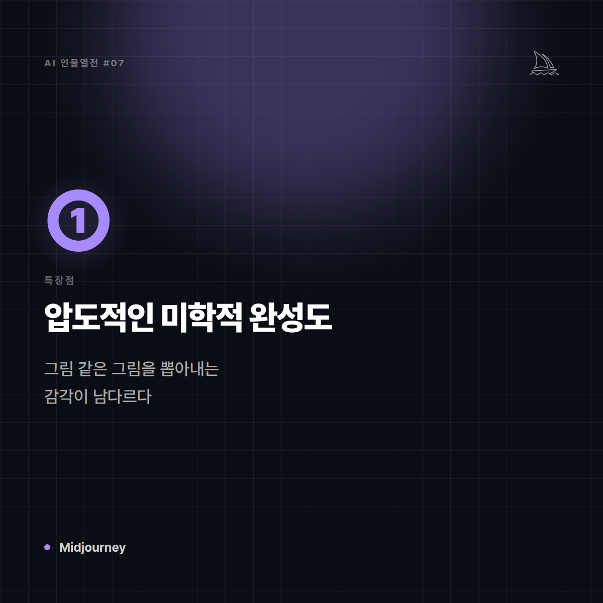
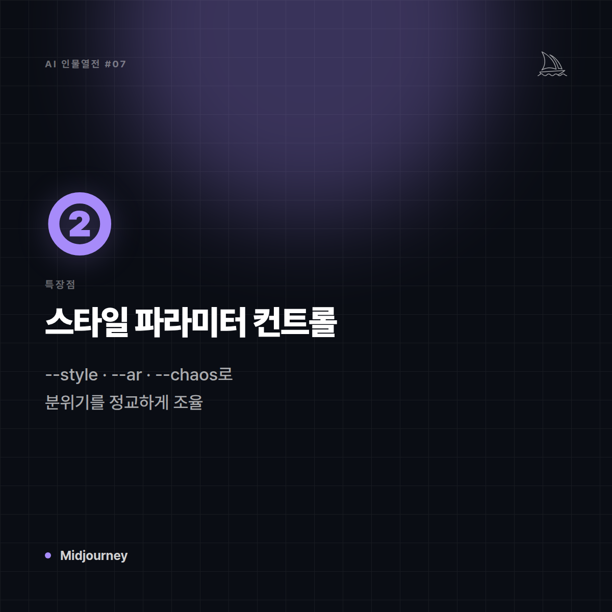
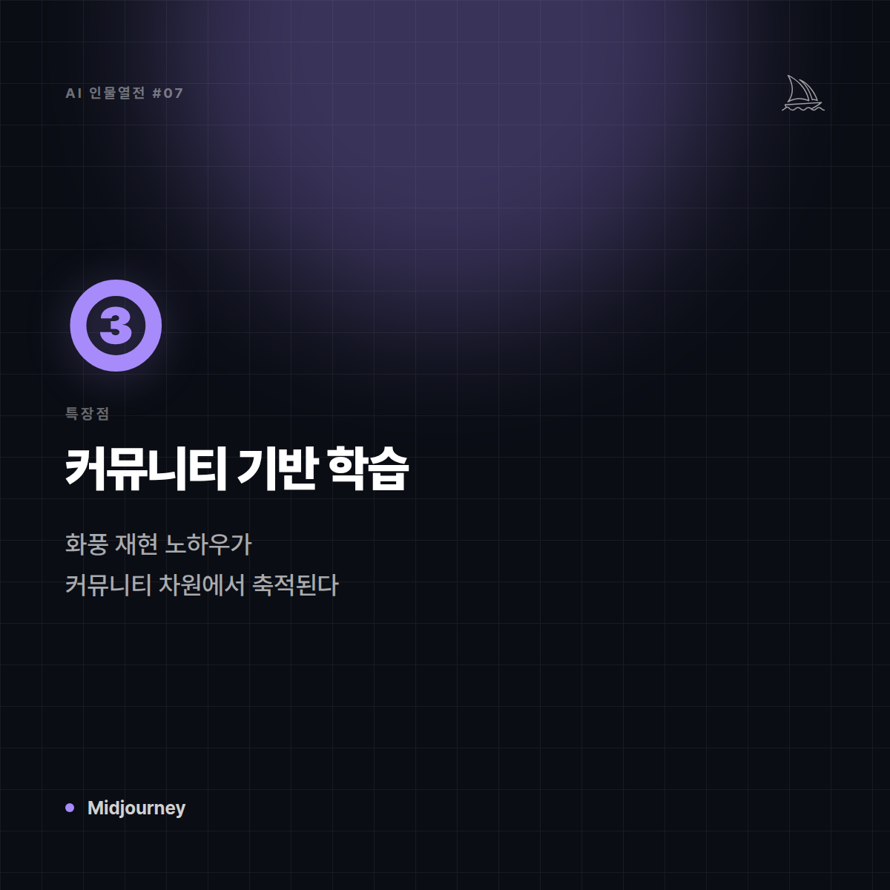
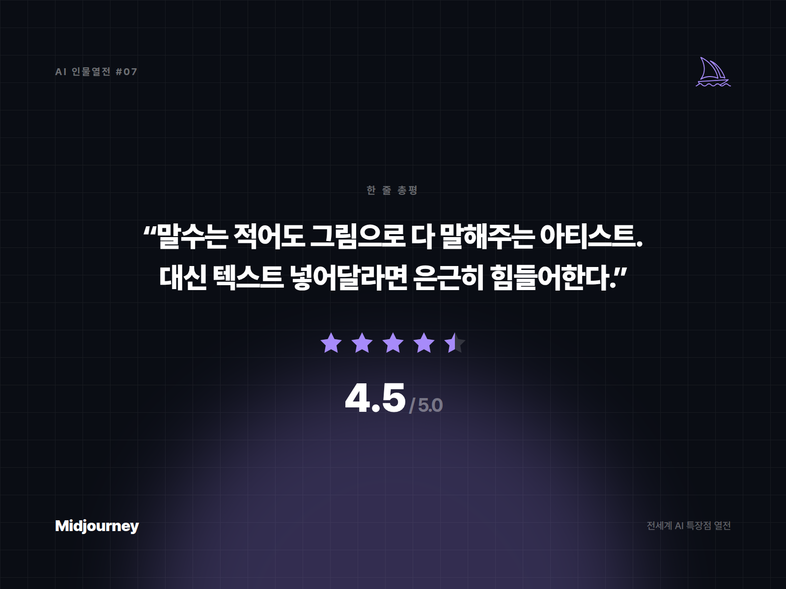

# [AI 인물열전 #7] Midjourney — "예술가 영혼을 장착한" 비주얼 끝판왕

*시리즈: 전세계 AI 특장점 열전 | 7/5 | 오늘의 주인공: Midjourney*

---

## 한 줄 소개

이미지 생성 AI 중에서도 "그림체가 예쁘다"는 평가를 가장 많이 받는 녀석. 디스코드 채널에서 시작해 지금은 독립 웹 플랫폼까지 갖춘, 크리에이터들의 은밀한(?) 최애 툴.

## 이 녀석은 이런 애다

비유하자면 Midjourney는 **말은 없지만 감각 하나는 기가 막힌 프리랜서 일러스트레이터**다. 디테일한 설명 없이 분위기만 던져줘도 "오, 이거 느낌 알겠다" 하면서 예술성 넘치는 결과물을 뽑아낸다. 실용성보다는 "때깔"에 진심인 타입.

## 특장점 3가지

**1. 압도적인 미학적 완성도**
다른 이미지 생성 AI 대비 '그림 같은 그림'을 뽑아내는 감각이 남다르다는 평가를 꾸준히 받아왔다. 콘셉트 아트, 무드보드, 브랜드 비주얼 작업에서 특히 강점을 보인다.

**2. 스타일 일관성 & 파라미터 컨트롤**
`--style`, `--ar`, `--chaos` 같은 세부 파라미터로 원하는 분위기를 정교하게 조율할 수 있다. 감으로 대충 찍는 게 아니라, 숙련되면 원하는 톤앤매너를 꽤 정밀하게 뽑아낼 수 있다.

**3. 커뮤니티 기반 스타일 학습**
수많은 사용자들이 만들어낸 프롬프트와 결과물이 쌓이면서, 특정 화풍이나 무드를 재현하는 노하우가 커뮤니티 차원에서 빠르게 축적되고 공유된다.

## 이럴 때 쓰면 좋다

- 콘셉트 아트, 무드보드, 브랜드 비주얼처럼 '분위기'가 중요한 작업
- 블로그·아티클용 감성적인 대표 이미지를 뽑고 싶을 때 (바로 이 시리즈처럼!)
- 실제 사진이 아닌 '그림 같은 그림'이 필요할 때

## 이럴 땐 살짝 비추

- 텍스트를 이미지 안에 정확히 삽입해야 하는 작업 (인포그래픽, 텍스트 포함 배너 등)
- 실사에 가까운 정밀한 편집(배경 제거, 특정 오브젝트만 수정)이 필요한 실무 작업

## 한 줄 총평

**"말수는 적어도 그림으로 다 말해주는 아티스트. 대신 텍스트 넣어달라고 하면 은근히 힘들어한다."**

⭐️⭐️⭐️⭐️⭐️ (4.5/5) — 비주얼 완성도 최상위권, 실용성보다 예술성에 특화.

---

*다음 편 예고: [AI 인물열전 #8] GitHub Copilot — "옆자리에서 계속 자동완성 쳐주는 페어프로그래머" 편에서 계속됩니다.*


---

## 🖼 이미지 (5장)

아래 이미지는 이 포스팅 전용으로 제작한 실제 이미지 파일입니다. 원본은 `images/07_Midjourney/` 폴더에 있습니다.

**대표 썸네일 (1600×900)**


**특장점 ① 카드 (1200×1200)**



**특장점 ② 카드 (1200×1200)**



**특장점 ③ 카드 (1200×1200)**



**총평 · 별점 카드 (1600×1200)**



---

## 🎨 이미지 생성 프롬프트 (5장)

아래 5개 프롬프트는 Midjourney, DALL·E, Stable Diffusion 등 이미지 생성 도구에 바로 사용할 수 있도록 작성했습니다. (공식 로고·스크린샷이 아닌, 포스팅 톤에 맞춘 창작 일러스트용입니다.)

**1. 대표 썸네일 — 캐릭터 비유 일러스트**
```
Editorial character illustration personifying Midjourney as "말수는 적지만 감각은 확실한 프리랜서 일러스트레이터",
rich jewel tones, artistic painterly tone, flat vector illustration with soft shadows,
tech-editorial magazine style, clean negative space for title text, 16:9 aspect ratio, no text, no logo
```

**2. 특장점 ① — 그림 같은 그림을 뽑아내는 압도적 미학**
```
Conceptual infographic-style illustration representing "그림 같은 그림을 뽑아내는 압도적 미학" for an AI tool review article,
rich jewel tones, artistic painterly tone, minimalist vector icons and abstract shapes, no text, no logo, square 1:1 aspect ratio
```

**3. 특장점 ② — 세부 파라미터로 조율하는 스타일 컨트롤**
```
Conceptual infographic-style illustration representing "세부 파라미터로 조율하는 스타일 컨트롤" for an AI tool review article,
rich jewel tones, artistic painterly tone, minimalist vector icons and abstract shapes, no text, no logo, square 1:1 aspect ratio
```

**4. 특장점 ③ — 커뮤니티가 함께 쌓아온 화풍 노하우**
```
Conceptual infographic-style illustration representing "커뮤니티가 함께 쌓아온 화풍 노하우" for an AI tool review article,
rich jewel tones, artistic painterly tone, minimalist vector icons and abstract shapes, no text, no logo, square 1:1 aspect ratio
```

**5. 총평 카드 — 별점 인포그래픽**
```
A minimal review-card style illustration with a star rating visual motif,
rich jewel tones, artistic painterly tone, flat design, rounded card layout, subtle gradient background,
space reserved for a one-line quote and star rating, no text, no logo, 4:3 aspect ratio
```
