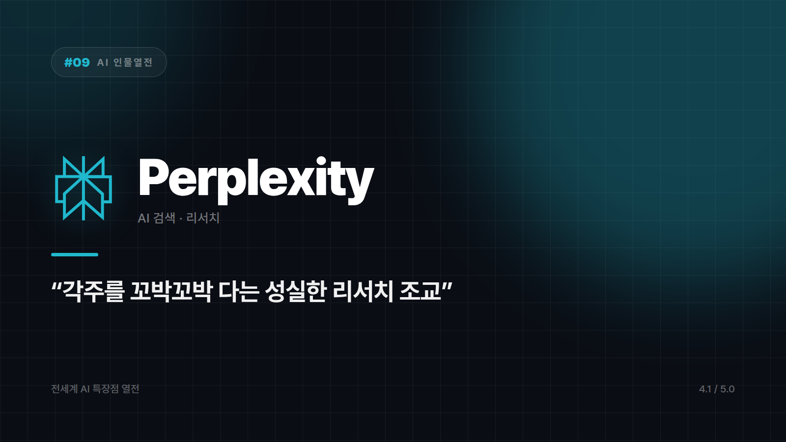

# Perplexity — 출처까지 딱딱 붙여주는 성실한 리서치 조교

*시리즈: 전세계 AI 특장점 열전 | 9/20 | 오늘의 주인공: Perplexity · 2026년 하반기 기준*

---

AI가 내놓은 답을 보고 한 번쯤 이런 생각을 한다. "이거 진짜야, 아니면 지어낸 거야?"

Perplexity는 그 질문을 미리 받아치는 쪽으로 설계됐다. 답을 주면서 "이건 여기서 가져왔어요"라며 링크를 같이 들이민다. 과제 낼 때 각주를 꼬박꼬박 다는 모범생 조교 같은 캐릭터다. "AI 검색엔진"이라는 카테고리를 사실상 대중화시킨 이름이기도 하다.

## 링크를 붙인다는 것의 무게

출처가 붙어 있으면 사용자가 직접 원문을 열어 확인할 수 있다. 별것 아닌 것 같지만, 이 한 가지가 "AI 말을 어디까지 믿어야 하나"라는 피로를 상당히 덜어준다. 틀린 답을 안 하는 게 아니라, 틀렸는지 확인할 수 있게 해주는 쪽이다. 그 차이는 꽤 크다.

요약도 검색과 자연스럽게 붙어 있다. 여러 웹 출처를 동시에 훑어서 핵심만 압축해준다. 브라우저 탭 열 개 띄워놓고 하나씩 읽다가 처음 뭘 찾으려 했는지 잊어버리는 그 코스를 건너뛸 수 있다.

인터페이스 자체도 조사라는 작업에 맞춰져 있다. 후속 질문, 관련 질문 추천 같은 요소가 잡담이 아니라 찾아보기 쪽으로 최적화돼 있다.

## 이런 일은 다른 데 맡기자

- 창작 글쓰기나 긴 스토리텔링 — 조사보다 대화가 필요한 작업이다
- 코드 작성이나 복잡한 소프트웨어 개발

반대로 신뢰할 출처가 반드시 필요한 리서치, 최신 이슈를 훑고 원문까지 확인해야 하는 상황, 여러 사이트를 오가며 정보를 짜맞춰야 하는 작업이라면 이쪽이 제일 빠르다.

묻는 말마다 참고문헌을 붙여주는 조교. 발표 전날 밤에 이 성실함의 가치를 알게 된다.

⭐️⭐️⭐️⭐️ (4.1/5) — 출처 신뢰도·리서치 효율 최강, 창작 작업은 원래 담당 분야가 아님.

---

*다음 편 예고: [AI 인물열전 #10] Notion AI — "이미 내 업무 문서 다 보고 있는 조용한 총무" 편.*

---

본문에 그림이 들어가면 좋을 자리는 아래와 같다. 실제 이미지는 아직 넣지 않았다.

〔이미지 자리 — 본문에서 1번째 특장점을 설명하는 대목〕

〔이미지 자리 — 본문에서 2번째 특장점을 설명하는 대목〕

〔이미지 자리 — 본문에서 3번째 특장점을 설명하는 대목〕

〔이미지 자리 — 총평 문단 바로 위〕
