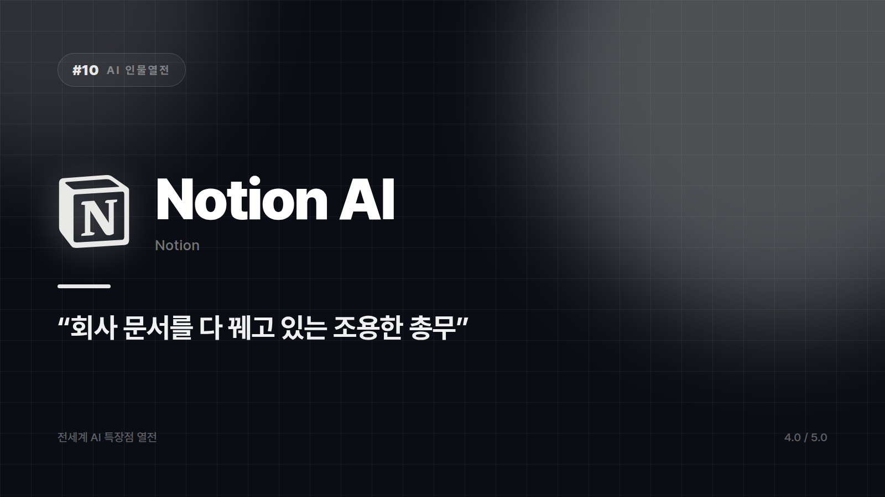

# [AI 인물열전 #10] Notion AI — 이미 내 업무 문서 다 보고 있는 조용한 총무

*시리즈: 전세계 AI 특장점 열전 | 10/20 | 오늘의 주인공: Notion AI · 2026년 하반기 기준*

---

조건부터 말하는 게 정직할 것 같다. Notion을 안 쓰는 팀이라면 이 편은 그냥 구경이다. Notion AI의 매력은 전부 Notion 안에서 나오고, 밖으로 나오면 그냥 평범한 AI가 된다.

Notion을 쓰는 팀이라면 얘기가 완전히 달라진다.

## 회사 문서를 제일 잘 아는 사람

Notion AI는 메모·문서·프로젝트 관리 툴 안에 살면서, 그동안 쌓인 회의록과 기획서와 위키 문서를 다 읽고 있다. 나서서 떠들지 않다가 "저번 회의록 요약 좀"이라고 하면 바로 내놓는 총무 직원 캐릭터다. 새로운 걸 만들어내기보다 이미 있는 걸 정리하고 다듬는 쪽에 특화돼 있다.

그래서 매번 배경 설명을 처음부터 다시 할 필요가 없다. 이미 작성된 페이지와 DB, 프로젝트 문서를 참고해서 "우리 팀 문서 기준으로" 답한다. 다른 AI에게 우리 회사 사정을 설명하다 지쳐본 적이 있다면 이게 무슨 뜻인지 안다.

회의록 요약, 액션 아이템 추출, 문구 다듬기, 번역까지 문서 작업의 앞뒤가 전부 같은 화면 안에서 끝난다. 창을 옮기지 않아도 된다는 조건이 붙으면 사람들은 실제로 그 기능을 쓴다.

부수 효과도 있다. 프로젝트 관리 도구에 AI가 붙어 있으니 팀원마다 제각각이던 AI 사용 방식이 자연스럽게 비슷해진다. 누구는 쓰고 누구는 안 쓰는 식의 파편화가 덜하다.

기대를 접어야 할 곳도 분명하다. 자유롭게 튀는 브레인스토밍은 이쪽 전공이 아니다. 정리와 요약이 목적일 때 강점이 산다.

화려하게 나서지 않는데, 없어지면 그때 알게 되는 종류의 존재다.

⭐️⭐️⭐️⭐ (4.0/5) — 문서 기반 업무 자동화 최적화, Notion 생태계 밖에선 매력 반감.

## 시리즈를 마치며

열 명을 만나고 나니 남는 건 순위표가 아니라 인상착의다. 만능이지만 전문가는 아닌 친구, 회식보다 회의실에서 빛나는 동료, 회식에서만 빛나는 친구, 청바지 입고 나타난 신입, 글자만 못 쓰는 화가.

제일 좋은 AI를 묻는 질문에는 답이 잘 안 나온다. 지금 내 책상 위에 놓인 일에 누가 맞는지를 물으면 답이 금방 나온다. 승부는 거기서 갈린다.

---

*시리즈 전체 목록: 01 ChatGPT · 02 Claude · 03 Gemini · 04 Grok · 05 DeepSeek · 06 Canva · 07 Midjourney · 08 GitHub Copilot · 09 Perplexity · 10 Notion AI*

*다음 편 예고: Microsoft Copilot — 입사 첫날 사내 시스템을 다 꿰찬 신입 비서 편.*

---

본문에 그림이 들어가면 좋을 자리는 아래와 같다. 실제 이미지는 아직 넣지 않았다.

〔이미지 자리 — 본문에서 1번째 특장점을 설명하는 대목〕

〔이미지 자리 — 본문에서 2번째 특장점을 설명하는 대목〕

〔이미지 자리 — 본문에서 3번째 특장점을 설명하는 대목〕

〔이미지 자리 — 총평 문단 바로 위〕
