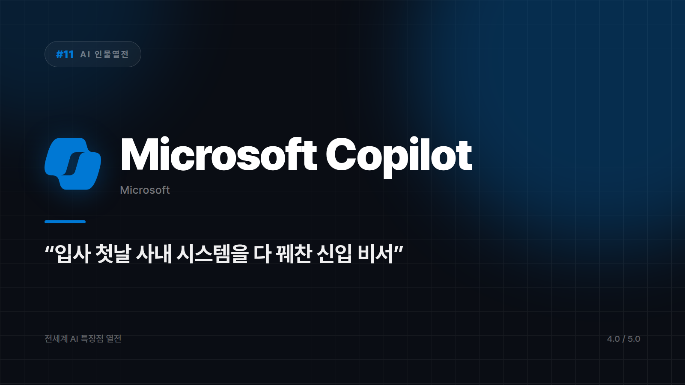
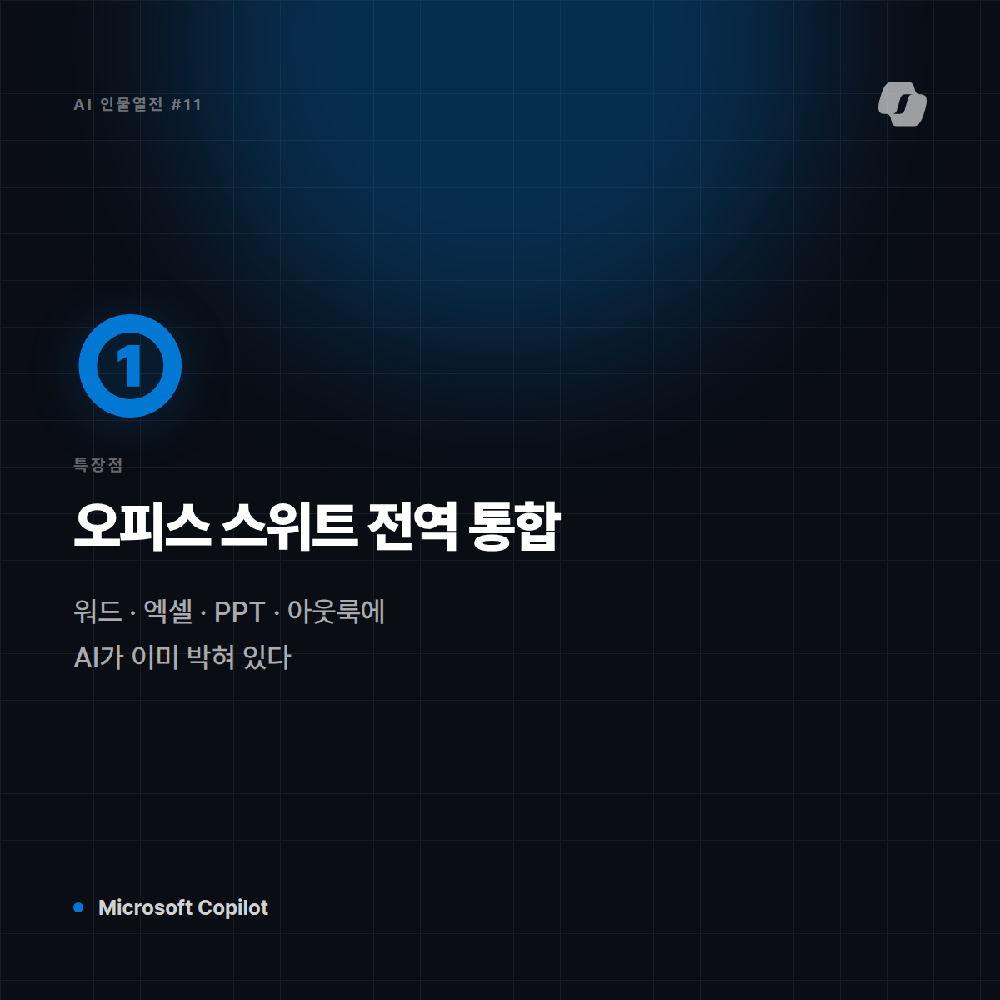
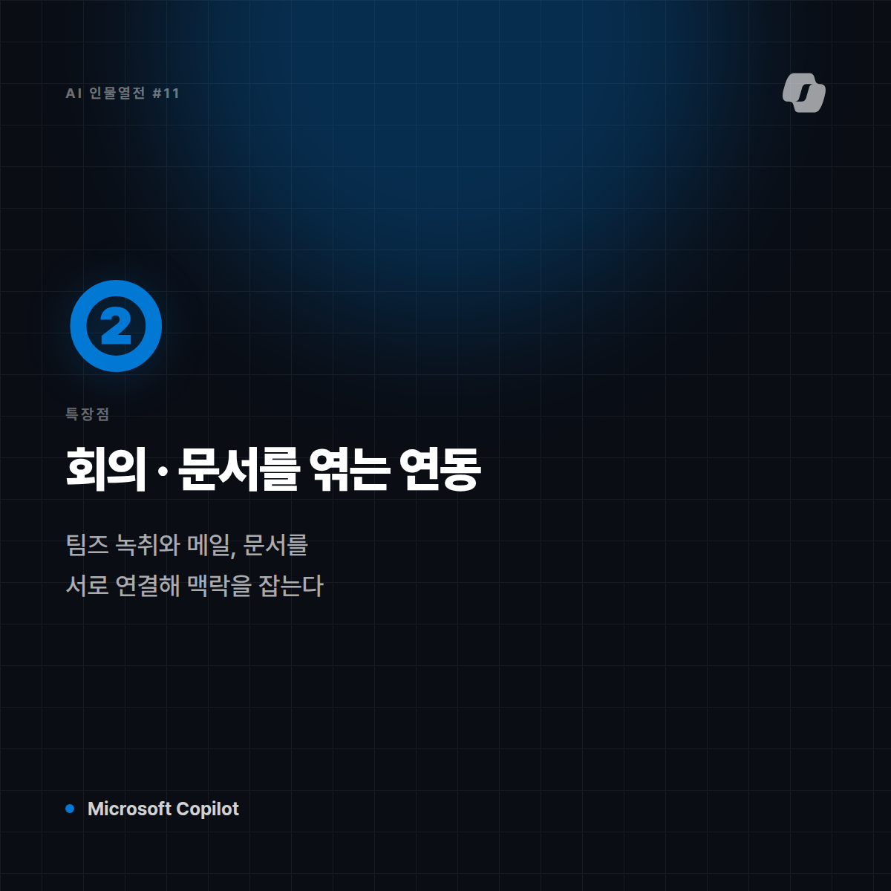
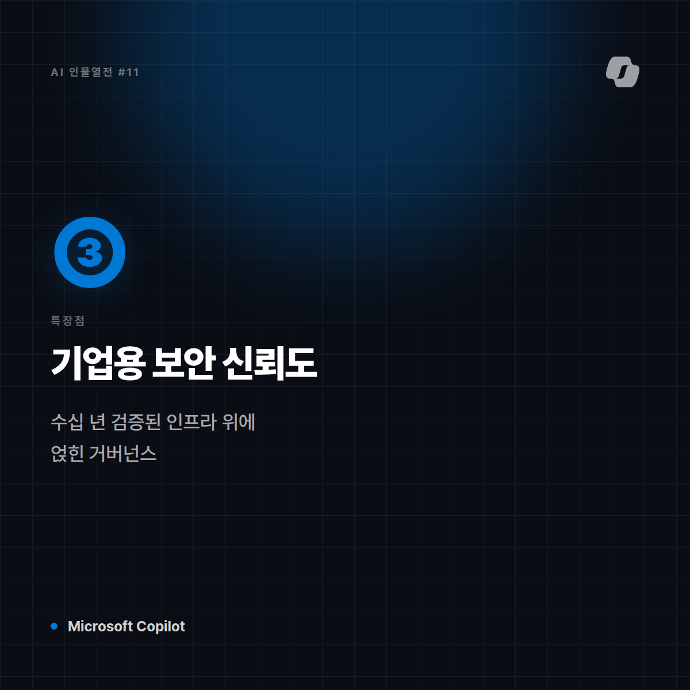
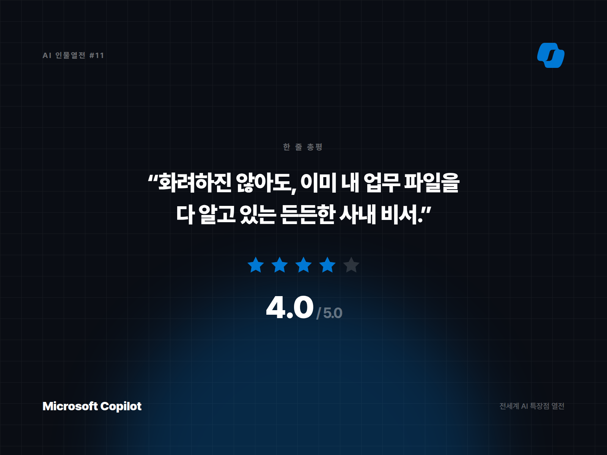

# [AI 인물열전 #11] Microsoft Copilot (365) — 엑셀·워드·아웃룩에 이미 눌러앉은 사내 비서

*시리즈: 전세계 AI 특장점 열전 | 11/10 (시즌2 시작) | 오늘의 주인공: Microsoft Copilot*

---

## 한 줄 소개

워드, 엑셀, 파워포인트, 아웃룩, 팀즈 — 전 세계 회사원 절반이 켜놓고 사는 그 프로그램들 안에 통째로 들어앉은 AI. GitHub Copilot이 개발자 옆자리 짝꿍이라면, 이 녀석은 회사 전체를 도는 만능 비서다.

## 이 녀석은 이런 애다

비유하자면 Microsoft Copilot은 **입사한 지 하루 만에 사내 시스템을 다 꿰찬 신입 비서**다. "이 회의록 요약해줘", "이 데이터로 표 좀 만들어줘", "이 메일 정중하게 다시 써줘"를 하나의 로그인으로 전부 해결해준다. 여러 앱을 오갈 필요가 없다는 게 핵심.

## 특장점 3가지

**1. 오피스 스위트 전역 통합**
엑셀 수식 추천부터 파워포인트 슬라이드 자동 생성, 아웃룩 메일 요약까지 — 업무 툴 전 영역에 AI가 이미 박혀 있다. 새로운 도구를 배울 필요 없이 쓰던 화면 그대로 써먹을 수 있다.

**2. 회의·문서 데이터를 엮는 능력 (Microsoft Graph 연동)**
팀즈 회의 녹취, 이메일, 문서를 서로 연결해 맥락을 파악한다. "지난주 그 프로젝트 관련 파일 다 모아줘" 같은 요청에 강하다.

**3. 기업용 보안·거버넌스 신뢰도**
대기업들이 이미 수십 년간 써온 보안 인프라 위에 얹힌 만큼, 엔터프라이즈 IT 담당자 입장에서 "도입해도 되는 AI"로서의 신뢰도가 높다.

## 이럴 때 쓰면 좋다

- 이미 마이크로소프트 365를 쓰고 있는 회사/팀
- 반복적인 문서·보고서·이메일 작업을 자동화하고 싶을 때
- 회의록부터 후속 업무까지 한 번에 정리하고 싶을 때

## 이럴 땐 살짝 비추

- 구글 워크스페이스나 다른 생태계를 쓰는 조직 (연동 시너지 반감)
- 창의적이고 자유분방한 콘텐츠 창작 작업

## 한 줄 총평

**"화려하진 않아도, 이미 내 업무 파일을 다 알고 있는 든든한 사내 비서."**

⭐️⭐️⭐️⭐ (4.0/5) — 기업 업무 자동화 최강자, 개인 창작용으로는 심심할 수 있음.

---

*다음 편 예고: [AI 인물열전 #12] Cursor — "IDE를 통째로 삼켜버린" 코딩 에이전트 편에서 계속됩니다.*


---

## 🖼 이미지 (5장)

아래 이미지는 이 포스팅 전용으로 제작한 실제 이미지 파일입니다. 원본은 `images/11_MicrosoftCopilot/` 폴더에 있습니다.

**대표 썸네일 (1600×900)**



**특장점 ① 카드 (1200×1200)**



**특장점 ② 카드 (1200×1200)**



**특장점 ③ 카드 (1200×1200)**



**총평 · 별점 카드 (1600×1200)**



---

## 🎨 이미지 생성 프롬프트 (5장)

아래 5개 프롬프트는 Midjourney, DALL·E, Stable Diffusion 등 이미지 생성 도구에 바로 사용할 수 있도록 작성했습니다. (공식 로고·스크린샷이 아닌, 포스팅 톤에 맞춘 창작 일러스트용입니다.)

**1. 대표 썸네일 — 캐릭터 비유 일러스트**
```
Editorial character illustration personifying Microsoft Copilot as "입사 첫날 사내 시스템을 다 꿰찬 신입 비서",
corporate blue and white, professional polished tone, flat vector illustration with soft shadows,
tech-editorial magazine style, clean negative space for title text, 16:9 aspect ratio, no text, no logo
```

**2. 특장점 ① — 워드·엑셀·파워포인트·아웃룩 전역 통합**
```
Conceptual infographic-style illustration representing "워드·엑셀·파워포인트·아웃룩 전역 통합" for an AI tool review article,
corporate blue and white, professional polished tone, minimalist vector icons and abstract shapes, no text, no logo, square 1:1 aspect ratio
```

**3. 특장점 ② — 회의·메일·문서를 엮는 Microsoft Graph 연동**
```
Conceptual infographic-style illustration representing "회의·메일·문서를 엮는 Microsoft Graph 연동" for an AI tool review article,
corporate blue and white, professional polished tone, minimalist vector icons and abstract shapes, no text, no logo, square 1:1 aspect ratio
```

**4. 특장점 ③ — 대기업이 신뢰하는 보안·거버넌스**
```
Conceptual infographic-style illustration representing "대기업이 신뢰하는 보안·거버넌스" for an AI tool review article,
corporate blue and white, professional polished tone, minimalist vector icons and abstract shapes, no text, no logo, square 1:1 aspect ratio
```

**5. 총평 카드 — 별점 인포그래픽**
```
A minimal review-card style illustration with a star rating visual motif,
corporate blue and white, professional polished tone, flat design, rounded card layout, subtle gradient background,
space reserved for a one-line quote and star rating, no text, no logo, 4:3 aspect ratio
```
