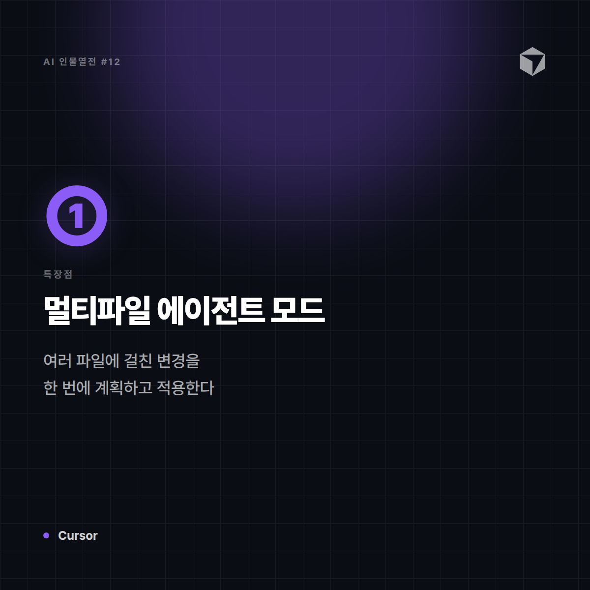
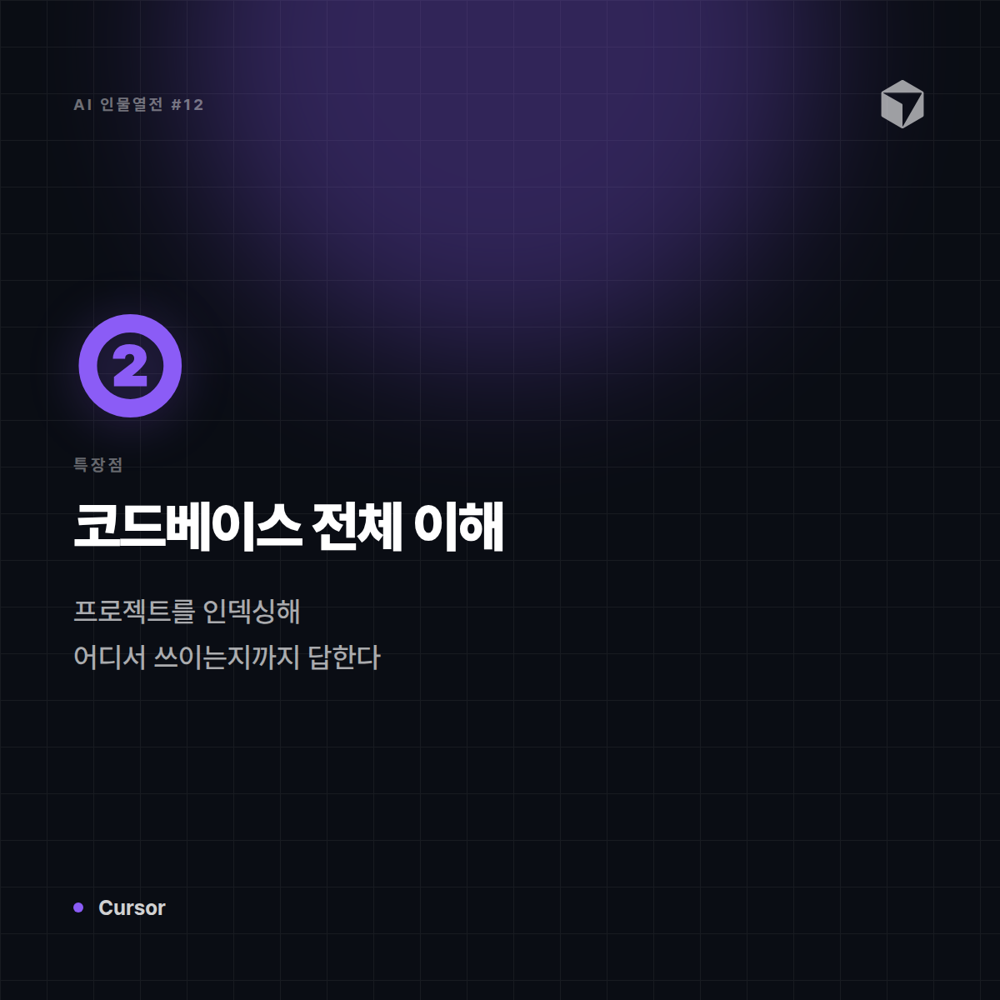
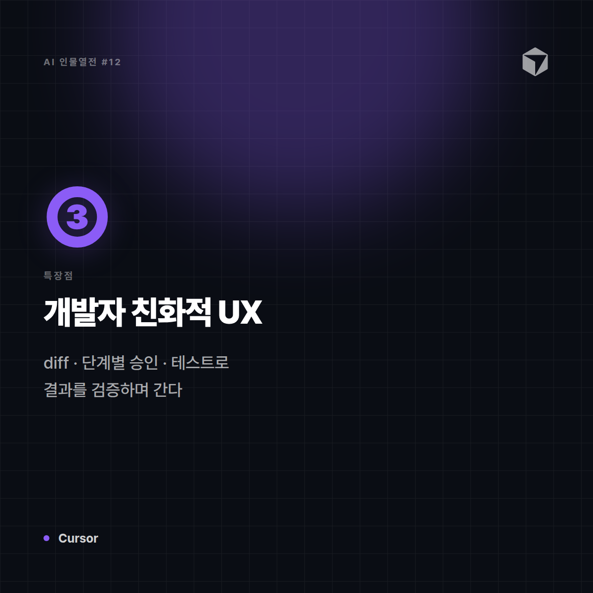
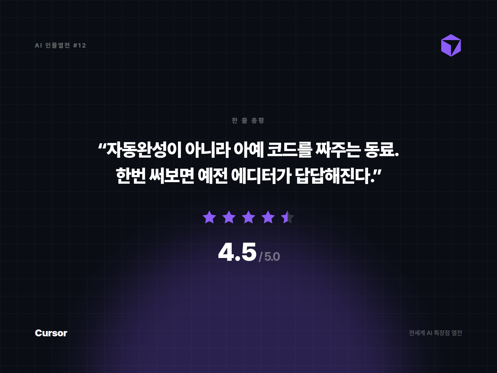

# [AI 인물열전 #12] Cursor — IDE를 통째로 삼켜버린 코딩 에이전트

*시리즈: 전세계 AI 특장점 열전 | 12/10 | 오늘의 주인공: Cursor*

---

## 한 줄 소개

"자동완성 정도로는 부족하다"는 생각에서 출발해, 아예 코드 에디터 자체를 AI 중심으로 새로 만든 녀석. 개발자들 사이에서 "한 번 쓰면 못 돌아간다"는 말이 나올 정도로 팬덤이 두텁다.

## 이 녀석은 이런 애다

비유하자면 Cursor는 **옆자리 동료를 넘어 아예 키보드를 같이 잡고 있는 페어프로그래머**다. 코드 한 줄 자동완성 수준이 아니라, "이 버그 고쳐줘", "이 기능 통째로 만들어줘"라고 하면 여러 파일을 오가며 직접 수정까지 해낸다.

## 특장점 3가지

**1. 멀티파일 편집 & 에이전트 모드**
단순 자동완성을 넘어, 여러 파일에 걸친 변경사항을 한 번에 계획하고 적용한다. "이 함수 이름 바꾸고 관련된 곳 다 고쳐줘" 같은 요청을 진짜로 끝까지 해낸다.

**2. 코드베이스 전체를 이해하는 맥락 파악**
프로젝트 전체 구조를 인덱싱해서, "이거 어디서 쓰이고 있어?" 같은 질문에도 정확히 답한다. 파일 하나만 보는 게 아니라 프로젝트 전체를 놓고 일하는 느낌.

**3. 개발자 워크플로우에 최적화된 UX**
diff 보기, 단계별 승인, 자동 테스트 실행까지 — 실제 개발자가 코드를 검증하고 병합하는 흐름 그대로 AI 작업 결과를 확인할 수 있게 설계돼 있다.

## 이럴 때 쓰면 좋다

- 여러 파일에 걸친 리팩토링이나 신규 기능 개발을 AI에 통째로 맡기고 싶을 때
- 프로젝트 전체 맥락을 이해하는 AI와 함께 코딩하고 싶을 때
- 자동완성 이상의 '진짜 작업 수행'을 원할 때

## 이럴 땐 살짝 비추

- 코딩과 무관한 문서·기획 작업
- 기존에 쓰던 IDE·플러그인 생태계에서 벗어나기 싫을 때 (에디터 자체를 갈아타야 함)

## 한 줄 총평

**"자동완성이 아니라 아예 코드를 대신 짜주는 동료. 한번 써보면 예전 에디터가 답답해진다."**

⭐️⭐️⭐️⭐️⭐️ (4.5/5) — 실질적인 코드 작업 수행력 최상위권, 에디터 자체를 바꿔야 하는 진입장벽 존재.

---

*다음 편 예고: [AI 인물열전 #13] Character.AI — "각자 취향대로 만드는 나만의 캐릭터" 편에서 계속됩니다.*


---

## 🖼 이미지 (5장)

아래 이미지는 이 포스팅 전용으로 제작한 실제 이미지 파일입니다. 원본은 `images/12_Cursor/` 폴더에 있습니다.

**대표 썸네일 (1600×900)**


**특장점 ① 카드 (1200×1200)**



**특장점 ② 카드 (1200×1200)**



**특장점 ③ 카드 (1200×1200)**



**총평 · 별점 카드 (1600×1200)**



---

## 🎨 이미지 생성 프롬프트 (5장)

아래 5개 프롬프트는 Midjourney, DALL·E, Stable Diffusion 등 이미지 생성 도구에 바로 사용할 수 있도록 작성했습니다. (공식 로고·스크린샷이 아닌, 포스팅 톤에 맞춘 창작 일러스트용입니다.)

**1. 대표 썸네일 — 캐릭터 비유 일러스트**
```
Editorial character illustration personifying Cursor as "아예 키보드를 같이 잡은 페어프로그래머",
sleek dark IDE aesthetic with violet accents, precise technical tone, flat vector illustration with soft shadows,
tech-editorial magazine style, clean negative space for title text, 16:9 aspect ratio, no text, no logo
```

**2. 특장점 ① — 여러 파일을 한 번에 고치는 멀티파일 에이전트 모드**
```
Conceptual infographic-style illustration representing "여러 파일을 한 번에 고치는 멀티파일 에이전트 모드" for an AI tool review article,
sleek dark IDE aesthetic with violet accents, precise technical tone, minimalist vector icons and abstract shapes, no text, no logo, square 1:1 aspect ratio
```

**3. 특장점 ② — 프로젝트 전체를 이해하는 코드베이스 인덱싱**
```
Conceptual infographic-style illustration representing "프로젝트 전체를 이해하는 코드베이스 인덱싱" for an AI tool review article,
sleek dark IDE aesthetic with violet accents, precise technical tone, minimalist vector icons and abstract shapes, no text, no logo, square 1:1 aspect ratio
```

**4. 특장점 ③ — diff·단계별 승인 등 개발자 친화적 UX**
```
Conceptual infographic-style illustration representing "diff·단계별 승인 등 개발자 친화적 UX" for an AI tool review article,
sleek dark IDE aesthetic with violet accents, precise technical tone, minimalist vector icons and abstract shapes, no text, no logo, square 1:1 aspect ratio
```

**5. 총평 카드 — 별점 인포그래픽**
```
A minimal review-card style illustration with a star rating visual motif,
sleek dark IDE aesthetic with violet accents, precise technical tone, flat design, rounded card layout, subtle gradient background,
space reserved for a one-line quote and star rating, no text, no logo, 4:3 aspect ratio
```
