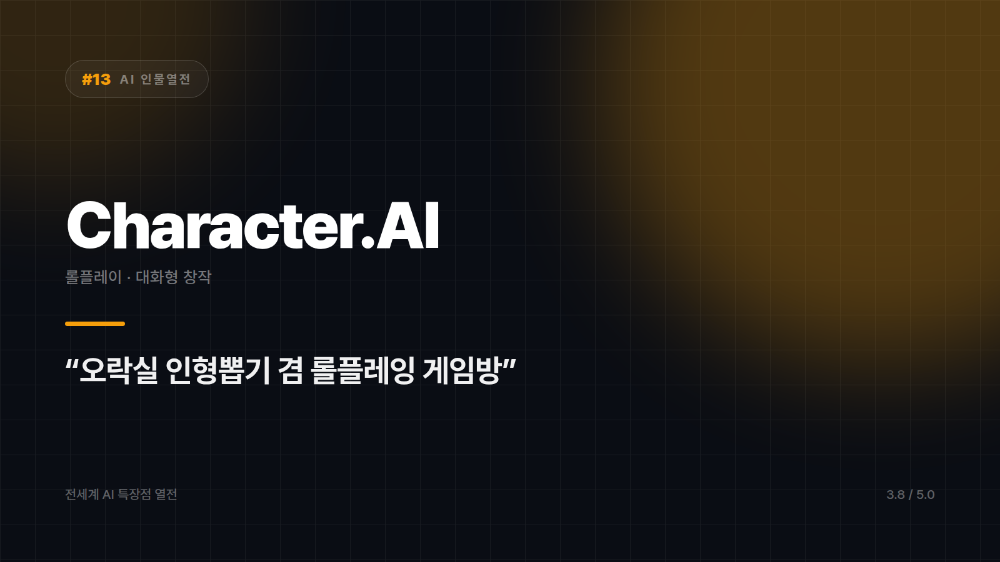
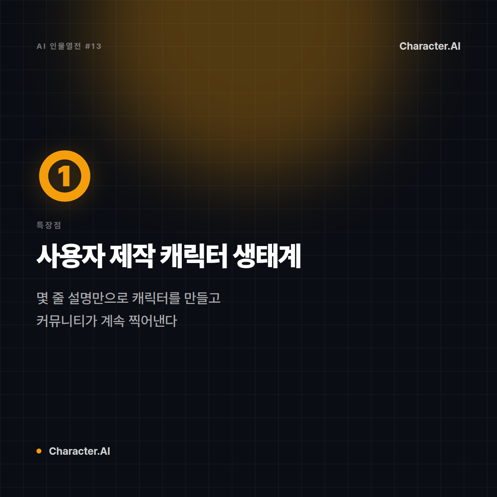
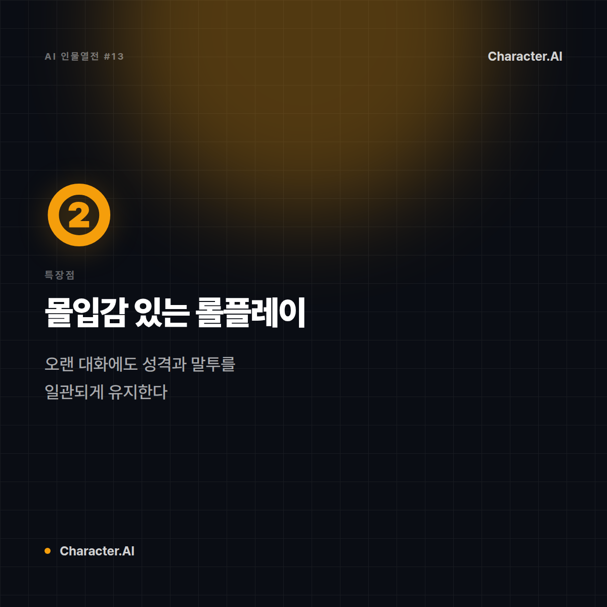
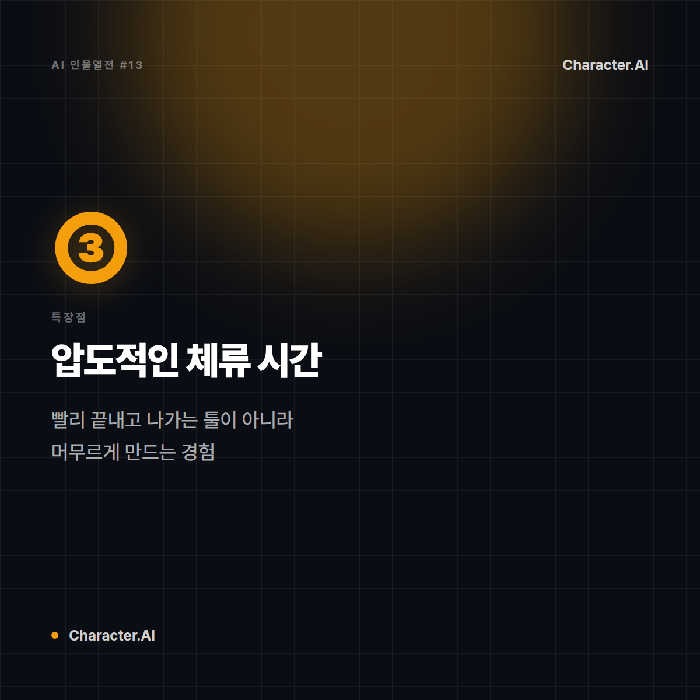
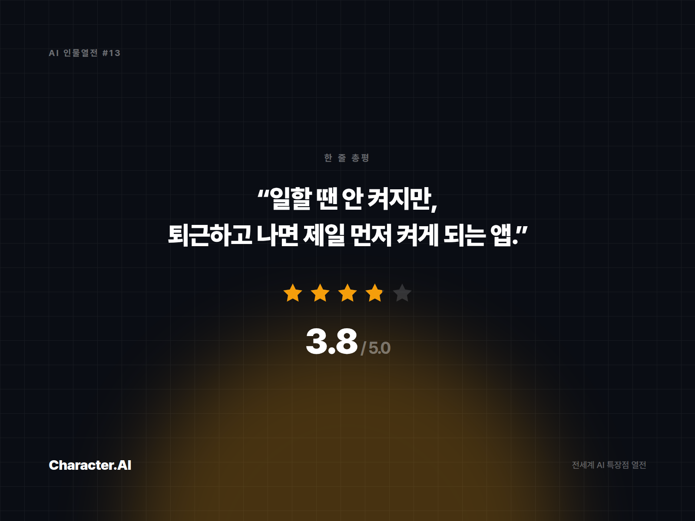

# [AI 인물열전 #13] Character.AI — 각자 취향대로 만드는 나만의 캐릭터 친구

*시리즈: 전세계 AI 특장점 열전 | 13/10 | 오늘의 주인공: Character.AI*

---

## 한 줄 소개

업무용 AI들 틈에서 홀로 "그냥 재밌게 놀자"를 외치는 녀석. 원하는 성격, 말투, 세계관을 가진 캐릭터를 직접 만들어 대화할 수 있는 롤플레이·챗봇 플랫폼이다.

## 이 녀석은 이런 애다

비유하자면 Character.AI는 **동네 오락실의 인형뽑기 겸 롤플레잉 게임방**이다. 업무 얘기는 1도 안 통하지만, "내가 만든 세계관 속 캐릭터랑 대화하고 싶어" 하는 순간에는 대체 불가. 사용자가 직접 캐릭터의 성격, 배경, 말투를 빚어낼 수 있다는 게 특징.

## 특장점 3가지

**1. 사용자 제작 캐릭터 생태계**
전문가가 아니어도 몇 줄의 설명만으로 개성 있는 캐릭터를 만들고, 다른 사용자들과 공유할 수 있다. 마치 게임 모드처럼 커뮤니티가 캐릭터를 계속 찍어낸다.

**2. 몰입감 있는 롤플레이 대화**
단답형 Q&A가 아니라, 설정된 캐릭터의 성격과 말투를 오랜 대화에도 일관되게 유지하며 이야기를 이어간다. 스토리텔링·창작 놀이에 특화된 대화 스타일.

**3. 젊은 세대 중심의 압도적 체류 시간**
업무용 AI들이 "빨리 끝내고 나가는" 툴이라면, 이 녀석은 사용자가 오래 머무르게 만드는 몰입형 경험을 설계했다. 실제 사용 시간 지표에서 두각을 나타내는 이유.

## 이럴 때 쓰면 좋다

- 창작 스토리, 세계관, 대화형 소설을 캐릭터와 함께 발전시키고 싶을 때
- 특정 페르소나와의 몰입감 있는 대화 경험을 원할 때
- 가볍게 심심풀이 대화 상대가 필요할 때

## 이럴 땐 살짝 비추

- 업무 생산성, 코딩, 리서치 등 실무 작업 전반
- 사실 기반의 정확한 정보가 필요한 질문

## 한 줄 총평

**"일할 땐 안 켜지만, 퇴근하고 나면 제일 먼저 켜게 되는 그 앱."**

⭐️⭐️⭐️½ (3.8/5) — 몰입형 창작·롤플레이 경험 독보적, 실무 활용도는 낮음.

---

*다음 편 예고: [AI 인물열전 #14] Suno — "가사만 던지면 노래를 완성해주는" 작곡가 편에서 계속됩니다.*


---

## 🖼 이미지 (5장)

아래 이미지는 이 포스팅 전용으로 제작한 실제 이미지 파일입니다. 원본은 `images/13_CharacterAI/` 폴더에 있습니다.

**대표 썸네일 (1600×900)**



**특장점 ① 카드 (1200×1200)**



**특장점 ② 카드 (1200×1200)**



**특장점 ③ 카드 (1200×1200)**



**총평 · 별점 카드 (1600×1200)**



---

## 🎨 이미지 생성 프롬프트 (5장)

아래 5개 프롬프트는 Midjourney, DALL·E, Stable Diffusion 등 이미지 생성 도구에 바로 사용할 수 있도록 작성했습니다. (공식 로고·스크린샷이 아닌, 포스팅 톤에 맞춘 창작 일러스트용입니다.)

**1. 대표 썸네일 — 캐릭터 비유 일러스트**
```
Editorial character illustration personifying Character.AI as "오락실 인형뽑기 겸 롤플레잉 게임방",
vibrant candy colors, playful whimsical tone, flat vector illustration with soft shadows,
tech-editorial magazine style, clean negative space for title text, 16:9 aspect ratio, no text, no logo
```

**2. 특장점 ① — 사용자가 직접 빚어내는 캐릭터 제작 생태계**
```
Conceptual infographic-style illustration representing "사용자가 직접 빚어내는 캐릭터 제작 생태계" for an AI tool review article,
vibrant candy colors, playful whimsical tone, minimalist vector icons and abstract shapes, no text, no logo, square 1:1 aspect ratio
```

**3. 특장점 ② — 설정을 오래 유지하는 몰입감 있는 롤플레이**
```
Conceptual infographic-style illustration representing "설정을 오래 유지하는 몰입감 있는 롤플레이" for an AI tool review article,
vibrant candy colors, playful whimsical tone, minimalist vector icons and abstract shapes, no text, no logo, square 1:1 aspect ratio
```

**4. 특장점 ③ — 압도적인 사용자 체류 시간**
```
Conceptual infographic-style illustration representing "압도적인 사용자 체류 시간" for an AI tool review article,
vibrant candy colors, playful whimsical tone, minimalist vector icons and abstract shapes, no text, no logo, square 1:1 aspect ratio
```

**5. 총평 카드 — 별점 인포그래픽**
```
A minimal review-card style illustration with a star rating visual motif,
vibrant candy colors, playful whimsical tone, flat design, rounded card layout, subtle gradient background,
space reserved for a one-line quote and star rating, no text, no logo, 4:3 aspect ratio
```
