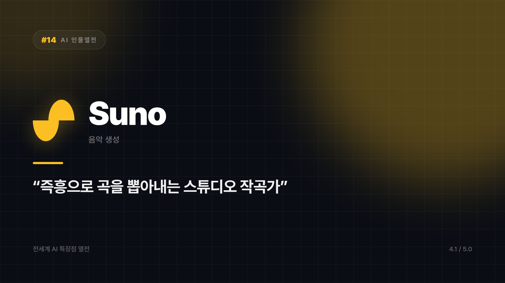
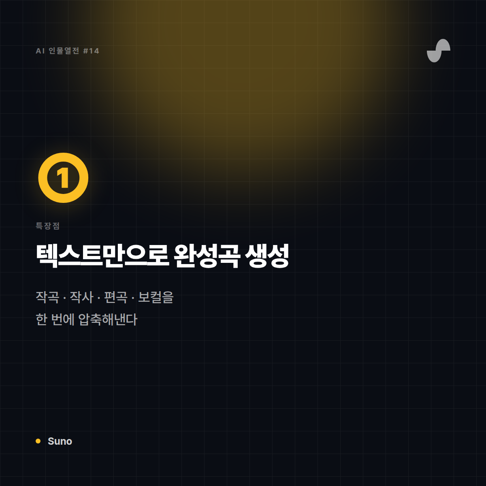
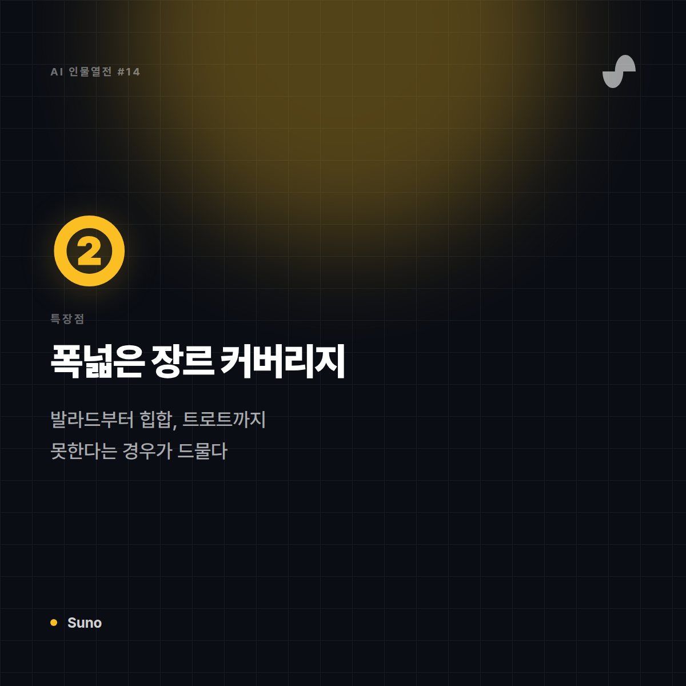
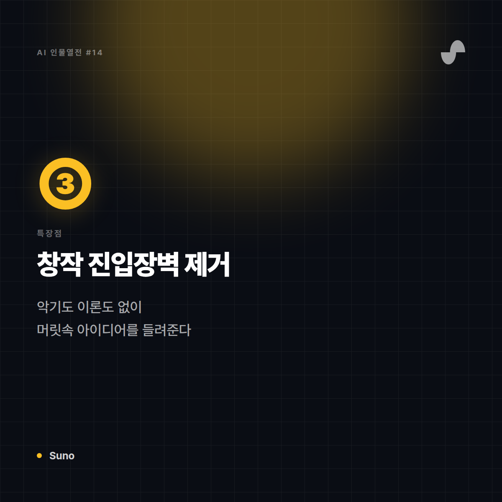
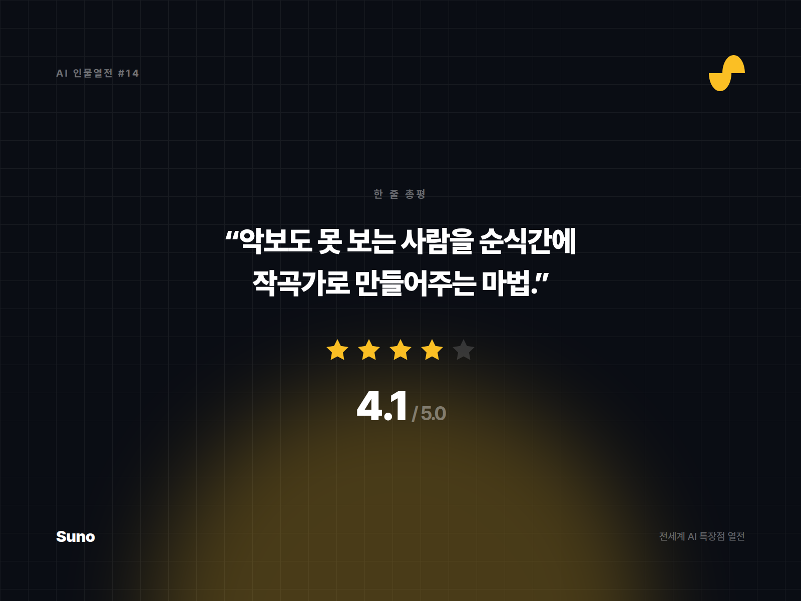

# [AI 인물열전 #14] Suno — 가사만 던지면 노래를 완성해주는 즉석 작곡가

*시리즈: 전세계 AI 특장점 열전 | 14/10 | 오늘의 주인공: Suno*

---

## 한 줄 소개

"나 작곡 하나도 모르는데 노래 만들고 싶어"라는 소망을 실현시켜준 AI 음악 생성 서비스. 장르와 가사, 분위기만 던지면 진짜 '노래'가 완성된 채로 나온다.

## 이 녀석은 이런 애다

비유하자면 Suno는 **동네 스튜디오에 앉아있는 즉흥 작곡가 겸 세션 밴드**다. "발라드 느낌으로, 이런 가사로 만들어줘" 하면 멜로디부터 보컬, 반주까지 몇 분 만에 뚝딱 완성해서 들려준다. 악보 볼 줄 몰라도 전혀 상관없다.

## 특장점 3가지

**1. 텍스트만으로 완성곡 생성**
가사와 장르 키워드만 입력하면 보컬이 실린 완성된 곡을 만들어낸다. 작곡·작사·편곡·보컬 녹음까지의 전체 과정을 AI가 한 번에 압축해낸 셈.

**2. 압도적으로 다양한 장르 커버리지**
발라드, 힙합, 록, 트로트에 이르기까지 폭넓은 장르 스타일을 소화한다. "이런 느낌 장르는 잘 못해요" 하는 경우가 드물다.

**3. 개인 창작의 진입장벽을 없앰**
악기를 배우거나 작곡 이론을 몰라도, 머릿속 아이디어를 몇 분 안에 실제 '들을 수 있는 곡'으로 만들어볼 수 있다. 취미 창작자에게는 혁명에 가까운 경험.

## 이럴 때 쓰면 좋다

- 유튜브·SNS 콘텐츠용 배경음악이나 로고송을 빠르게 만들고 싶을 때
- 가사만 있고 곡을 만들 줄 모르는 아마추어 창작자
- 특정 컨셉의 데모곡을 빠르게 뽑아 아이디어를 검증하고 싶을 때

## 이럴 땐 살짝 비추

- 상업적 발매를 전제로 한 정교한 프로듀싱 (믹싱·마스터링 디테일은 전문가 손길이 필요)
- 저작권 이슈가 민감한 상업 프로젝트 (사용 정책 사전 확인 필수)

## 한 줄 총평

**"악보도 못 보는 사람을 순식간에 작곡가로 만들어주는 마법. 단, 데뷔는 본인 몫."**

⭐️⭐️⭐️⭐ (4.1/5) — 창작 진입장벽 제거 최강, 프로급 프로듀싱은 아직 사람 손길 필요.

---

*다음 편 예고: [AI 인물열전 #15] ElevenLabs — "목소리 자체를 복제하는" 성우 편에서 계속됩니다.*


---

## 🖼 이미지 (5장)

아래 이미지는 이 포스팅 전용으로 제작한 실제 이미지 파일입니다. 원본은 `images/14_Suno/` 폴더에 있습니다.

**대표 썸네일 (1600×900)**



**특장점 ① 카드 (1200×1200)**



**특장점 ② 카드 (1200×1200)**



**특장점 ③ 카드 (1200×1200)**



**총평 · 별점 카드 (1600×1200)**



---

## 🎨 이미지 생성 프롬프트 (5장)

아래 5개 프롬프트는 Midjourney, DALL·E, Stable Diffusion 등 이미지 생성 도구에 바로 사용할 수 있도록 작성했습니다. (공식 로고·스크린샷이 아닌, 포스팅 톤에 맞춘 창작 일러스트용입니다.)

**1. 대표 썸네일 — 캐릭터 비유 일러스트**
```
Editorial character illustration personifying Suno as "즉흥으로 곡을 뽑아내는 스튜디오 작곡가 겸 세션밴드",
warm studio amber and deep purple, musical creative tone, flat vector illustration with soft shadows,
tech-editorial magazine style, clean negative space for title text, 16:9 aspect ratio, no text, no logo
```

**2. 특장점 ① — 가사만 던지면 완성곡이 나오는 텍스트→음악 생성**
```
Conceptual infographic-style illustration representing "가사만 던지면 완성곡이 나오는 텍스트→음악 생성" for an AI tool review article,
warm studio amber and deep purple, musical creative tone, minimalist vector icons and abstract shapes, no text, no logo, square 1:1 aspect ratio
```

**3. 특장점 ② — 발라드부터 힙합까지 폭넓은 장르 커버리지**
```
Conceptual infographic-style illustration representing "발라드부터 힙합까지 폭넓은 장르 커버리지" for an AI tool review article,
warm studio amber and deep purple, musical creative tone, minimalist vector icons and abstract shapes, no text, no logo, square 1:1 aspect ratio
```

**4. 특장점 ③ — 악기를 몰라도 되는 창작 진입장벽 제거**
```
Conceptual infographic-style illustration representing "악기를 몰라도 되는 창작 진입장벽 제거" for an AI tool review article,
warm studio amber and deep purple, musical creative tone, minimalist vector icons and abstract shapes, no text, no logo, square 1:1 aspect ratio
```

**5. 총평 카드 — 별점 인포그래픽**
```
A minimal review-card style illustration with a star rating visual motif,
warm studio amber and deep purple, musical creative tone, flat design, rounded card layout, subtle gradient background,
space reserved for a one-line quote and star rating, no text, no logo, 4:3 aspect ratio
```
