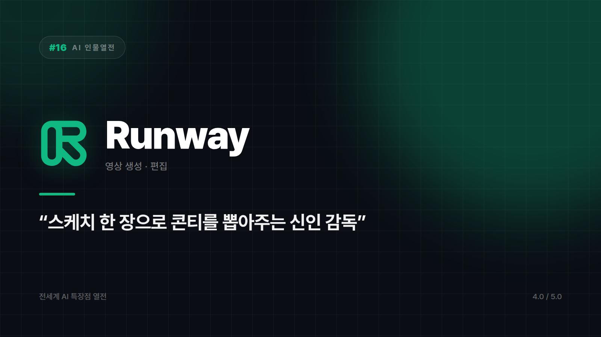

# [AI 인물열전 #16] Runway — 텍스트로 영화 한 장면을 만들어내는 신인 감독

*시리즈: 전세계 AI 특장점 열전 | 16/20 | 오늘의 주인공: Runway · 2026년 하반기 기준*

---

카메라가 없다. 배우도 없고, 조명팀도 없고, 장소 섭외도 안 했다. 그런데 "이런 장면이 필요해요"라고 설명하면 그럴듯한 영상 클립이 나온다.

Runway는 텍스트나 이미지 한 장으로 짧은 영상을 만들어내는 도구들 중 선두에 있다. 스케치 한 장만 보여줘도 콘티까지 뽑아오는 신인 감독 같은 캐릭터인데, 영화나 광고 업계 사람들도 실제 작업 흐름에 슬쩍 끼워 쓰기 시작했다.

## 생성만 하는 도구가 아니다

문장 하나, 이미지 한 장으로 클립이 만들어진다는 게 제일 눈에 띄는 부분이지만, 실무에서 더 자주 쓰이는 건 편집 쪽일 수도 있다. 그린스크린 없이 배경을 제거하고, 특정 오브젝트만 지우고, 슬로모션을 만들어낸다. 영상 편집자가 시간을 제일 많이 쏟는 구간들이다.

실제 현장에서의 채택도 이 지점과 맞물린다. 독립 영화 제작자나 광고 제작사가 프리프로덕션 단계, 그러니까 콘셉트를 확인하고 스토리보드를 검증하는 구간에 실험적으로 들이는 사례가 늘고 있다. 완성본이 아니라 판단을 앞당기는 용도다.

## 촬영을 대체하진 않는다

정밀한 연출이 필요한 장면, 롱테이크로 밀고 가야 하는 완성도 높은 장편은 아직 무리다. 배우의 섬세한 연기가 핵심인 드라마틱한 장면도 마찬가지다. 이 부분은 현재 진행형이라 평가가 자주 바뀌는 영역이기도 하다.

대신 짧은 콘셉트 영상이나 프로모션 클립을 빠르게 눈앞에 띄워야 할 때, 스토리보드와 사전 시각화가 필요할 때, 오브젝트 제거나 배경 교체 같은 편집이 필요할 때는 이미 충분히 쓸모가 있다.

제작비 0원으로 일단 그려보는 스케치북. 촬영을 없애주진 않지만, 촬영 전에 헤매는 시간을 줄여준다.

⭐️⭐️⭐️⭐ (4.0/5) — 영상 프로토타이핑 속도 최강, 완성도 높은 장편 제작은 아직 미완성 단계.

---

*다음 편 예고: [AI 인물열전 #17] Adobe Firefly — "포토샵에 스며든" 정직한 디자인 도우미 편.*

---

본문에 그림이 들어가면 좋을 자리는 아래와 같다. 실제 이미지는 아직 넣지 않았다.

〔이미지 자리 — 본문에서 1번째 특장점을 설명하는 대목〕

〔이미지 자리 — 본문에서 2번째 특장점을 설명하는 대목〕

〔이미지 자리 — 본문에서 3번째 특장점을 설명하는 대목〕

〔이미지 자리 — 총평 문단 바로 위〕
