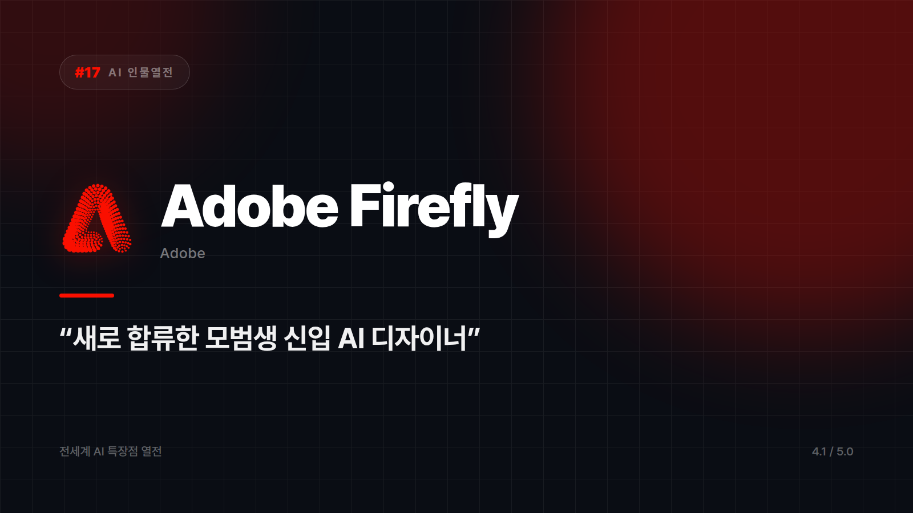

# Adobe Firefly — "이거 써도 되는 거 맞아요?"에 답하기 쉬운 이미지 AI

*시리즈: 전세계 AI 특장점 열전 | 17/20 | 오늘의 주인공: Adobe Firefly · 2026년 하반기 기준*

---

디자인 팀이 AI로 뽑은 이미지를 들고 가면 법무나 결재 라인에서 같은 질문이 돌아온다. "이거 써도 되는 거 맞아요?" 그 질문 하나에 프로젝트 하나가 통째로 엎어진 경험이 있는 사람이라면 다음 문단이 반가울 것이다.

Adobe Firefly는 그 질문에 답하기 쉬운 쪽으로 자리를 잡았다. 라이선스가 명확한 콘텐츠 위주로 학습했다는 점을 앞세워 "상업적으로 써도 안전한 AI"라는 포지션을 들고 나왔다. 화려한 개성을 뽐내기보다 저작권 리스크를 줄이는 데 진심인 모범생 타입이다.

## 이미 쓰던 화면 안에 있다

포토샵과 일러스트레이터로 디자인 업계를 오래 지배해온 회사가 만든 만큼, 통합이 자연스럽다. 생성형 채우기나 배경 확장 같은 기능이 기존 툴 안에 들어 있어서, 다른 프로그램을 열 필요 없이 작업 중인 파일 위에서 바로 쓴다. 새 프로그램 설치하고 로그인하고 튜토리얼 영상 보는 그 지루한 절차가 통째로 생략된다. 새 도구를 배운다는 감각이 거의 없다.

결과물을 다루는 방식도 실무 쪽에 가깝다. 색상, 조명, 구도 같은 파라미터를 조정하며 다듬을 수 있어서, 버튼 한 번에 완성품이 튀어나오는 자동 생성기보다는 숙련된 디자이너의 보조 도구에 가깝다. 손대는 사람이 있다는 전제로 설계돼 있다.

## 여기선 다른 애를 부르자

파격적이고 실험적인 아트 스타일이 필요하다면 Midjourney 쪽이 어울린다. Adobe 생태계 밖에서 독립적으로 빠르게 뽑아 쓰고 싶을 때도 굳이 이걸 고를 이유는 없다.

반대로 기존 포토샵 작업물에 AI를 얹고 싶을 때, 저작권이 걸린 상업 프로젝트에서 생성형 이미지를 써야 할 때, 리터칭과 배경 확장과 오브젝트 제거 같은 실무 편집이 주 업무일 때는 후보가 좁아진다.

화려함 대신 안전함을 골랐다. 회사에서 결재 올리기 제일 편한 AI라는 말에는 칭찬과 아쉬움이 반씩 섞여 있다. 파티에서 제일 재밌는 사람은 아닌데, 보증인 세울 땐 제일 먼저 떠오르는 이름이다.

⭐️⭐️⭐️⭐ (4.1/5) — 상업적 안전성과 기존 워크플로우 통합 최강, 파격적 개성은 다소 부족.

---

*다음 편 예고: [AI 인물열전 #18] DeepL — "뉘앙스까지 살려내는" 통역 전문가 편.*

---

본문에 그림이 들어가면 좋을 자리는 아래와 같다. 실제 이미지는 아직 넣지 않았다.

〔이미지 자리 — 본문에서 1번째 특장점을 설명하는 대목〕

〔이미지 자리 — 본문에서 2번째 특장점을 설명하는 대목〕

〔이미지 자리 — 본문에서 3번째 특장점을 설명하는 대목〕

〔이미지 자리 — 총평 문단 바로 위〕
