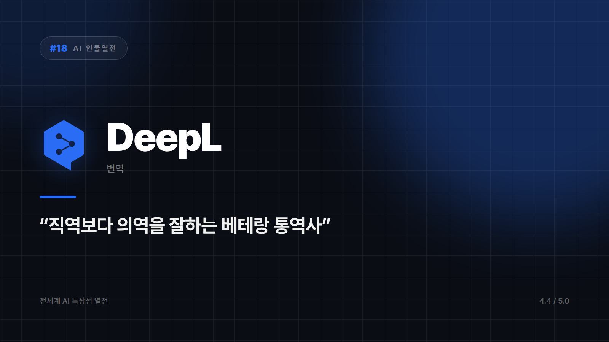

# DeepL — 뉘앙스까지 살려내는 프로 통역사

*시리즈: 전세계 AI 특장점 열전 | 18/20 | 오늘의 주인공: DeepL · 2026년 하반기 기준*

---

이 시리즈에 나온 스무 명 중 가장 욕심 없는 캐릭터다. 코딩도 안 하고, 그림도 안 그리고, 검색도 안 한다. 번역만 한다. 명함에 직함이 하나뿐인 사람이다.

그런데 그 하나를 잘한다.

DeepL이 입소문을 탄 계기는 단순했다. "구글 번역보다 자연스럽다"는 말이 사람들 입에서 반복됐다. 단어를 그대로 옮기는 대신 문맥과 뉘앙스를 살리는 쪽이라, 직역 티가 나는 문장 대신 원어민이 실제로 쓸 법한 표현이 나온다. "우리 팀은 귀사의 제안을 신중히 검토하고 있습니다" 같은 문장이 어색한 번역투 없이 그대로 나오는 걸 보면, 이 사람 영어 좀 하는구나 싶어진다. 비즈니스 메일이나 계약서, 논문처럼 한 단어의 온도가 결과를 바꾸는 문서에서 이 차이가 확실히 드러난다.

번역 실력 말고 실무자들이 조용히 좋아하는 기능이 하나 더 있다. 워드나 파워포인트, PDF를 그대로 올리면 레이아웃과 서식을 거의 유지한 채 번역해준다. 번역보다 번역 후 서식 맞추는 데 시간을 더 써본 사람에게는 이쪽이 본편이다.

DeepL Write로 같은 문장을 격식체와 친근체 사이에서 굴려볼 수도 있다. 번역기를 넘어 표현을 다듬는 도구로 쓰는 사람들이 여기서 나온다.

## 대신 그 밖은 담당이 아니다

코딩이나 검색, 창작처럼 대화형 AI의 영역을 기대하면 곤란하다. 아주 희귀한 언어 쌍이라면 지원 범위를 먼저 확인하는 편이 낫다.

한 우물만 판 사람이 대개 그렇듯, 부탁할 수 있는 일은 적고 그 하나는 확실하다. 술자리에서 재밌는 이야기는 못 해도, 계약서 번역 하나는 믿고 맡기게 되는 그런 사람.

번역이라는 한 가지 일 하나만 놓고 매기면 ⭐️⭐️⭐️⭐⭐ (4.4/5) — 번역 품질 최상위권, 멀티태스킹보다 전문성에 올인.

---

*다음 편 예고: [AI 인물열전 #19] Meta AI — "인스타·왓츠앱에 이미 들어와 있는" 옆집 AI 편.*

---

본문에 그림이 들어가면 좋을 자리는 아래와 같다. 실제 이미지는 아직 넣지 않았다.

〔이미지 자리 — 본문에서 1번째 특장점을 설명하는 대목〕

〔이미지 자리 — 본문에서 2번째 특장점을 설명하는 대목〕

〔이미지 자리 — 본문에서 3번째 특장점을 설명하는 대목〕

〔이미지 자리 — 총평 문단 바로 위〕
