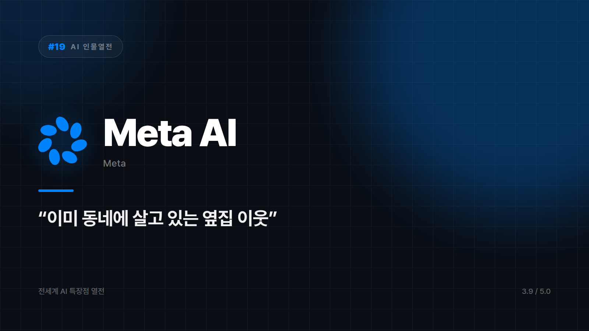

# [AI 인물열전 #19] Meta AI — 인스타·왓츠앱에 이미 들어와 있는 옆집 친구

*시리즈: 전세계 AI 특장점 열전 | 19/20 | 오늘의 주인공: Meta AI (Llama 기반) · 2026년 하반기 기준*

---

앞선 열여덟 편에는 공통 절차가 하나씩 있었다. 앱을 깔거나, 가입하거나, 최소한 새 탭을 열어야 했다.

Meta AI는 그 단계가 없다. 인스타그램 DM에도, 왓츠앱 채팅에도, 페이스북 검색창에도 이미 들어와 있다. 따로 인사할 필요 없는 옆집 이웃 같은 포지션이다. 접근성 하나만 놓고 보면 이 시리즈에서 상대가 없다.

## 앱 하나가 아니라 바닥에 깔린 인프라

Meta AI의 존재감은 두 군데서 나온다. 하나는 방금 말한 도달 범위고, 다른 하나는 기반 모델인 Llama다.

Llama가 오픈웨이트로 공개되면서 전 세계의 개발자와 스타트업이 이걸 바탕으로 자기 서비스를 만들고 있다. 사용자 눈에 보이는 건 메신저 속 말풍선 하나지만, 그 아래에는 남의 제품을 떠받치는 기반 인프라 역할이 깔려 있다. 이 시리즈에서 앱과 인프라를 동시에 하는 캐릭터는 흔치 않다.

SNS 안에서 바로 이미지를 만들어 스티커나 게시물에 쓰는 것도 가능하다. 만들고 공유하는 사이에 다른 툴로 건너갈 일이 없다는 점이 이 플랫폼다운 강점이다.

## 기대를 접을 곳

- 코딩, 리서치, 복잡한 문서 작업 같은 깊은 전문 업무
- 메타 플랫폼을 아예 안 쓰는 경우 — 접근성이라는 최대 강점이 통째로 사라진다

찾아갈 필요 없이 이미 옆에 와 있다. 존재감은 은근한데 도달 범위는 세계 최대급이다.

⭐️⭐️⭐️½ (3.9/5) — 접근성·오픈소스 생태계 영향력 최강, 전문 업무 깊이는 상대적으로 얕음.

---

*다음 편 예고: [AI 인물열전 #20] Qwen — "아시아 시장을 정조준한" 오픈소스 다크호스 편.*

---

본문에 그림이 들어가면 좋을 자리는 아래와 같다. 실제 이미지는 아직 넣지 않았다.

〔이미지 자리 — 본문에서 1번째 특장점을 설명하는 대목〕

〔이미지 자리 — 본문에서 2번째 특장점을 설명하는 대목〕

〔이미지 자리 — 본문에서 3번째 특장점을 설명하는 대목〕

〔이미지 자리 — 총평 문단 바로 위〕
