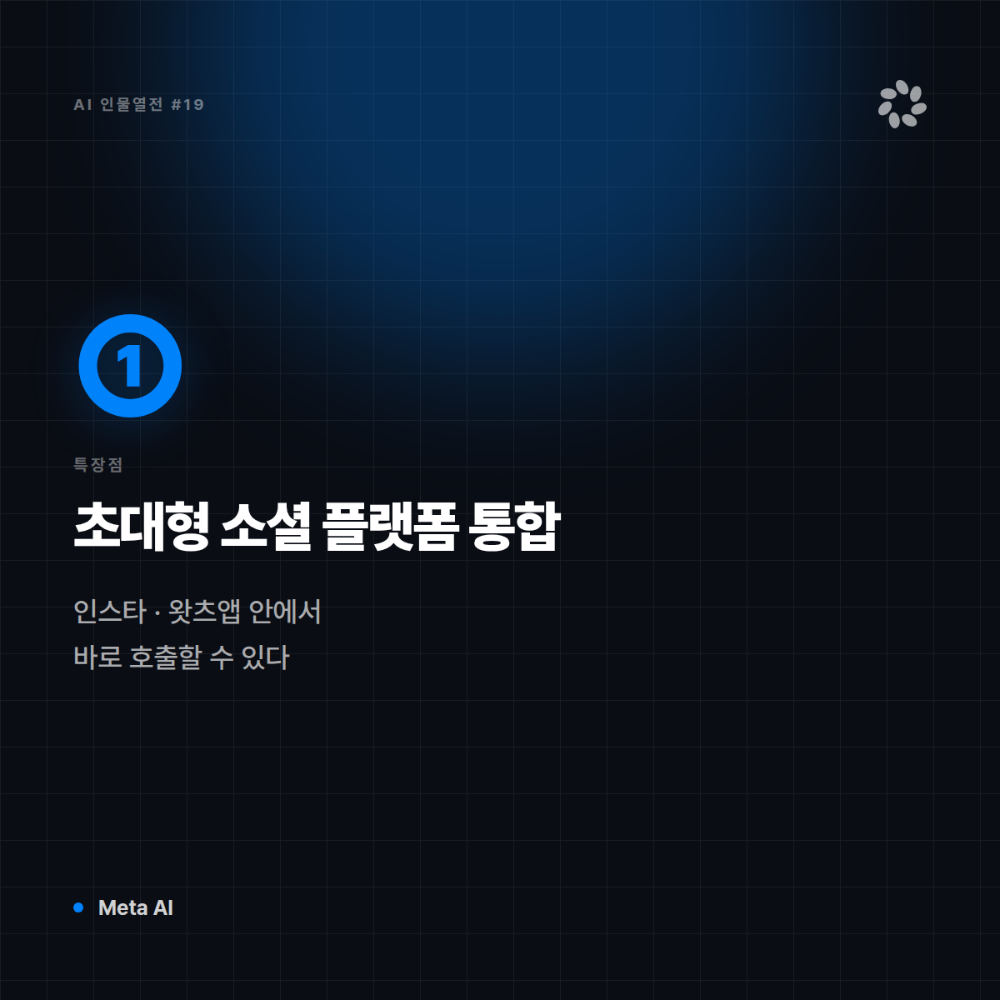
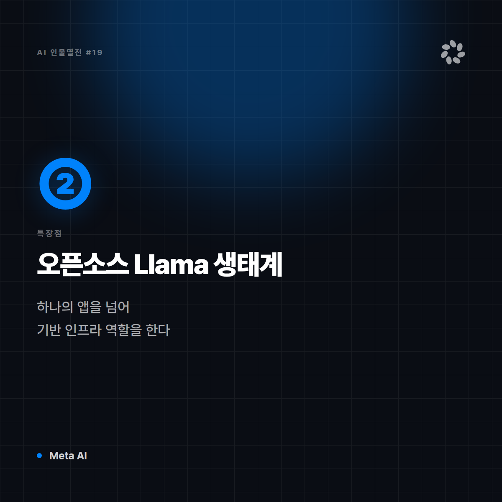
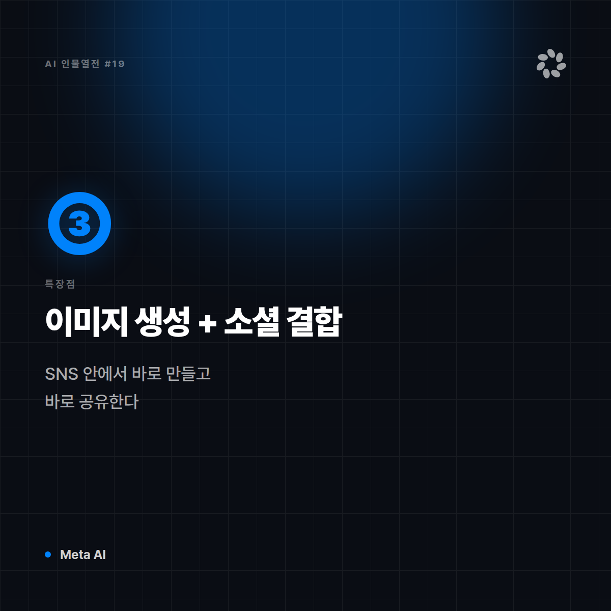
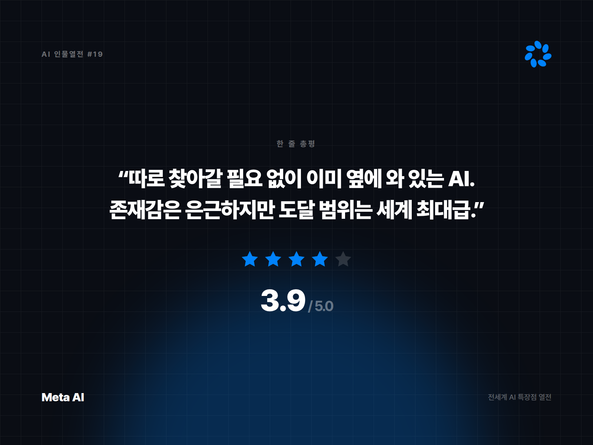

# [AI 인물열전 #19] Meta AI — 인스타·왓츠앱에 이미 들어와 있는 옆집 친구

*시리즈: 전세계 AI 특장점 열전 | 19/10 | 오늘의 주인공: Meta AI (Llama 기반)*

---

## 한 줄 소개

페이스북, 인스타그램, 왓츠앱까지 — 전 세계 수십억 명이 매일 켜는 앱들 안에 자연스럽게 들어와 있는 AI. 오픈소스 모델 Llama를 기반으로 만들어져, 개발자 커뮤니티에서도 존재감이 크다.

## 이 녀석은 이런 애다

비유하자면 Meta AI는 **이미 우리 동네에 살고 있어서 따로 인사할 필요도 없는 이웃**이다. 별도로 앱을 설치하거나 로그인할 필요 없이, 이미 쓰고 있던 메신저와 SNS 검색창에 AI가 슬쩍 들어와 있다. 접근성 하나는 타의 추종을 불허한다.

## 특장점 3가지

**1. 초대형 소셜 플랫폼과의 자연스러운 통합**
인스타그램 DM, 왓츠앱 채팅, 페이스북 검색 등 이미 일상적으로 쓰는 앱 안에서 바로 호출할 수 있다. 별도 진입장벽이 사실상 없다.

**2. 오픈소스 Llama 생태계의 존재감**
기반 모델인 Llama가 오픈웨이트로 공개되면서, 전 세계 수많은 개발자와 스타트업이 이를 기반으로 자체 서비스를 만들고 있다. 하나의 앱을 넘어 하나의 '기반 인프라' 역할을 하는 셈.

**3. 이미지 생성과 소셜 콘텐츠의 결합**
SNS 안에서 바로 이미지를 만들고 스티커·게시물에 활용할 수 있어, 별도 툴로 옮겨가지 않고도 콘텐츠 제작이 가능하다.

## 이럴 때 쓰면 좋다

- 이미 쓰고 있는 인스타그램·왓츠앱 안에서 간단히 AI 도움을 받고 싶을 때
- Llama 기반의 오픈소스 모델을 활용해 자체 서비스를 만들고 싶은 개발자
- SNS 콘텐츠(이미지, 스티커)를 빠르게 만들고 바로 공유하고 싶을 때

## 이럴 땐 살짝 비추

- 깊이 있는 전문 업무(코딩, 리서치, 복잡한 문서 작업)
- 메타 플랫폼을 쓰지 않는 사용자 (접근성 강점이 사라짐)

## 한 줄 총평

**"따로 찾아갈 필요 없이 이미 내 옆에 와 있는 AI. 존재감은 은근하지만 도달 범위는 세계 최대급."**

⭐️⭐️⭐️½ (3.9/5) — 접근성·오픈소스 생태계 영향력 최강, 전문 업무 깊이는 상대적으로 얕음.

---

*다음 편 예고: [AI 인물열전 #20] Qwen — "아시아 시장을 정조준한" 오픈소스 다크호스 편에서 계속됩니다.*


---

## 🖼 이미지 (5장)

아래 이미지는 이 포스팅 전용으로 제작한 실제 이미지 파일입니다. 원본은 `images/19_MetaAI/` 폴더에 있습니다.

**대표 썸네일 (1600×900)**


**특장점 ① 카드 (1200×1200)**



**특장점 ② 카드 (1200×1200)**



**특장점 ③ 카드 (1200×1200)**



**총평 · 별점 카드 (1600×1200)**



---

## 🎨 이미지 생성 프롬프트 (5장)

아래 5개 프롬프트는 Midjourney, DALL·E, Stable Diffusion 등 이미지 생성 도구에 바로 사용할 수 있도록 작성했습니다. (공식 로고·스크린샷이 아닌, 포스팅 톤에 맞춘 창작 일러스트용입니다.)

**1. 대표 썸네일 — 캐릭터 비유 일러스트**
```
Editorial character illustration personifying Meta AI as "이미 동네에 살고 있어서 따로 인사할 필요 없는 이웃",
social-media gradient blues and purples, connected friendly tone, flat vector illustration with soft shadows,
tech-editorial magazine style, clean negative space for title text, 16:9 aspect ratio, no text, no logo
```

**2. 특장점 ① — 인스타그램·왓츠앱 등 초대형 소셜 플랫폼 통합**
```
Conceptual infographic-style illustration representing "인스타그램·왓츠앱 등 초대형 소셜 플랫폼 통합" for an AI tool review article,
social-media gradient blues and purples, connected friendly tone, minimalist vector icons and abstract shapes, no text, no logo, square 1:1 aspect ratio
```

**3. 특장점 ② — 오픈소스 Llama가 만든 개발자 생태계 영향력**
```
Conceptual infographic-style illustration representing "오픈소스 Llama가 만든 개발자 생태계 영향력" for an AI tool review article,
social-media gradient blues and purples, connected friendly tone, minimalist vector icons and abstract shapes, no text, no logo, square 1:1 aspect ratio
```

**4. 특장점 ③ — SNS 안에서 바로 만드는 이미지·스티커 생성**
```
Conceptual infographic-style illustration representing "SNS 안에서 바로 만드는 이미지·스티커 생성" for an AI tool review article,
social-media gradient blues and purples, connected friendly tone, minimalist vector icons and abstract shapes, no text, no logo, square 1:1 aspect ratio
```

**5. 총평 카드 — 별점 인포그래픽**
```
A minimal review-card style illustration with a star rating visual motif,
social-media gradient blues and purples, connected friendly tone, flat design, rounded card layout, subtle gradient background,
space reserved for a one-line quote and star rating, no text, no logo, 4:3 aspect ratio
```
