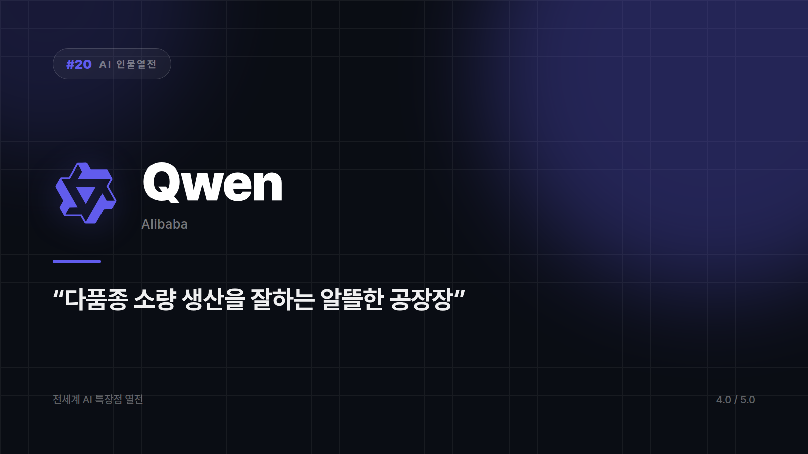

# Qwen — 중국어와 한국어를 같이 잘하는 오픈소스 진영의 실속파

*시리즈: 전세계 AI 특장점 열전 | 20/20 | 오늘의 주인공: Qwen (Alibaba) · 2026년 하반기 기준*

---

요즘 AI 경쟁은 대개 "누가 더 큰 모델을 내놓느냐"로 흘러간다. 다들 몸집 키우기 대회에 나가 있는 동안, Qwen은 그 줄에 안 섰다. 대신 가벼운 모델부터 무거운 모델까지 라인업을 촘촘히 깔아놓고 "필요한 사이즈로 골라 쓰세요"라고 말한다.

한 방을 노리는 대신 다품종 소량 생산으로 먹고사는 알뜰한 공장장. 알리바바가 만든 이 오픈소스 모델군은 DeepSeek과 함께 "중국발 오픈웨이트도 만만치 않다"는 인식을 심어준 주역이기도 하다.

## 골라 쓰라는 말이 진짜인 경우

초경량부터 대형까지 여러 크기로 공개돼 있어서, 서버에 올릴지 기기 안에서 돌릴지에 따라 선택지가 넓다. 옷 가게에서 프리사이즈 하나로 버티는 대신 S부터 XL까지 다 갖춰놓은 셈인데, 개발자 입장에서는 이게 은근히 큰 배려다. 모델 하나를 억지로 모든 환경에 우겨넣지 않아도 된다.

파생 모델 전략도 같은 결이다. 코딩 특화, 수학 특화처럼 특정 작업에 맞춘 버전을 함께 내놓기 때문에, 범용 모델 하나로 버티는 것보다 나은 효율을 노려볼 수 있다.

가중치가 공개돼 있다는 점은 여기에 자유도를 더한다. 자체 데이터로 파인튜닝하거나 온프레미스에 올리는 길이 열려 있어서, 아시아 언어와 문화 맥락에 맞춘 서비스를 만들려는 개발자에게는 괜찮은 베이스캠프가 된다.

## 손이 많이 간다는 뜻이기도 하다

고를 게 많다는 건 고르고 맞추고 운영할 사람이 필요하다는 얘기다. 완성된 상용 플랫폼처럼 매끄러운 사용자 경험을 기대하면 실망한다. 데이터 거버넌스나 컴플라이언스에 민감한 조직이라면 도입 전 정책 검토는 건너뛸 수 없는 단계다.

화려한 마케팅 없이 라인업으로 존재감을 넓히는 다크호스. 고를 게 많아서 고민된다는 게 유일한 단점이라면 나쁜 단점은 아니다. 메뉴판이 너무 두꺼워서 못 고르는 맛집, 그런데 뭘 시켜도 실패는 안 하는 그런 가게다.

고를 수 있는 선택지의 폭으로 매기면 ⭐️⭐️⭐️⭐ (4.0/5) — 라인업 다양성과 커스터마이징 자유도 강점, 완성형 사용자 경험은 상대적으로 약함.

## 시즌2를 마치며

시즌1이 대화창 안에서 벌어지는 일이었다면, 시즌2는 대화창 밖으로 나간 열 명이었다. 엑셀 시트에, 코드 에디터에, 녹음 부스에, 편집 타임라인에, 번역 문서에, 메신저 말풍선에 각자 들어앉은 AI들. 한 지붕 아래 살면 분명 시끄러웠을 스무 명이다.

스무 편을 쓰고 나서 남은 생각은 의외로 단순하다. 목록이 길어질수록 중요해지는 건 목록이 아니라 지금 내가 붙잡고 있는 일이 뭔지 아는 쪽이다. 다음에 누굴 부를지는 "이거 다뤄줘" 한마디에 달렸다.

---

*시즌2 전체 목록: 11 Microsoft Copilot · 12 Cursor · 13 Character.AI · 14 Suno · 15 ElevenLabs · 16 Runway · 17 Adobe Firefly · 18 DeepL · 19 Meta AI · 20 Qwen*

---

본문에 그림이 들어가면 좋을 자리는 아래와 같다. 실제 이미지는 아직 넣지 않았다.

〔이미지 자리 — 본문에서 1번째 특장점을 설명하는 대목〕

〔이미지 자리 — 본문에서 2번째 특장점을 설명하는 대목〕

〔이미지 자리 — 본문에서 3번째 특장점을 설명하는 대목〕

〔이미지 자리 — 총평 문단 바로 위〕
