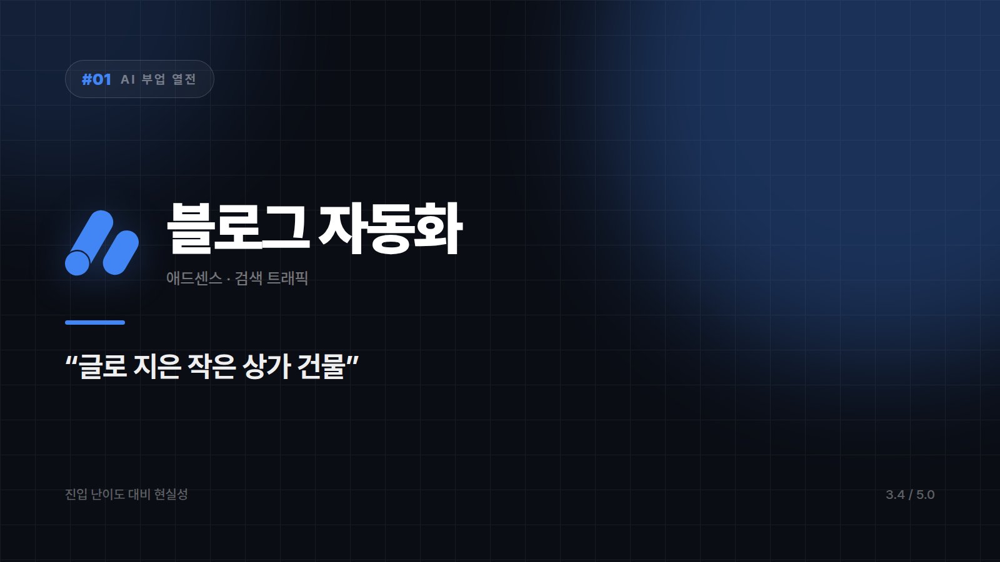

# 블로그 자동화 — "글 써서 월세 받는 건물주" 흉내내기

*시리즈: AI 부업 열전 | 1/10 | 오늘의 주인공: AI 블로그 + 애드센스*

---

AI 부업 얘기가 나오면 거의 항상 제일 먼저 나오는 이름이다. AI로 글을 뽑아 블로그에 올리고, 광고 수익을 받는다. 구조만 놓고 보면 글로 지은 작은 상가 건물에 가깝다. 한 채 지어두면 사람이 드나들고, 그 통행량만큼 광고비가 들어온다. 자는 동안에도 벌린다는 말이 여기서 나왔다.

문제는 이 동네에 건물이 너무 많이 지어졌다는 것이다. 목 좋은 자리는 이미 찼고, 대충 지은 건물엔 아무도 들어오지 않는다. 방문자 통계를 열어보면 사람 대신 검색엔진 로봇만 성실하게 드나든 흔적이 남아 있는 경우도 흔하다.

## 그런데도 계속 1번으로 불리는 이유

시작하는 데 드는 돈이 사실상 없다. 서버도 재고도 사무실도 필요 없고, 도메인 값 정도면 문이 열린다. 망해도 잃을 게 없으니 입문용으로 계속 호명되는 것이다.

한 번 쓴 글이 계속 일한다는 점도 크다. 검색에 자리를 잡은 글은 몇 년씩 방문자를 데려온다. 노동 시간과 수익이 분리되는 구조는 생각보다 흔치 않다. 쌓이면 복리처럼 굴러간다.

그리고 이 일의 공정이 하필 AI가 제일 잘하는 영역과 정확히 겹친다. 자료 조사(출처까지 챙겨야 한다면 [Perplexity](../series/09_Perplexity_특장점.md) 같은 도구가 유용하다), 초안, 제목 뽑기, 재구성. 예전엔 한 편에 세 시간 걸리던 게 삼십 분으로 줄었다.

## 여기부터가 진짜 얘기다

구글은 검색 순위를 노린 대량 생산 콘텐츠를 명시적으로 스팸으로 규정하고 있다. 기준은 AI를 썼느냐가 아니라 가치 없는 양산형이냐다. 복사·붙여넣기 수준으로 찍어내면 색인에서 통째로 빠진다. 한 편이 아니라 사이트 전체가 빠진다는 뜻이다.

경쟁은 이미 포화다. 같은 생각을 한 사람이 수십만 명이고, "AI로 쉽게"라는 말이 통하던 시기는 지났다.

시간도 걸린다. 승인 조건을 채우고 검색에 노출되기까지 보통 수개월이다. 한 달 만에 수익이 나는 구조가 아니라는 것만은 분명히 알고 시작하는 편이 낫다.

## 누가 하면 되나

본인이 이미 아는 분야가 있는 사람. 직업이든 취미든 오래 붙잡고 있던 무언가가 있으면 그 자리에서 출발할 수 있다. 그리고 반년쯤은 표가 안 나도 계속 쌓을 수 있는 사람. AI를 대필 작가가 아니라 조사·초안 보조로 쓸 줄 알면 속도가 확실히 달라진다(조사 단계를 체계적으로 돌리는 방법은 [자료 조사 루틴](../series6_실습/06_자료조사루틴.md)에 정리돼 있다).

반대로 이번 달 생활비가 급한 사람에게는 맞지 않는다. 아무 주제나 골라 자동 생성만 돌리는 방식도 마찬가지다. 이건 거의 확실히 실패한다.

진입장벽이 0에 가까운 대신 살아남는 문턱은 해마다 높아지는 종목이다. AI는 속도를 줄여줄 뿐 자리를 만들어주진 않는다. 이웃 품앗이로 댓글 100개를 채워도, 정작 실 방문자는 나와 내 이웃들이 서로의 글을 눌러주는 사람들뿐인 경우도 드물지 않다.

⭐️⭐️⭐️½ (3.4/5) — 시작은 누구나, 지속은 소수. 본인 전문 분야가 있다면 여전히 유효하다.

---

*다음 편 예고: [AI 부업 열전 #2] 유튜브 쇼츠 자동화 — "얼굴 안 팔고 목소리만 파는 1인 방송국" 편에서 계속됩니다.*

---

본문에 그림이 들어가면 좋을 자리는 아래와 같다. 실제 이미지는 아직 넣지 않았다.

〔이미지 자리 — 본문에서 1번째 이유를 설명하는 대목〕

〔이미지 자리 — 본문에서 2번째 이유를 설명하는 대목〕

〔이미지 자리 — 본문에서 3번째 이유를 설명하는 대목〕

〔이미지 자리 — 총평 문단 바로 위〕
