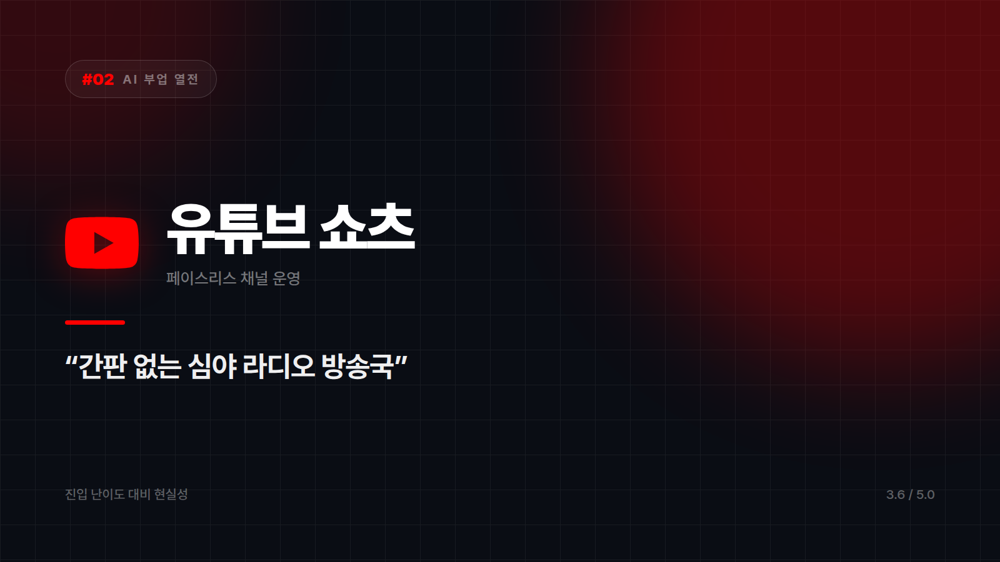

# 유튜브 쇼츠 자동화 — 얼굴 안 팔고 목소리만 파는 1인 방송국

*시리즈: AI 부업 열전 | 2/10 | 오늘의 주인공: 페이스리스(faceless) 쇼츠 채널*

---

얼굴도 목소리도 내 것이 아닌 채로 영상을 찍어내는 채널이 있다. AI 성우가 읽고, AI가 그린 그림이 지나가고, 편집은 툴이 붙인다. 하루에 여러 편도 올릴 수 있다는 점 때문에 '자동화'라는 이름이 붙었다.

간판 없는 심야 라디오 방송국 같은 것이다. DJ가 누군지 아무도 모르지만 사연과 음악만 좋으면 사람들은 계속 듣는다. 얼굴을 드러내기 싫은 사람에게 이만한 구조가 없다. 댓글에 "이 목소리 어디 성우님이세요?"라는 질문이 달리면, 사실 그 목소리의 주인이 채널 운영자도 잘 모르는 AI 보이스 모델 47번이라는 사실은 굳이 밝히지 않는 편이 낫다.

## 혼자서 공정 전체를 돌릴 수 있다

대본은 LLM이 쓰고, 성우는 ElevenLabs가 대신하고, 이미지와 영상은 Midjourney나 Runway가 만들고, 자막과 편집은 자동화 툴이 붙인다. 예전 같으면 사람 몇을 붙여야 했던 공정이다.

쇼츠라는 판 자체도 신규 진입자에게 유리하다. 긴 영상과 달리 채널이 작아도 한 편이 터지면 노출이 폭발한다. 구독자 수보다 알고리즘의 기분이 크게 작용한다는 뜻인데, 이게 운이라 불안하면서 동시에 기회이기도 하다.

무엇보다 신원이 드러나지 않는다. 직장인 부업의 가장 큰 장벽이 대개 여기였다는 걸 생각하면, 이 하나만으로 시도할 수 있는 사람의 범위가 꽤 넓어진다.

## 관문은 세 개다

첫 번째는 정책이다. 유튜브는 반복적이고 독창성 없는 콘텐츠에 수익 창출을 제한한다. 남의 영상에 AI 내레이션만 얹는 방식은 승인 자체가 어렵다. 만들기는 다 만들어놓고 정산 단계에서 막히는 경우가 여기서 나온다.

두 번째는 단가다. 쇼츠는 긴 영상에 비해 조회수당 수익이 낮다. 조회수 그래프는 시원하게 올라가는데 정산액을 열어보면 기대 이하인 일이 흔하다.

세 번째가 제일 조용하게 무섭다. 소재 고갈이다. 하루 여러 편을 계속 뽑아내는 일은 생각보다 빨리 지친다. 대부분 3주 안에 멈춘다.

## 그래서

역사든 과학이든 미스터리든, 오래 파고들 주제가 이미 있는 사람이라면 해볼 만하다. 편집 툴 배우는 걸 귀찮아하지 않는 성격이면 더 좋다. 반대로 올려두면 알아서 벌린다는 그림을 그리고 있다면 3주 뒤의 자신을 한 번 상상해보길 권한다. 매일 밤 다음 편 소재를 쥐어짜내다가 위키백과 문서 스무 개를 열어놓고 커서만 깜빡이는 모습, 그게 3주 차의 흔한 풍경이다. 남의 콘텐츠 재가공에 거부감이 없는 경우도 말리고 싶다. 저작권과 정책 양쪽에서 막힌다.

공장은 AI가 지어줬는데, 뭘 만들지는 여전히 사람이 정해야 한다. 자동화는 편집이지 기획이 아니다.

⭐️⭐️⭐️½ (3.6/5) — 진입은 쉽고 터질 가능성도 있지만, 정책과 지구력이라는 두 관문이 있다.

---

*다음 편 예고: [AI 부업 열전 #3] 전자책 출판 — "한 번 만들고 계속 파는 디지털 붕어빵 기계" 편에서 계속됩니다.*

---

본문에 그림이 들어가면 좋을 자리는 아래와 같다. 실제 이미지는 아직 넣지 않았다.

〔이미지 자리 — 본문에서 1번째 이유를 설명하는 대목〕

〔이미지 자리 — 본문에서 2번째 이유를 설명하는 대목〕

〔이미지 자리 — 본문에서 3번째 이유를 설명하는 대목〕

〔이미지 자리 — 총평 문단 바로 위〕
