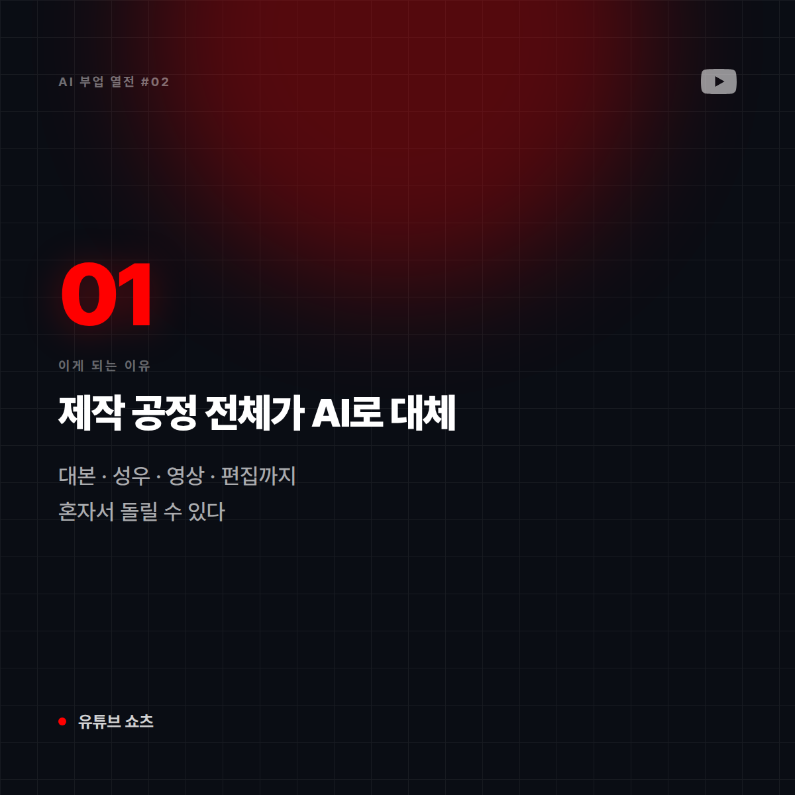
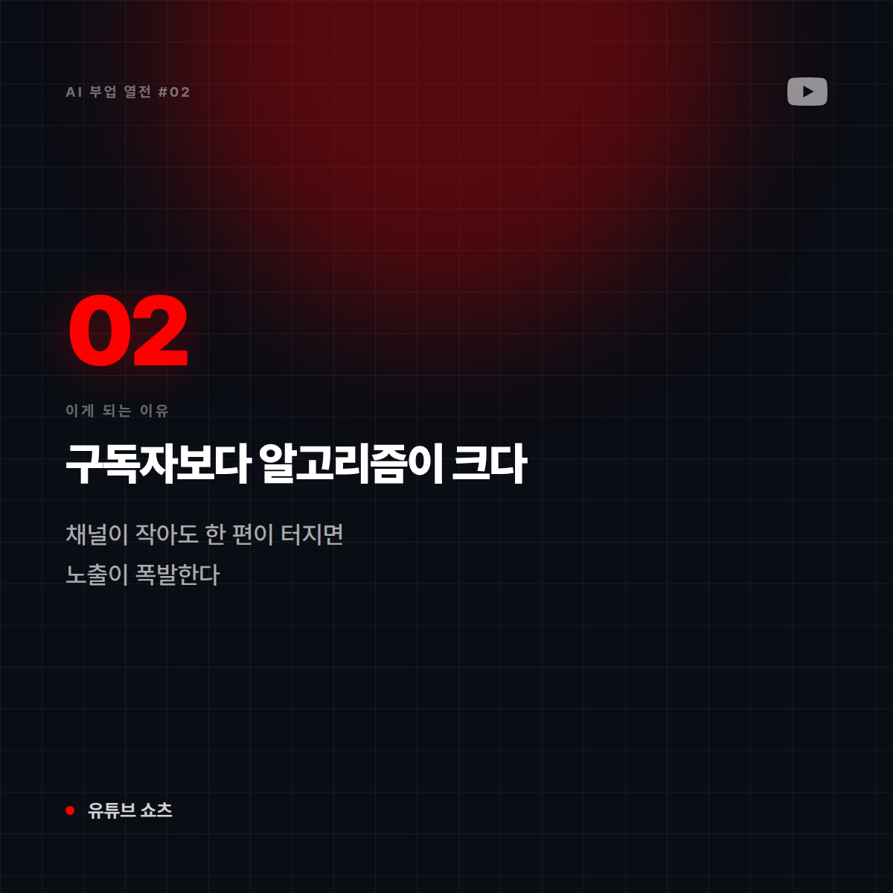
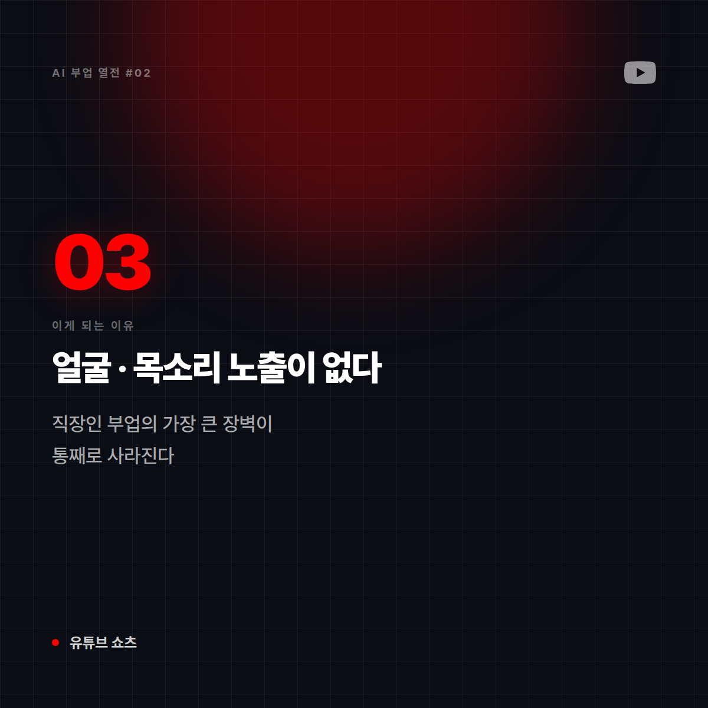
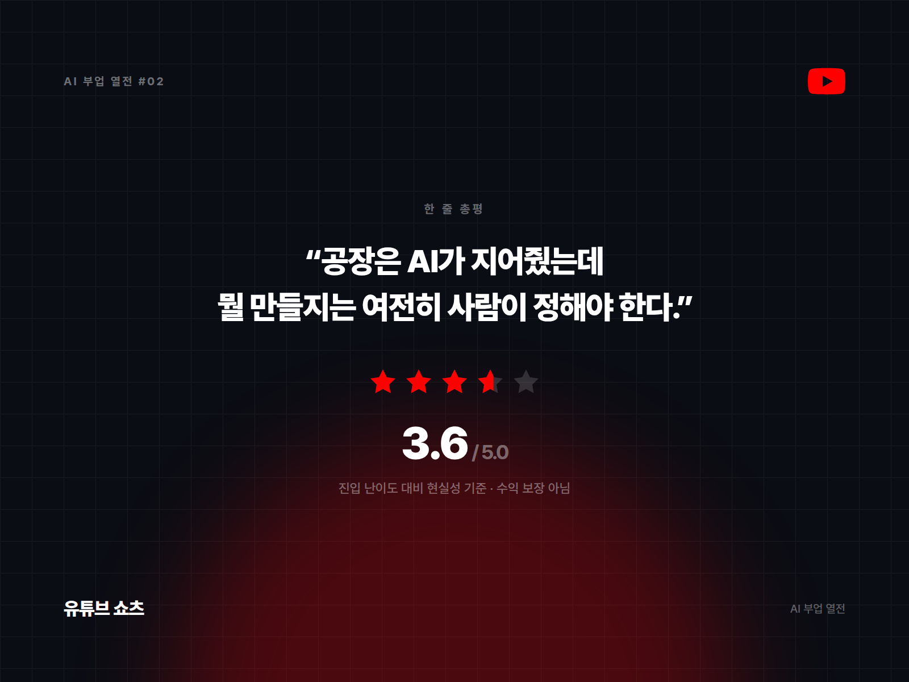

# [AI 부업 열전 #2] 유튜브 쇼츠 자동화 — 얼굴 안 팔고 목소리만 파는 1인 방송국

*시리즈: AI 부업 열전 | 2/10 | 오늘의 주인공: 페이스리스(faceless) 쇼츠 채널*

---

## 한 줄 소개

얼굴도 목소리도 내 것 아닌 채로 영상을 찍어내는 채널 운영. AI 성우 + AI 이미지 + 자동 편집으로 하루에도 여러 편을 올릴 수 있다는 점 때문에 '자동화'라는 이름이 붙었다.

## 이 부업은 이런 일이다

비유하자면 **간판 없는 심야 라디오 방송국**이다. DJ가 누군지 아무도 모르지만, 사연과 음악만 좋으면 사람들이 계속 듣는다. 얼굴을 드러내기 싫은 사람에게 이만한 구조가 없다.

## 이게 되는 이유 3가지

**1. 제작 파이프라인이 통째로 AI로 대체된다**
대본(LLM) → 성우(ElevenLabs) → 이미지·영상(Midjourney·Runway) → 자막·편집(자동화 툴). 예전엔 팀이 필요했던 공정을 혼자서 돌릴 수 있다.

**2. 쇼츠는 구독자 수보다 '알고리즘 운'이 크다**
긴 영상과 달리 쇼츠는 채널이 작아도 한 편이 터지면 노출이 폭발한다. 신규 진입자에게도 기회가 열려 있는 구조다.

**3. 얼굴·목소리 노출 부담이 없다**
직장인 부업의 가장 큰 장벽인 "신원 노출"이 사라진다. 이것만으로 시도 가능한 사람의 범위가 크게 넓어진다.

## 솔직한 리스크

- **수익화 정책**: 유튜브는 "반복적이고 독창성 없는 콘텐츠"에 수익 창출을 제한한다. 남의 영상에 AI 내레이션만 얹는 식은 승인 자체가 어렵다.
- **단가 문제**: 쇼츠는 긴 영상 대비 조회수당 수익이 낮다. 조회수는 잘 나오는데 정산액은 기대 이하인 경우가 흔하다.
- **소재 고갈**: 하루 여러 편을 계속 뽑아내는 건 생각보다 빨리 지친다. 대부분 3주 안에 멈춘다.

## 이런 사람에게 맞다

- 특정 주제(역사·과학·미스터리·자기계발 등)를 오래 파고들 수 있는 사람
- 얼굴 노출 없이 콘텐츠를 해보고 싶은 직장인
- 편집 툴을 배우는 걸 즐기는 사람

## 이런 사람에겐 비추

- "자동으로 올려두면 알아서 벌리겠지"를 기대하는 사람
- 남의 콘텐츠를 재가공하는 데 거부감이 없는 사람 (저작권·정책 양쪽에서 막힌다)

## 한 줄 총평

**"공장은 AI가 지어줬는데, 뭘 만들지는 여전히 사람이 정해야 한다. 자동화는 편집이지 기획이 아니다."**

⭐️⭐️⭐️½ (3.6/5) — 진입은 쉽고 터질 가능성도 있지만, 정책과 지구력이라는 두 관문이 있다.

---

*다음 편 예고: [AI 부업 열전 #3] 전자책 출판 — "한 번 만들고 계속 파는 디지털 붕어빵 기계" 편에서 계속됩니다.*

---

## 🖼 이미지 (5장)

이 포스팅 전용으로 제작한 이미지입니다. 원본은 `images/02_유튜브쇼츠/` 폴더에 있습니다.

**대표 썸네일 (1600×900)**

**이유 ① 카드 (1200×1200)**

**이유 ② 카드 (1200×1200)**

**이유 ③ 카드 (1200×1200)**

**총평 · 별점 카드 (1600×1200)**

