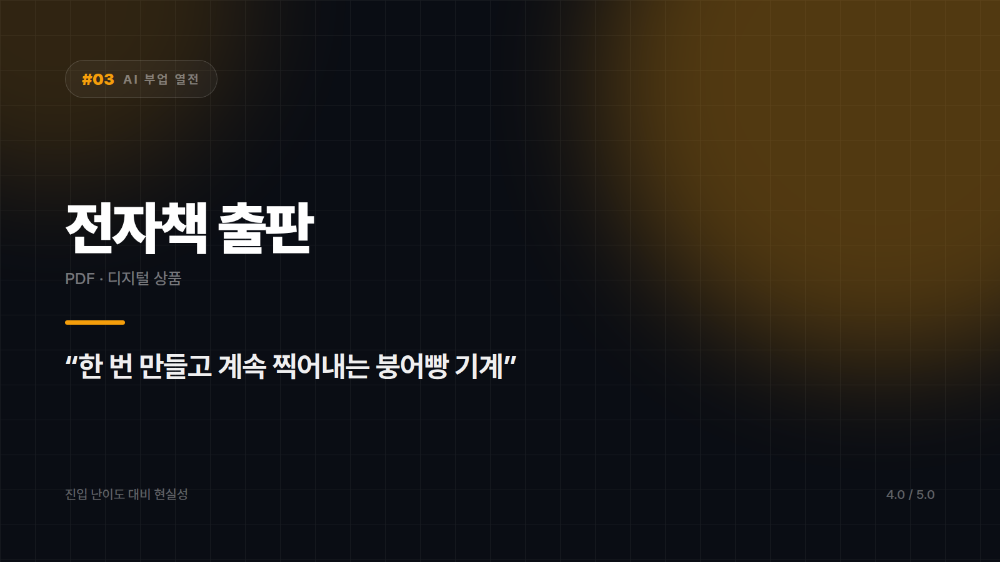

# [AI 부업 열전 #3] 전자책 출판 — 한 번 만들고 계속 파는 디지털 붕어빵 기계

*시리즈: AI 부업 열전 | 3/10 | 오늘의 주인공: PDF 전자책 · 디지털 상품*

---

특정 주제의 노하우를 PDF 한 권으로 묶어 판다. 재고도 배송도 없고 복제 비용이 0원이라, 디지털 상품 중에서도 구조가 제일 단순하다. 한 번 만들어두면 계속 찍어내는 붕어빵 기계에 가깝다. 반죽을 제대로 만드는 데 시간이 들 뿐, 그다음부터는 한 개를 팔든 천 개를 팔든 내 손이 더 들어가지 않는다.

실물 부업에서 제일 무서운 건 안 팔린 물건이 방 한쪽에 쌓이는 일인데, 여기엔 그게 없다. 안 팔려도 잃는 건 시간뿐이다. 실패 비용이 이렇게 낮은 종목은 흔치 않다.

AI가 들어오면서 달라진 건 속도보다 병목의 위치다. 머릿속에 노하우는 있는데 글로 옮기지 못해 멈춰 있던 사람이 많았다. 목차를 짜고, 챕터별 초안을 뽑고, 예시를 만드는 뼈대 작업을 AI가 맡으면 그 병목이 풀린다. 그리고 이 시장은 좁을수록 잘 팔린다. "글쓰기 잘하는 법"은 안 팔려도 "30대 간호사를 위한 이직 포트폴리오 작성법"은 팔린다. 대형 출판사가 절대 건드리지 않는 틈이 여기서는 기회가 된다.

문제는 그 틈을 채우는 재료다. 목차만 그럴듯하고 내용이 일반론이면 후기에 바로 박히고 환불로 돌아온다. 팔리는 전자책은 예외 없이 본인 경험이 뼈대다. AI가 대신 써줄 수 없는 부분이 정확히 거기다.

그리고 만드는 것보다 알리는 게 훨씬 어렵다. 블로그든 인스타든 오픈채팅이든, 이미 사람이 조금이라도 모여 있는 자리가 없으면 책을 만들어놓고 아무도 모르는 상태가 된다. 마케팅이 곁다리가 아니라 본체인 종목이다. 가격 저항도 넘어야 한다. 무료 정보가 넘치는 분야일수록 "이걸 돈 주고?"라는 벽이 높다.

그래서 이 종목은 사람을 꽤 가린다. 어떤 분야에서 실제로 헤매보고 시행착오를 겪어본 사람, 작더라도 자기 채널을 하나 가지고 있는 사람, 완벽주의를 내려놓고 일단 1권을 끝낼 수 있는 사람에게 맞는다. 경험 없이 검색과 AI로만 내용을 채우려는 경우라면 다른 편을 보는 게 낫다. 홍보할 채널이 없고 만들 생각도 없다면 마찬가지다.

AI는 글을 대신 써주지만, 팔리는 내용은 당신 머릿속에서만 나온다. 경험이 있으면 최고의 부업, 없으면 최악의 부업이다.

⭐️⭐️⭐️⭐️ (4.0/5) — 진입 난이도 대비 현실성이 가장 높은 축. 단, '경험 보유'가 전제 조건이다.

---

*다음 편 예고: [AI 부업 열전 #4] 스톡 이미지 판매 — "팔릴 때까지 기다리는 디지털 노점상" 편에서 계속됩니다.*

---

본문에 그림이 들어가면 좋을 자리는 아래와 같다. 실제 이미지는 아직 넣지 않았다.

〔이미지 자리 — 본문에서 1번째 이유를 설명하는 대목〕

〔이미지 자리 — 본문에서 2번째 이유를 설명하는 대목〕

〔이미지 자리 — 본문에서 3번째 이유를 설명하는 대목〕

〔이미지 자리 — 총평 문단 바로 위〕
