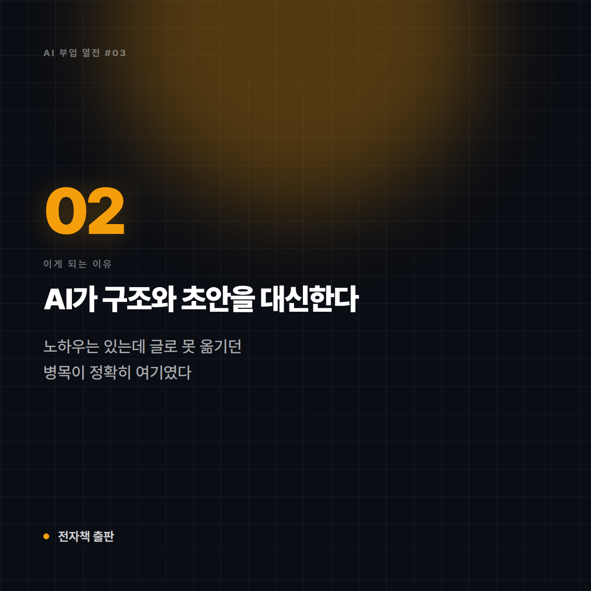

# [AI 부업 열전 #3] 전자책 출판 — 한 번 만들고 계속 파는 디지털 붕어빵 기계

*시리즈: AI 부업 열전 | 3/10 | 오늘의 주인공: PDF 전자책 · 디지털 상품*

---

## 한 줄 소개

특정 주제의 노하우를 PDF 한 권으로 묶어 파는 방식. 재고도 배송도 없고, 한 번 만들면 복제 비용이 0원이라 디지털 상품 중에서도 구조가 가장 단순하다.

## 이 부업은 이런 일이다

비유하자면 **한 번 만들어두면 계속 찍어내는 붕어빵 기계**다. 반죽(콘텐츠)을 제대로 만드는 데 시간이 들 뿐, 그다음부터는 한 개를 팔든 천 개를 팔든 내 손이 더 들어가지 않는다.

## 이게 되는 이유 3가지

**1. 재고·배송·원가가 전부 0원**
실물 상품 부업의 가장 큰 리스크인 '재고를 떠안는 일'이 아예 없다. 안 팔려도 손해가 시간뿐이라 실패 비용이 극단적으로 낮다.

**2. AI가 '구조 잡기'와 '초안'을 대신한다**
목차 설계, 챕터별 초안, 예시 만들기 같은 뼈대 작업이 크게 단축된다. 머릿속에 노하우는 있는데 글로 못 옮기던 사람들의 병목이 정확히 여기였다.

**3. 좁은 주제일수록 잘 팔린다**
"글쓰기 잘하는 법"은 안 팔려도 "30대 간호사를 위한 이직 포트폴리오 작성법"은 팔린다. 대형 출판사가 절대 안 다루는 좁은 틈새가 오히려 기회가 된다.

## 솔직한 리스크

- **AI 티가 나면 환불로 돌아온다**: 목차만 그럴듯하고 내용이 일반론이면 후기에 바로 박힌다. 팔리는 전자책은 예외 없이 **본인 경험**이 뼈대다.
- **마케팅이 본체다**: 만드는 것보다 알리는 게 훨씬 어렵다. 블로그·SNS 등 이미 있는 채널이 없으면 만들어놓고 아무도 모르는 상태가 된다.
- **가격 저항**: 무료 정보가 넘치는 분야일수록 "이걸 돈 주고?"라는 벽을 넘어야 한다.

## 이런 사람에게 맞다

- 특정 분야에서 실제 경험·시행착오를 겪어본 사람
- 이미 작은 채널(블로그·인스타·오픈채팅)이라도 가지고 있는 사람
- 완벽주의를 내려놓고 일단 1권을 완성할 수 있는 사람

## 이런 사람에겐 비추

- 본인 경험 없이 검색·AI만으로 내용을 채우려는 사람
- 홍보할 채널이 전혀 없고 만들 생각도 없는 사람

## 한 줄 총평

**"AI는 글을 대신 써주지만, 팔리는 내용은 당신 머릿속에서만 나온다. 경험이 있으면 최고의 부업, 없으면 최악의 부업."**

⭐️⭐️⭐️⭐️ (4.0/5) — 진입 난이도 대비 현실성이 가장 높은 축. 단, '경험 보유'가 전제 조건이다.

---

*다음 편 예고: [AI 부업 열전 #4] 스톡 이미지 판매 — "팔릴 때까지 기다리는 디지털 노점상" 편에서 계속됩니다.*

---

## 🖼 이미지 (5장)

이 포스팅 전용으로 제작한 이미지입니다. 원본은 `images/03_전자책출판/` 폴더에 있습니다.

**대표 썸네일 (1600×900)**

**이유 ① 카드 (1200×1200)**

**이유 ② 카드 (1200×1200)**

**이유 ③ 카드 (1200×1200)**

**총평 · 별점 카드 (1600×1200)**

