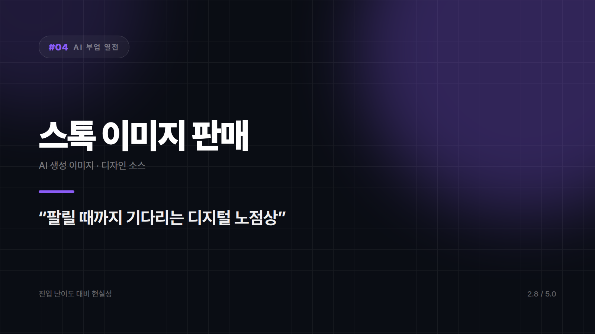
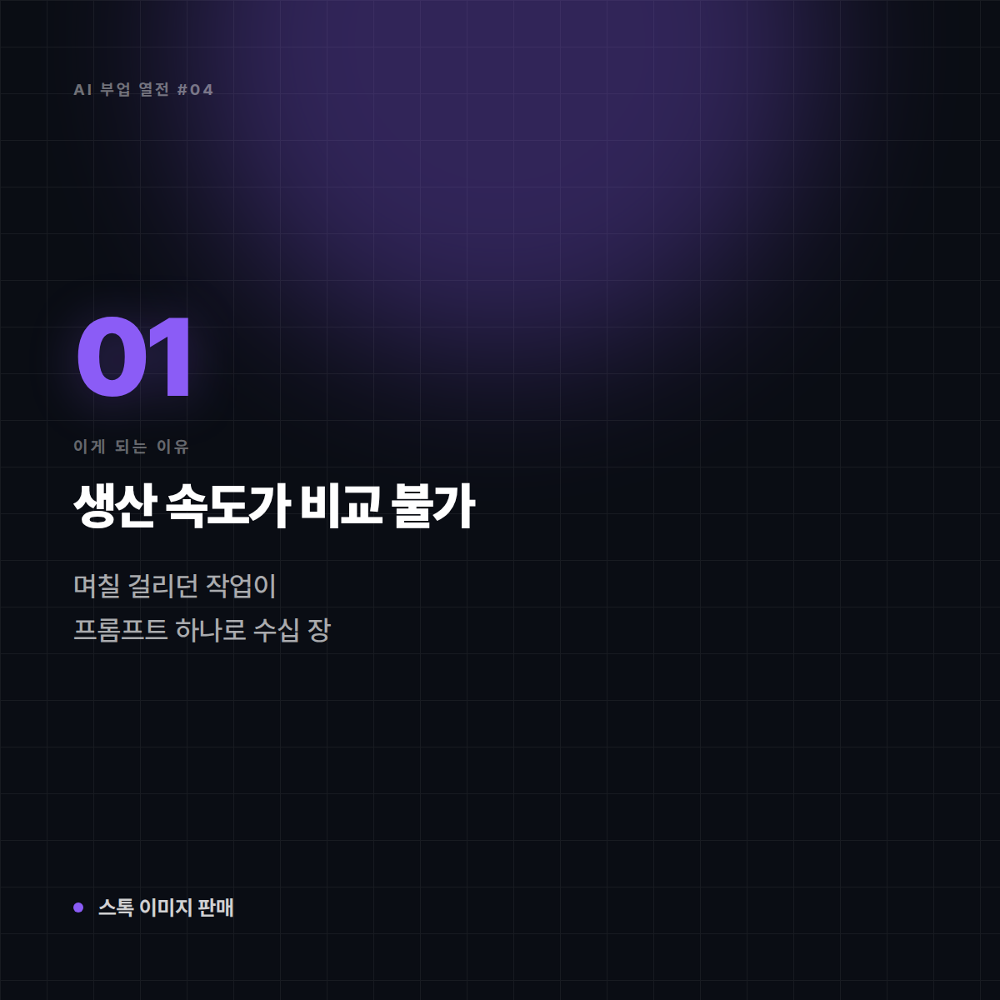
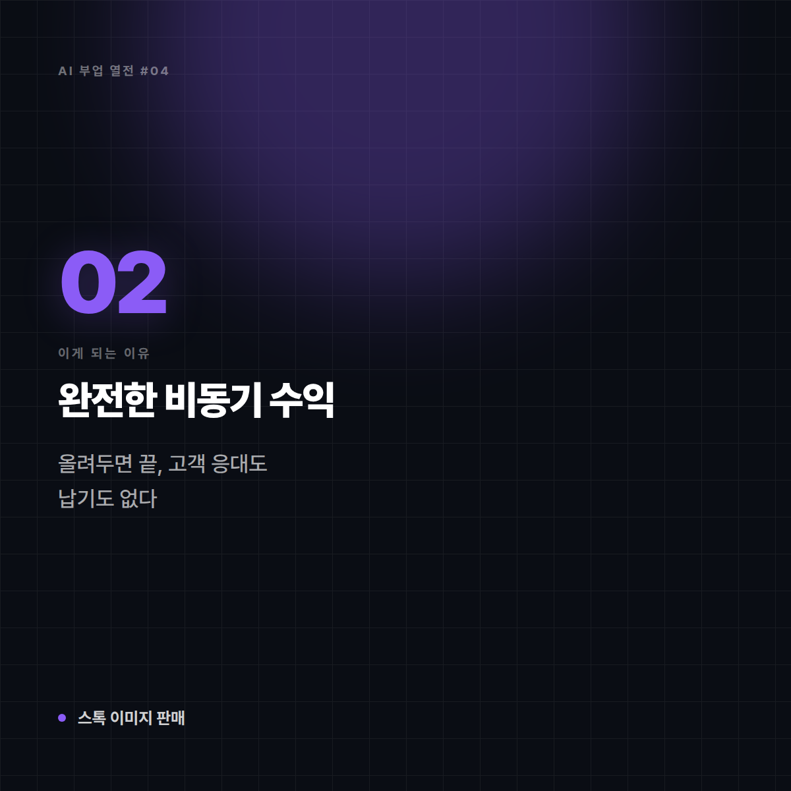
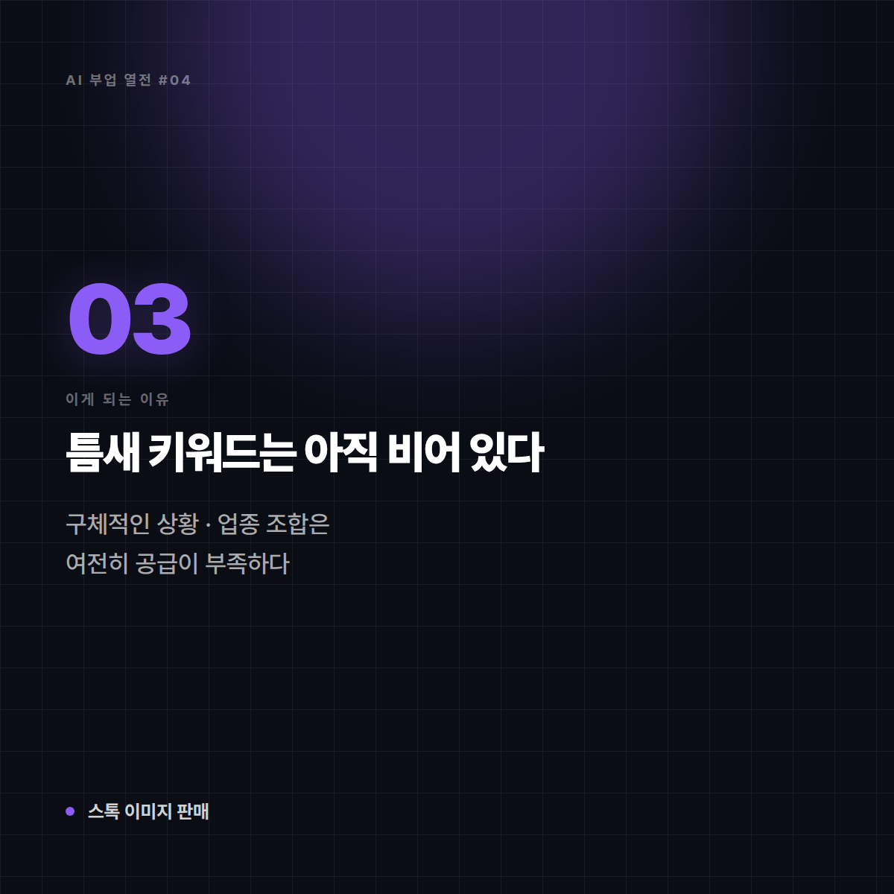
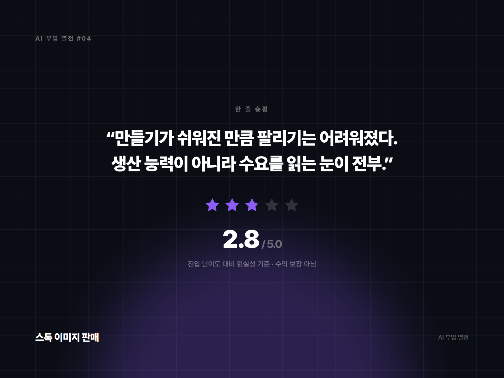

# [AI 부업 열전 #4] 스톡 이미지 판매 — 팔릴 때까지 기다리는 디지털 노점상

*시리즈: AI 부업 열전 | 4/10 | 오늘의 주인공: AI 생성 이미지 · 디자인 소스 판매*

---

## 한 줄 소개

AI로 이미지를 대량 생성해 스톡 사이트나 마켓에 올려두고, 누군가 다운로드할 때마다 수수료를 받는 방식. 이론상 가장 '자동화'에 가까워 보이는 아이템이다.

## 이 부업은 이런 일이다

비유하자면 **사람 많은 길목에 좌판 깔아놓고 기다리는 노점상**이다. 물건 만드는 건 이제 쉬워졌는데, 문제는 옆 좌판도, 그 옆 좌판도 똑같은 물건을 팔고 있다는 것. 심지어 오늘도 좌판 수백 개가 새로 깔린다.

## 이게 되는 이유 3가지

**1. 생산 속도가 비교 불가**
예전엔 사진작가가 촬영·보정에 며칠을 썼다. 지금은 프롬프트 하나로 수십 장이 나온다. 물량으로 승부하는 구조에서 생산 단가가 사실상 0이 됐다.

**2. 완전한 비동기 수익**
올려두면 끝이다. 자는 동안에도 팔린다. 고객 응대도, 납기도 없다. 부업 중 손이 가장 덜 가는 축에 속한다.

**3. 틈새 키워드는 아직 비어 있다**
"비즈니스 미팅" 같은 흔한 키워드는 포화지만, 아주 구체적인 상황·지역·업종 조합은 여전히 공급이 부족한 경우가 있다.

## 솔직한 리스크 (이 종목은 특히 냉정하게 봐야 한다)

- **공급 과잉이 심각하다**: AI 이미지가 쏟아지면서 장당 단가와 노출 확률이 동시에 떨어졌다. "많이 올리면 언젠가 팔리겠지"가 잘 작동하지 않는다.
- **플랫폼별 AI 정책이 제각각이다**: AI 생성물을 아예 금지하거나, 별도 카테고리로 분리하거나, 라벨링을 의무화하는 곳이 있다. **업로드 전에 각 플랫폼 약관을 반드시 확인해야 한다.**
- **저작권 회색지대**: 실존 인물·브랜드·캐릭터가 연상되는 결과물은 판매 자체가 분쟁 소지다.
- **수익 실현까지의 기간**: 초기 수개월은 거의 0에 가까운 경우가 흔하다.

## 이런 사람에게 맞다

- 프롬프트를 실험하고 다듬는 과정 자체가 재밌는 사람
- 당장 수익 없이 반년 이상 쌓아둘 여유가 있는 사람
- 특정 산업(의료·건설·교육 등) 이미지 수요를 잘 아는 사람

## 이런 사람에겐 비추

- 빠른 현금 흐름이 필요한 사람
- 플랫폼 약관 확인을 귀찮아하는 사람 (계정 정지로 한 번에 날아간다)

## 한 줄 총평

**"만들기가 쉬워진 만큼, 팔리기는 어려워졌다. 생산 능력이 아니라 수요를 읽는 눈이 전부인 종목."**

⭐️⭐️⭐ (2.8/5) — 이 시리즈에서 가장 박한 점수. 불가능하진 않지만, 지금 시작해 단기간에 성과를 내긴 어렵다.

---

*다음 편 예고: [AI 부업 열전 #5] 온라인 강의 제작 — "한 번 강의하고 계속 수강료 받는 사설 학원" 편에서 계속됩니다.*

---

## 🖼 이미지 (5장)

이 포스팅 전용으로 제작한 이미지입니다. 원본은 `images/04_스톡이미지판매/` 폴더에 있습니다.

**대표 썸네일 (1600×900)**

**이유 ① 카드 (1200×1200)**

**이유 ② 카드 (1200×1200)**

**이유 ③ 카드 (1200×1200)**

**총평 · 별점 카드 (1600×1200)**

