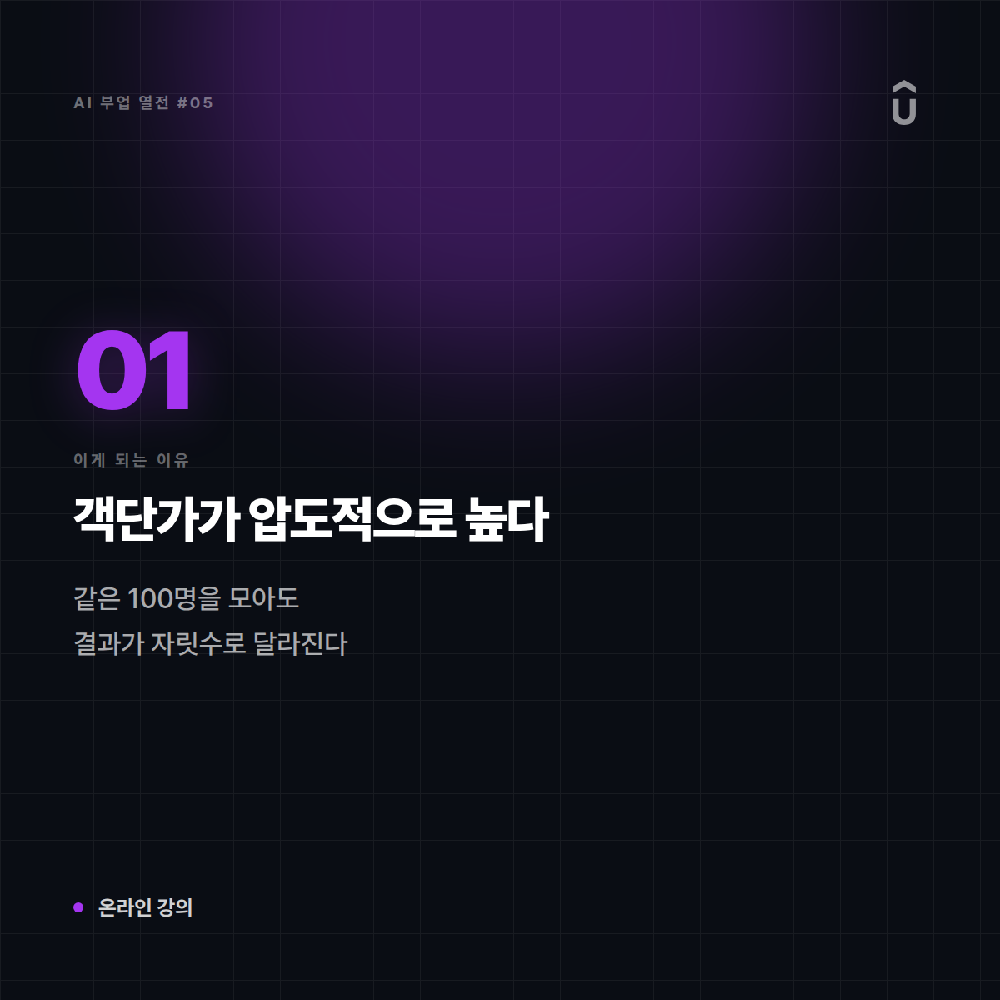
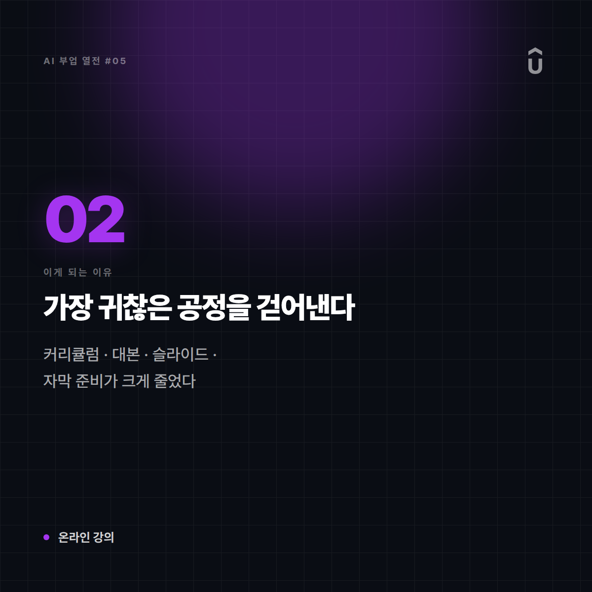
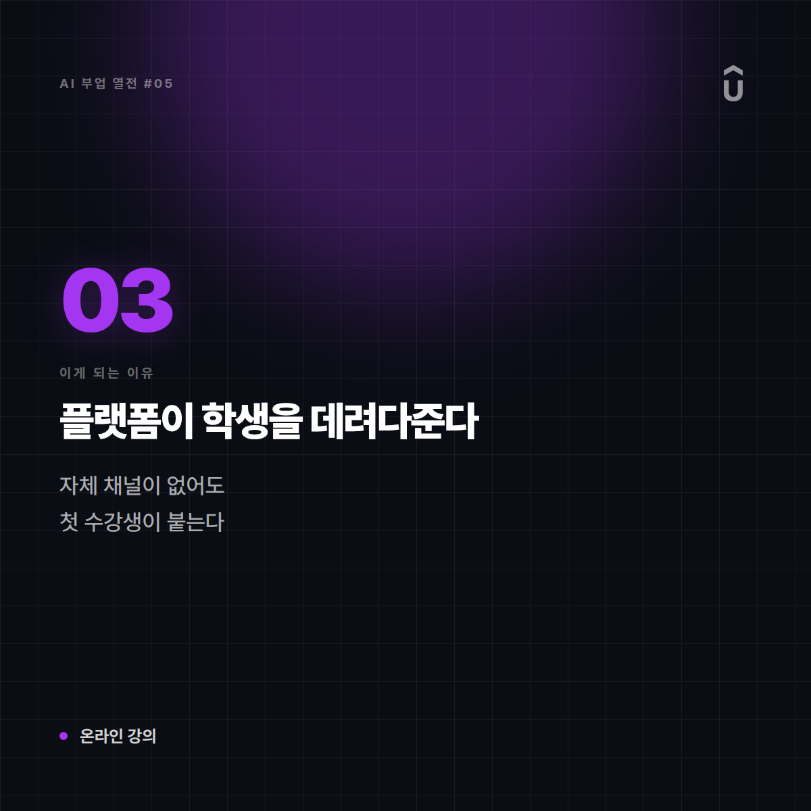
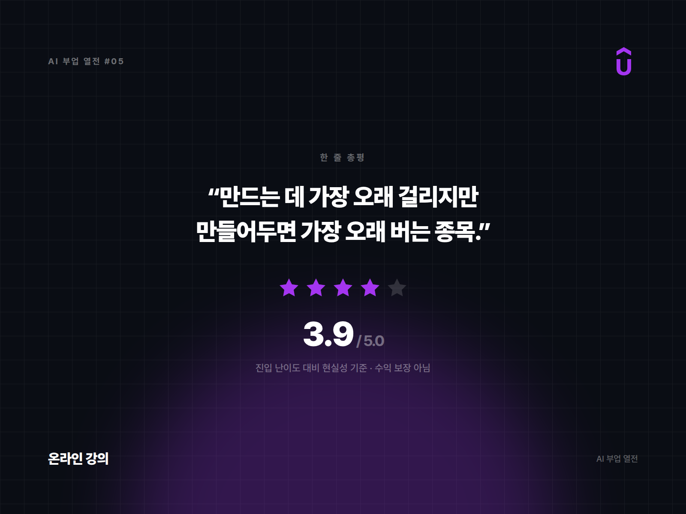

# [AI 부업 열전 #5] 온라인 강의 제작 — 한 번 강의하고 계속 수강료 받는 사설 학원

*시리즈: AI 부업 열전 | 5/10 | 오늘의 주인공: 온라인 강의 · VOD 클래스*

---

## 한 줄 소개

본인이 할 줄 아는 것을 영상 커리큘럼으로 묶어 파는 방식. 전자책의 상위 호환 격으로, 단가가 훨씬 높고 그만큼 만드는 품이 든다.

## 이 부업은 이런 일이다

비유하자면 **원장 혼자 운영하는 사설 학원**인데, 수업을 한 번만 녹화해두면 학생이 몇 명이 오든 같은 수업이 돌아간다. 대신 커리큘럼이 부실하면 환불 요청이 학원 문 앞에 줄을 선다.

## 이게 되는 이유 3가지

**1. 객단가가 압도적으로 높다**
전자책이 몇천~몇만 원 단위라면, 강의는 자릿수가 하나 더 붙는다. 같은 100명을 모아도 결과가 완전히 다르다.

**2. AI가 가장 귀찮은 공정을 걷어낸다**
커리큘럼 설계, 대본 작성, 슬라이드 제작, 자막, 퀴즈·과제 생성까지 — 강의에서 시간을 제일 많이 잡아먹는 준비 작업이 크게 줄었다.

**3. 플랫폼이 학생을 데려다준다**
자체 채널이 없어도 강의 플랫폼에 올리면 그쪽 트래픽으로 첫 수강생이 붙는다. 마케팅 채널이 없는 사람에게 이건 큰 차이다.

## 솔직한 리스크

- **제작 기간이 길다**: 제대로 만들면 몇 주에서 몇 달이 걸린다. 중도 포기율이 높은 이유다.
- **수수료와 가격 정책**: 플랫폼이 가져가는 몫이 작지 않고, 대규모 할인 행사에 가격이 끌려다니는 경우가 많다.
- **"검증 가능한 실력"이 전제다**: 강의는 전자책보다 기대치가 높다. 어설프면 후기에서 바로 걸러진다.
- **얼굴·목소리 노출**: 완전 무노출로 하기 어려운 포맷이다.

## 이런 사람에게 맞다

- 실무에서 쌓은 기술이 명확한 사람 (디자인·개발·마케팅·자격증·언어 등)
- 남을 가르쳐본 경험이 있거나, 설명하는 걸 좋아하는 사람
- 한두 달 집중 투자할 시간을 낼 수 있는 사람

## 이런 사람에겐 비추

- 가르칠 주제가 아직 뚜렷하지 않은 사람 (이 경우 전자책부터가 순서다)
- 얼굴·목소리 노출이 절대 불가한 사람

## 한 줄 총평

**"만드는 데 가장 오래 걸리지만, 만들어두면 가장 오래 버는 종목. 실력이 있는데 판로가 없던 사람에게는 최적해."**

⭐️⭐️⭐️⭐ (3.9/5) — 진입 난이도는 높은 편이나, 넘고 나면 수익 구조가 가장 안정적이다.

---

*다음 편 예고: [AI 부업 열전 #6] 번역·현지화 프리랜싱 — "AI가 초벌하고 사람이 마감하는 2인 1조" 편에서 계속됩니다.*

---

## 🖼 이미지 (5장)

이 포스팅 전용으로 제작한 이미지입니다. 원본은 `images/05_온라인강의/` 폴더에 있습니다.

**대표 썸네일 (1600×900)**

**이유 ① 카드 (1200×1200)**

**이유 ② 카드 (1200×1200)**

**이유 ③ 카드 (1200×1200)**

**총평 · 별점 카드 (1600×1200)**

