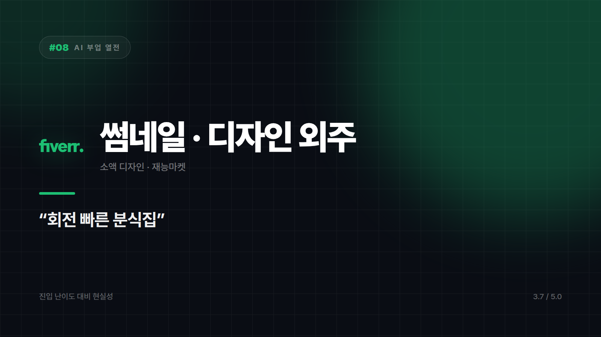
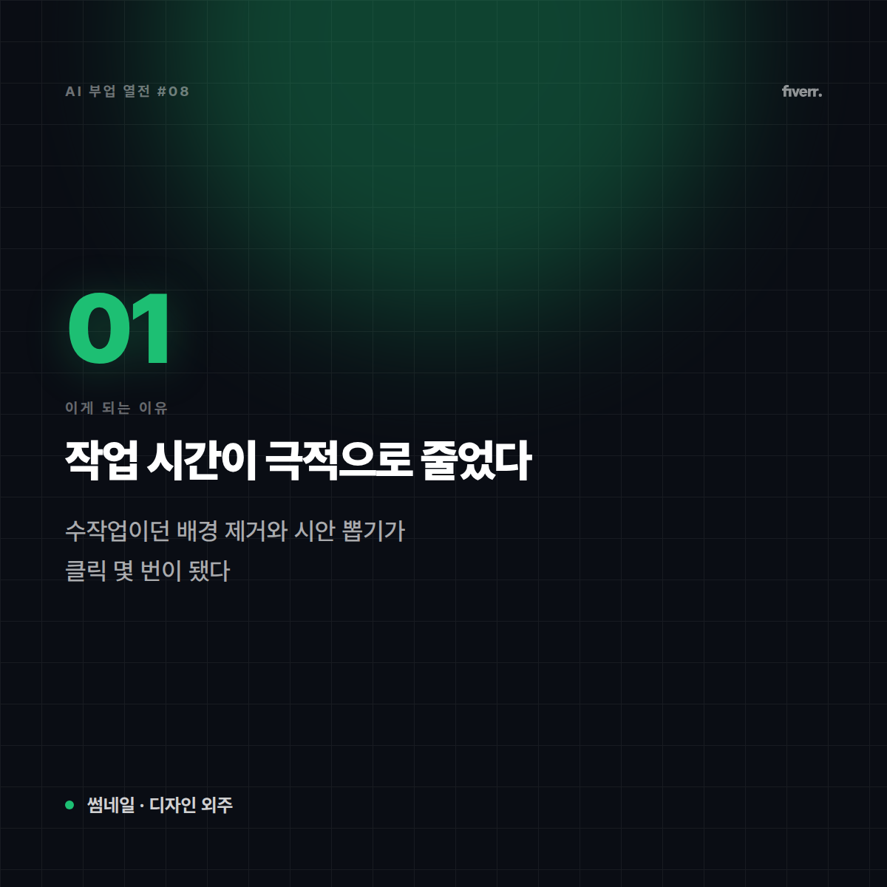
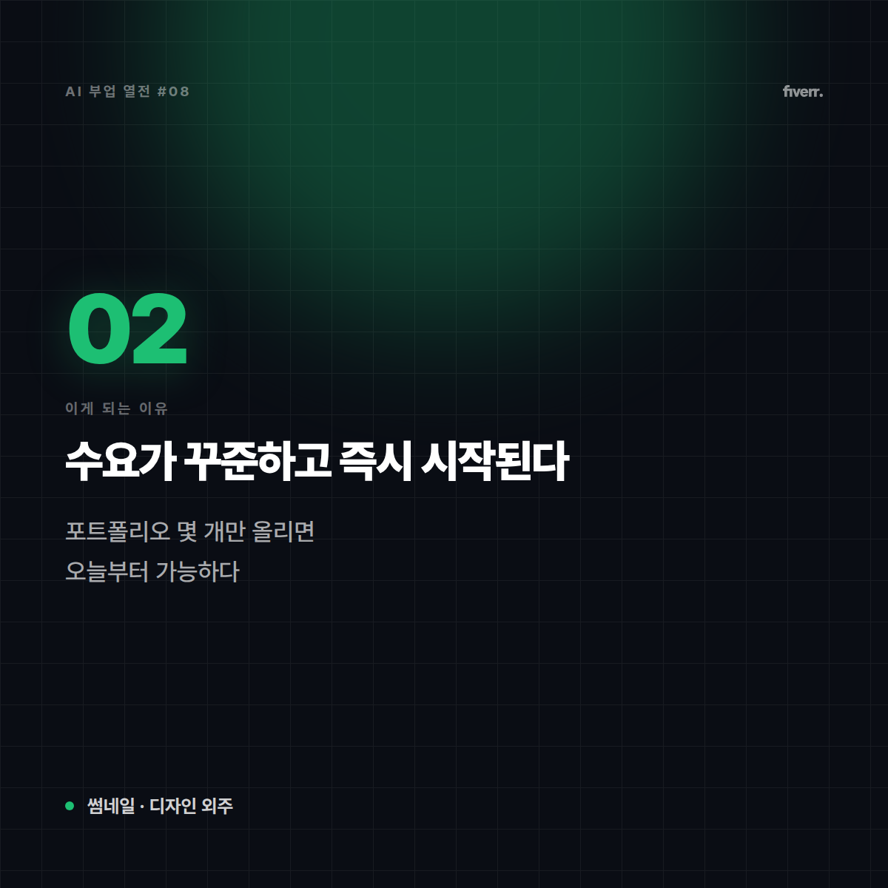
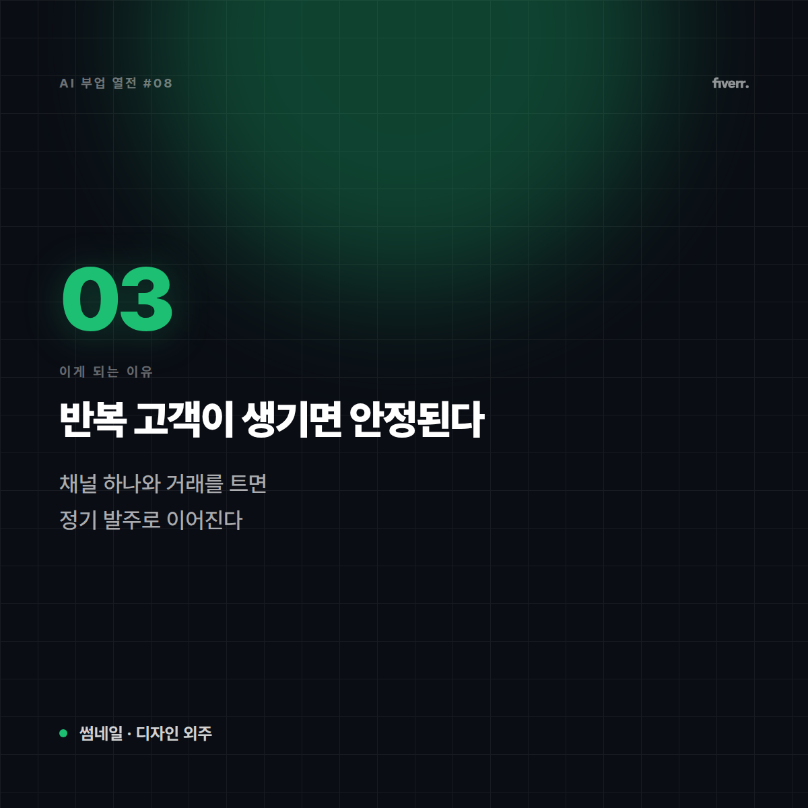
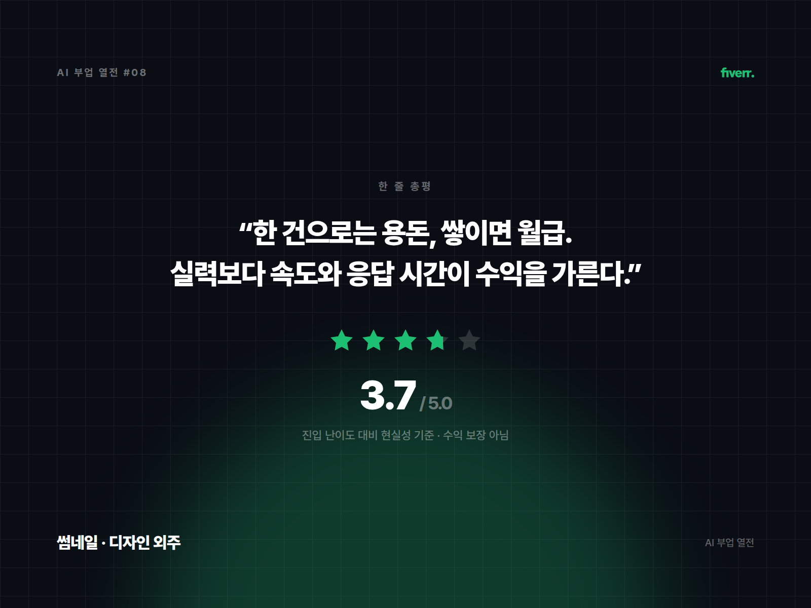

# [AI 부업 열전 #8] 썸네일·디자인 외주 — 작은 작업을 빠르게 쳐내는 속도전

*시리즈: AI 부업 열전 | 8/10 | 오늘의 주인공: 썸네일 · 배너 · 로고 등 소액 디자인 외주*

---

## 한 줄 소개

유튜브 썸네일, SNS 배너, 간단한 로고처럼 건당 단가는 작지만 회전이 빠른 디자인 작업을 받는 일. 재능마켓 플랫폼에서 가장 거래량이 많은 카테고리 중 하나다.

## 이 부업은 이런 일이다

비유하자면 **분식집**이다. 한 그릇 단가는 낮지만 회전이 빠르고, 손에 익으면 동시에 여러 개를 돌릴 수 있다. 대신 손이 느리면 남는 게 없다.

## 이게 되는 이유 3가지

**1. 작업 시간이 극적으로 줄었다**
배경 제거, 시안 여러 개 뽑기, 색 조합 바꾸기 — 예전엔 수작업이던 게 클릭 몇 번이 됐다. 건당 단가가 낮아도 시간당 수익은 올라간다.

**2. 수요가 꾸준하고 진입이 즉시 가능하다**
유튜버·소상공인·1인 사업자가 계속 늘어나는 한 썸네일 수요는 사라지지 않는다. 포트폴리오 몇 개만 올리면 오늘 바로 시작할 수 있다.

**3. 반복 고객이 생기면 안정된다**
채널 하나와 거래를 트면 매주 정기 발주로 이어지는 경우가 많다. 신규 영업 없이도 기본 물량이 깔린다.

## 솔직한 리스크

- **단가가 낮다**: 건당 금액이 작아서 물량이 안 나오면 시급이 최저임금 아래로 떨어질 수 있다. **물량 확보가 전부인 종목이다.**
- **AI로 진입장벽이 낮아진 만큼 경쟁자도 늘었다**: 같은 도구를 누구나 쓴다. 결국 차별점은 감각과 응답 속도다.
- **감정 노동**: "조금만 더 눈에 띄게요" 같은 모호한 수정 요청이 반복된다.
- **저작권**: 폰트·이미지 라이선스를 확인하지 않고 납품하면 고객 쪽 분쟁이 내 책임으로 돌아온다.

## 이런 사람에게 맞다

- 손이 빠르고 결과물을 빨리 쳐내는 데 능한 사람
- 완벽함보다 '적당히 좋고 빠르게'를 받아들일 수 있는 사람
- 디자인 툴을 이미 다뤄본 사람

## 이런 사람에겐 비추

- 작품 하나에 오래 공들이는 성향인 사람 (구조적으로 안 맞는다)
- 낮은 단가에 스트레스를 크게 받는 사람

## 한 줄 총평

**"한 건으로는 용돈, 쌓이면 월급이 되는 박리다매형. 실력보다 속도와 응답 시간이 수익을 가른다."**

⭐️⭐️⭐️½ (3.7/5) — 즉시 시작 가능하다는 게 최대 장점. 단, 물량을 못 만들면 시급이 무너진다.

---

*다음 편 예고: [AI 부업 열전 #9] 업무 자동화 구축 대행 — "남의 회사 일손을 기계로 바꿔주는 기술자" 편에서 계속됩니다.*

---

## 🖼 이미지 (5장)

이 포스팅 전용으로 제작한 이미지입니다. 원본은 `images/08_썸네일디자인외주/` 폴더에 있습니다.

**대표 썸네일 (1600×900)**

**이유 ① 카드 (1200×1200)**

**이유 ② 카드 (1200×1200)**

**이유 ③ 카드 (1200×1200)**

**총평 · 별점 카드 (1600×1200)**

