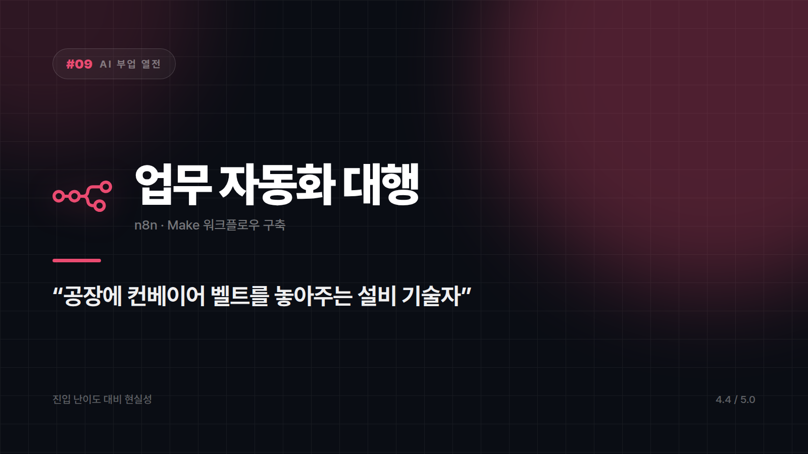

# [AI 부업 열전 #9] 업무 자동화 구축 대행 — 남의 회사 일손을 기계로 바꿔주는 기술자

*시리즈: AI 부업 열전 | 9/10 | 오늘의 주인공: n8n · Make 등 자동화 워크플로우 구축*

---

## 한 줄 소개

중소기업·소상공인의 반복 업무를 자동화 툴로 엮어주는 일. 주문서가 들어오면 자동으로 시트에 기록되고, 알림이 가고, 답장까지 나가는 식의 파이프라인을 대신 만들어준다.

## 이 부업은 이런 일이다

비유하자면 **공장에 컨베이어 벨트를 놓아주는 설비 기술자**다. 지금까지 사람이 손으로 물건을 나르던 걸 기계로 바꿔주는 일. 한 번 깔아주면 사장님은 매달 사람 몫의 시간을 아끼니, 비용을 지불할 이유가 아주 명확하다.

## 이게 되는 이유 3가지

**1. 단가가 이 시리즈에서 가장 높다**
썸네일 한 장과 달리, 자동화 한 세트는 회사의 인건비를 직접 줄여준다. 고객이 체감하는 가치가 크니 청구할 수 있는 금액도 자릿수가 다르다.

**2. 유지보수라는 반복 매출이 붙는다**
한 번 구축하면 끝이 아니라, 수정·확장·장애 대응이 계속 따라온다. 월 단위 계약으로 전환되는 경우가 많아 **일회성이 아닌 고정 수입**이 된다.

**3. 코딩을 몰라도 진입할 수 있다**
n8n·Make 같은 노코드 툴은 블록을 연결하는 방식이다. 개발자가 아니어도 논리적으로 순서를 짤 줄 알면 시작할 수 있고, 막히는 부분은 AI에게 물어가며 해결할 수 있다.

## 솔직한 리스크

- **학습 기간이 필요하다**: 이 시리즈에서 **시작까지 가장 오래 걸리는 종목**이다. 최소 몇 주는 툴을 만져봐야 남의 일을 받을 수 있다.
- **책임 범위가 크다**: 자동화가 멈추면 고객의 업무가 멈춘다. 장애 대응 범위를 계약서에 명확히 써두지 않으면 24시간 대기하는 상황이 된다.
- **고객 데이터 취급**: 주문·고객 정보를 다루게 되므로 개인정보 처리 책임이 따라온다. 가볍게 볼 부분이 아니다.
- **영업이 필요하다**: 플랫폼에 올려두면 알아서 들어오는 구조가 아니다. 초기에는 직접 찾아다녀야 한다.

## 이런 사람에게 맞다

- 회사에서 "이거 맨날 손으로 하는 거 짜증난다"를 느껴본 직장인 (그 경험이 그대로 상품이 된다)
- 논리적으로 순서를 설계하는 걸 좋아하는 사람
- 단기 수익보다 장기 고정 매출을 원하는 사람

## 이런 사람에겐 비추

- 이번 달 안에 수익이 나야 하는 사람
- 고객사 장애 대응 같은 책임을 지고 싶지 않은 사람

## 한 줄 총평

**"배우는 데 가장 오래 걸리지만, 한 번 자리 잡으면 가장 안정적으로 도는 종목. 부업이라기보다 작은 사업에 가깝다."**

⭐️⭐️⭐️⭐️½ (4.4/5) — 이 시리즈 최고점. 진입장벽이 곧 방어막이 되어주는 몇 안 되는 아이템.

---

*다음 편 예고: [AI 부업 열전 #10] BGM·오디오 판매 — "귀에 걸리는 15초를 파는 장사" 최종편에서 계속됩니다.*

---

본문에 그림이 들어가면 좋을 자리는 아래와 같다. 실제 이미지는 아직 넣지 않았다.

〔이미지 자리 — 본문에서 1번째 이유를 설명하는 대목〕

〔이미지 자리 — 본문에서 2번째 이유를 설명하는 대목〕

〔이미지 자리 — 본문에서 3번째 이유를 설명하는 대목〕

〔이미지 자리 — 총평 문단 바로 위〕
