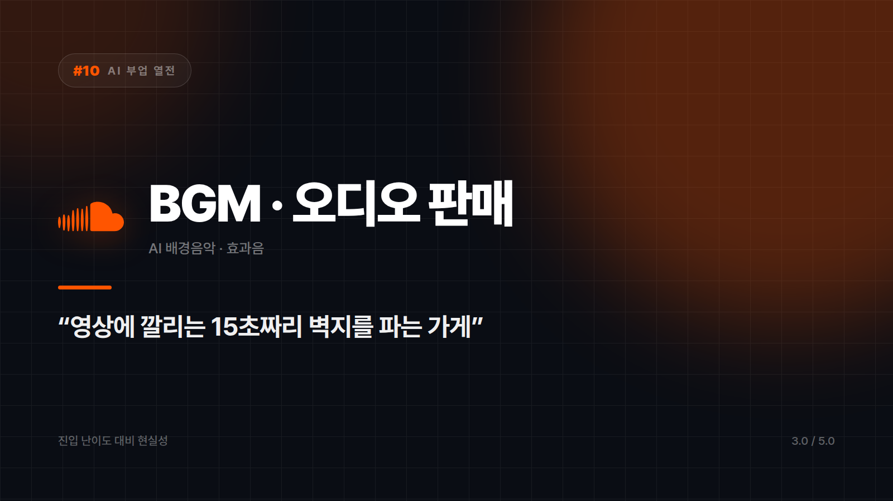

# BGM·오디오 판매 — 귀에 걸리는 15초를 파는 장사

*시리즈: AI 부업 열전 | 10/10 | 오늘의 주인공: AI 배경음악 · 효과음 판매*

---

AI 작곡 도구로 배경음악을 만들어 음원 라이브러리에 등록해두고, 영상 제작자가 쓸 때마다 수익을 받는다. 악보를 못 읽어도 시작할 수 있다는 점에서 문턱이 가장 극적으로 낮아진 영역이다.

영상에 깔리는 15초짜리 벽지를 파는 가게라고 보면 된다. 아무도 배경음악을 감상하려고 영상을 보지는 않는다. 그런데 없으면 허전하다. 주인공이 아니라 무대 장치를 파는 장사다. 벽지 무늬가 너무 튀면 방이 산만해 보이듯, 배경음악도 너무 개성 있으면 영상에서 붕 뜬다. 존재감이 없는 게 이 바닥에서는 오히려 실력이다.

장르와 분위기만 넣으면 완성된 곡이 나온다. 악기와 작곡과 믹싱을 다 배워야 겨우 넘볼 수 있던 영역이었다는 걸 생각하면 이상할 정도다. 수요도 분명히 있다. 유튜브든 쇼츠든 릴스든 광고든, 영상이 만들어지는 곳에는 반드시 배경음악이 필요하고 그 수는 계속 는다. 전자책이나 스톡 이미지처럼 한 번 등록해두면 계속 일하는 축적형 구조라, 잘 만든 곡 하나가 여러 영상에 반복해서 쓰이면 수익이 꾸준히 들어온다.

## 이 종목의 진짜 관문은 음악이 아니다

플랫폼 약관이 가장 큰 변수입니다. 음원 라이브러리마다 AI 생성 음악에 대한 정책이 다릅니다. 아예 금지하는 곳, 별도 표기를 요구하는 곳, 허용하는 곳이 섞여 있습니다. **등록 전에 반드시 해당 플랫폼 약관을 확인해야 합니다.**

생성 도구 쪽 조건도 따로 봐야 합니다. AI 음악 서비스는 요금제에 따라 상업적 사용 권리가 달라지는 경우가 많습니다. 무료 플랜으로 만든 곡을 팔면 약관 위반이 될 수 있으니, 이것도 반드시 사전 확인 대상입니다.

여기까지 통과해도 차별화라는 벽이 남는다. 같은 도구에 같은 프롬프트를 넣으면 비슷한 곡이 나온다. 무난한 곡은 이미 넘쳐난다. 기존 곡과 유사하다는 신고가 들어올 여지도 있고, 이 영역의 법적 기준은 아직 정리되는 중이다.

음악 듣는 걸 좋아하고 장르 감각이 있는 사람에게 맞는다. 브이로그용이든 게임용이든 명상용이든 운동용이든, 용도를 좁혀 파는 감각이 있으면 더 좋다. 그리고 약관을 꼼꼼히 읽고 지킬 수 있어야 한다. 이 종목은 그게 실력의 절반이다. "잔잔한 피아노, 잔잔한 감성"을 넣고 뽑은 곡이 지구 반대편 누군가의 결과물과 쌍둥이처럼 라이브러리에 나란히 걸리는 일도 드물지 않다. 약관 확인이 귀찮은 성격이라면 계정과 수익이 한 번에 사라질 수 있고, 빠른 수익화가 필요하다면 애초에 자리가 아니다.

만들기는 세상에서 제일 쉬워졌는데 파는 자격을 갖추는 게 제일 까다로워졌다. 약관 읽기가 곧 실력인 종목이다.

⭐️⭐️⭐ (3.0/5) — 가능성은 있으나 규정 리스크가 커서 신중한 접근이 필요하다.

---

## 시리즈를 마치며

열 가지를 훑고 나니 불편하지만 분명한 패턴이 하나 보인다.

점수가 높았던 쪽은 자동화 대행 4.4, 번역 4.2, 상세페이지 4.1, 전자책 4.0이었다. 전부 이미 내가 가진 무언가가 있어야 굴러가는 종목이다. 어학 실력, 업계 경험, 사람 상대하는 능력, 순서를 설계하는 머리 같은 것들.

점수가 낮았던 쪽은 스톡 이미지 2.8, BGM 3.0, 블로그 3.4였다. 이쪽은 AI만 있으면 누구나 할 수 있다는 공통점이 있었다. 그리고 바로 그 이유로 경쟁이 포화됐다.

AI는 진입장벽을 낮춰준다. 그런데 진입장벽이 낮은 곳에는 돈이 남지 않는다. 두 문장이 같이 참이라는 게 이 시리즈에서 열 번 확인한 것이다. AI의 쓸모는 원래 할 줄 알던 일의 속도를 몇 배로 올리는 쪽에 있었지, 아무것도 없는 상태에서 대신 벌어다 주는 쪽에는 없었다.

그러니 물어볼 것도 바뀐다. AI로 뭘 해서 돈을 벌까가 아니라, 내가 원래 할 줄 아는 것에 AI를 어떻게 붙일까. 앞쪽 질문에는 수십만 명이 같이 줄을 서 있고, 뒤쪽 질문 앞에는 그렇게 붐비지 않는다.

---

*시리즈 전체 목록: 01 블로그 자동화 · 02 유튜브 쇼츠 · 03 전자책 출판 · 04 스톡 이미지 · 05 온라인 강의 · 06 번역·현지화 · 07 상세페이지 제작 · 08 썸네일 외주 · 09 업무 자동화 대행 · 10 BGM·오디오*

*※ 본 시리즈의 별점은 수익 금액이 아니라 "진입 난이도 대비 현실성"을 기준으로 매겼습니다. 실제 수익은 개인차가 매우 크며, 특정 수익을 보장하지 않습니다. 플랫폼 약관과 관련 법규는 수시로 바뀌므로 시작 전 반드시 직접 확인하시기 바랍니다.*

---

본문에 그림이 들어가면 좋을 자리는 아래와 같다. 실제 이미지는 아직 넣지 않았다.

〔이미지 자리 — 본문에서 1번째 이유를 설명하는 대목〕

〔이미지 자리 — 본문에서 2번째 이유를 설명하는 대목〕

〔이미지 자리 — 본문에서 3번째 이유를 설명하는 대목〕

〔이미지 자리 — 총평 문단 바로 위〕
