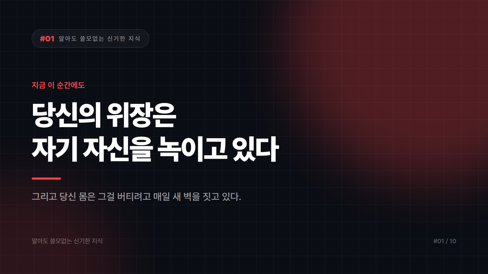

# 당신의 위장은 지금 이 순간에도 자기 자신을 녹이고 있다

*시리즈: 알아도 쓸모없는 신기한 지식 | 첫 번째 이야기*

---

당신의 위 속에는 금속도 갉아먹을 만큼 독한 산이 들어 있습니다.

그런데 왜 위는 안 녹을까요?

정답은 "안 녹는다"가 아닙니다.

녹습니다. 지금 이 순간에도 위벽은 자기가 만든 산에 조금씩 상하고 있어요.

위가 버티는 비결은 방어가 아니라 속도입니다. 위 안쪽 표면은 점액층으로 덮여 있고, 그 아래 세포들은 상하는 족족 새것으로 교체됩니다. 벽이 튼튼해서가 아닙니다. 벽을 계속 새로 바르고 있어서 멀쩡해 보이는 거죠. 페인트가 벗겨지는 속도보다 칠하는 속도가 빠른 다리 같은 겁니다.

그러니까 당신의 위는 지금 자기랑 싸우면서 간신히 이기고 있는 중입니다. 밤에 야식 시킬 때 한 번쯤 미안해하셔도 됩니다.

## 근데 여기서 더 이상한 게 있습니다

당신 눈의 제일 앞쪽, 검은자를 덮고 있는 투명한 막(각막)에는 혈관이 없습니다.

몸의 거의 모든 조직은 혈관으로 산소와 영양분을 받습니다. 혈관 없이 사는 조직은 거의 없어요. 그런데 각막만은 예외입니다.

이유는 단순하고 잔인할 만큼 합리적입니다. 혈관이 있으면 안 보이거든요. 렌즈 한가운데에 빨간 핏줄이 지나간다고 생각해 보세요. 선명함을 위해 각막은 혈관을 포기했습니다.

대신 각막은 눈물과 눈 속 액체에서 영양분을 받고, 산소는 그냥 공기에서 직접 흡수합니다. 네, 당신의 눈은 표면으로 숨을 쉽니다. 렌즈를 너무 오래 끼면 안 된다는 잔소리에는 이런 배경이 있는 거죠.

## 그리고 결정적인 반전

아기와 어른 중, 뼈가 더 많은 쪽은 누구일까요?

직관적으로는 어른입니다. 크니까요.

아닙니다.

아기가 훨씬 많습니다.

갓 태어난 아기의 뼈는 대략 300개 안팎으로 알려져 있습니다. 다 자란 어른은 206개죠. 아기는 자라면서 뼈를 잃습니다.

정확히 말하면 잃는 게 아니라 합칩니다. 아기의 뼈 중 상당수는 아직 딱딱하게 굳지 않은 연골 덩어리이고, 여러 조각이 자라면서 하나로 붙습니다. 머리뼈가 대표적이에요. 아기 정수리가 말랑한 이유는 조각들이 아직 안 붙어서고, 그 말랑함 덕분에 좁은 산도를 머리가 통과할 수 있습니다.

즉 인간은 조립식으로 태어나서 살면서 용접되는 구조입니다.

## 보너스: 당신은 아침마다 키가 큽니다

밤새 누워 있는 동안 척추뼈 사이의 물렁한 디스크가 눌림에서 풀려 다시 부풀어 오릅니다. 그래서 아침에 잰 키가 저녁에 잰 키보다 살짝 큽니다. 하루 안에 줄었다가 다시 돌아오는 걸 평생 반복하는 거죠.

키 재는 날 아침 일찍 가라는 말은, 놀랍게도 과학입니다.

## 그래서 이걸 알면 뭐가 좋냐면

아무 쓸모 없습니다.

위가 자기를 녹인다는 걸 안다고 속쓰림이 낫지 않고, 각막이 숨 쉰다는 걸 안다고 시력이 좋아지지 않으며, 아침에 키가 크다는 걸 안다고 그 1cm가 평생 가지도 않습니다.

다만 오늘 하루, 당신 몸이 아무 보상도 없이 얼마나 정교하게 일하고 있는지는 알게 되셨습니다. 그것도 쓸모는 없습니다만.

---

*다음 편: 심장이 세 개인데 피는 파란 동물이 있습니다.*

---

본문에 그림이 들어가면 좋을 자리는 아래와 같다. 실제 이미지는 아직 넣지 않았다.

〔이미지 자리 — 본문에서 1번째 논점을 설명하는 대목〕

〔이미지 자리 — 본문에서 2번째 논점을 설명하는 대목〕

〔이미지 자리 — 본문에서 3번째 논점을 설명하는 대목〕

〔이미지 자리 — 마지막 문단 바로 위〕
