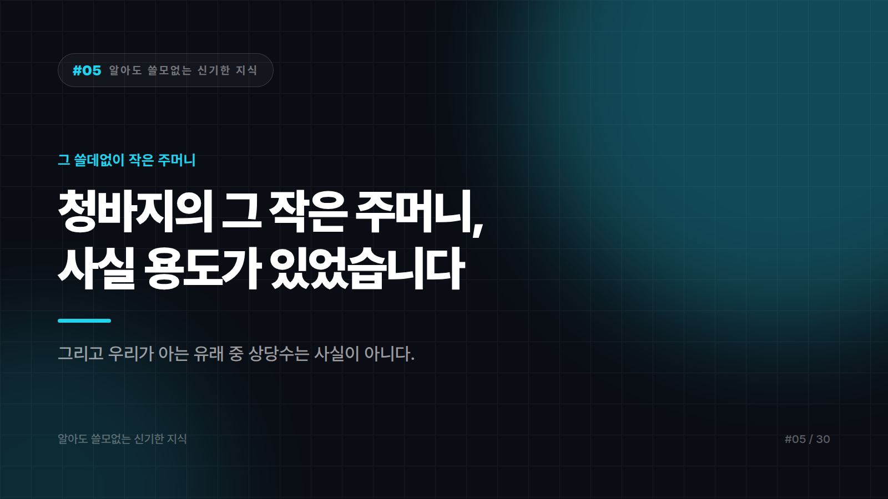

# 청바지의 그 쓸데없이 작은 주머니, 사실 용도가 있었습니다

*시리즈: 알아도 쓸모없는 신기한 지식 | 5/30*

---

지금 청바지 입고 계신가요? 오른쪽 앞주머니 안에 붙어 있는, 손가락 두 개 겨우 들어가는 그 작은 주머니 말입니다.

거기에 뭘 넣어보셨습니까? 동전? 라이터? 아마 거의 아무것도 안 넣으셨을 겁니다.

그 주머니는 **회중시계**를 넣던 자리로 전해집니다.

주머니에 넣고 줄로 연결해서 꺼내 보던 그 손목시계 이전 세대의 시계요. 작업복 바지에 시계를 안전하게 넣을 칸이 필요했던 시절의 설계입니다.

회중시계는 진작에 사라졌습니다. 손목시계로, 다시 휴대폰으로 넘어갔죠. 그런데 그 주머니는 **150년 가까이 살아남았습니다.**

용도가 사라졌는데 형태만 남은 것. 디자인 업계에서는 이런 걸 화석이라고 부릅니다. 그리고 이런 화석은 생각보다 도처에 있습니다.

## 예를 들면 키보드

지금 손 아래 있는 자판을 보세요. Q W E R T Y.

알파벳 순서도 아니고, 자주 쓰는 글자가 모여 있지도 않습니다. 대놓고 비효율적으로 생겼어요.

이 배열은 **기계식 타자기 시대**에 만들어졌습니다. 글자마다 금속 막대가 달려 있어서 튀어 올라 종이를 때리는 구조였죠.

가장 널리 알려진 설명은 이렇습니다. 자주 붙어 나오는 글자들을 멀리 떨어뜨려서 **막대끼리 엉키는 걸 줄이려 했다**는 것. 다만 이 설명이 전부인지에 대해서는 이견도 있습니다. 전신 기사들의 작업 습관, 판매 전략 등 다른 요인이 섞였다는 주장도 있어요. 단일 원인으로 딱 잘라 말하기는 어렵습니다.

확실한 건 하나입니다. **엉킬 막대는 이미 100년 전에 사라졌는데, 배열은 안 사라졌습니다.**

더 효율적인 배열이 나중에 여러 번 제안됐고, 실제로 더 빠르다는 주장도 있었습니다. 그런데 아무도 안 바꿨어요. 이미 전 세계가 손가락으로 외워버린 뒤였거든요.

기술은 최고가 이기는 게 아니라, **먼저 익숙해진 쪽이 이깁니다.**

## 그리고 연필 이야기

연필심을 흔히 "연필 납"이라고 하죠. 영어로도 pencil lead, 말 그대로 납입니다.

연필심에는 **납이 없습니다.** 한 톨도요. 흑연과 점토를 섞어 구운 겁니다.

왜 납이라고 부르냐면, 옛날 유럽에서 흑연 광맥을 발견했을 때 사람들이 그걸 **납의 일종으로 착각했기** 때문입니다. 검고 무르고 손에 묻으니까요. "검은 납"이라고 불렀고, 나중에 화학적으로 전혀 다른 물질이라는 게 밝혀졌는데 이름은 그대로 굳었습니다.

그러니까 우리는 수백 년째 틀린 이름을 부르고 있습니다. 아무도 안 고치고요.

## 여기서 한 번 뒤집겠습니다

이런 이야기를 좋아하면 반드시 만나는 유명한 썰이 하나 있습니다.

**"현대 철도 선로의 폭은 고대 로마 전차의 바퀴 간격에서 왔고, 그건 말 두 마리의 엉덩이 너비다."**

인터넷에서 수십 년째 돌고 있고, 발표 자료 단골 소재고, 들으면 소름이 돋습니다.

**근거가 없습니다.**

여러 차례 검증 대상이 됐고, 사실로 확인되지 않은 이야기로 정리되는 쪽입니다. 그럴듯한 구조, 깔끔한 결론, 마지막의 말 엉덩이 펀치라인. 사실이 아니라 **잘 만들어진 이야기**라서 살아남은 거죠.

재미있는 TMI와 가짜 TMI의 차이는 딱 하나입니다. 추적이 되느냐. 회중시계 주머니와 연필의 흑연은 추적이 되고, 말 엉덩이는 안 됩니다.

그래서 이 시리즈는 소름 돋는 얘기를 하나 버렸습니다. 아까워도 어쩔 수 없습니다.

## 그래서 이걸 알면 뭐가 좋냐면

아무 쓸모 없습니다.

작은 주머니의 정체를 안다고 거기에 넣을 물건이 생기지도 않고, QWERTY의 역사를 안다고 타자 속도가 오르지도 않습니다. 연필심에 납이 없다는 걸 알아도 여전히 "연필 납"이라고 부르실 거고요.

다만 오늘 하루 집 안을 둘러보면, 이유가 사라진 채 모양만 남은 물건이 몇 개쯤 보이실 겁니다. 세어봐야 쓸모는 없습니다.

---

*다음 편: 바나나는 베리인데 딸기는 베리가 아닙니다. 억울하시죠.*

---

본문에 그림이 들어가면 좋을 자리는 아래와 같다. 실제 이미지는 아직 넣지 않았다.

〔이미지 자리 — 본문에서 1번째 논점을 설명하는 대목〕

〔이미지 자리 — 본문에서 2번째 논점을 설명하는 대목〕

〔이미지 자리 — 본문에서 3번째 논점을 설명하는 대목〕

〔이미지 자리 — 마지막 문단 바로 위〕
