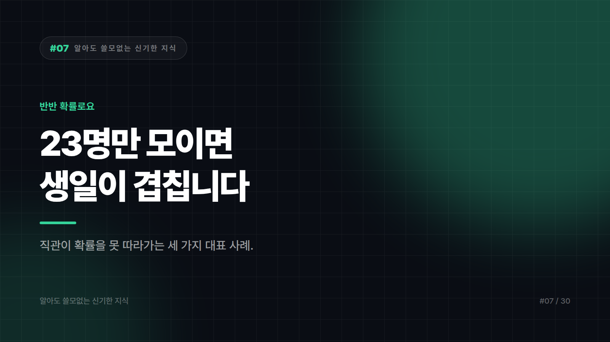

# 23명만 모이면 생일이 겹칩니다. 반반 확률로요.

*시리즈: 알아도 쓸모없는 신기한 지식 | 일곱 번째 이야기*

---

교실에 23명이 있습니다. 그중 생일이 같은 사람이 한 쌍이라도 있을 확률은?

대부분 이렇게 생각합니다. "1년이 365일인데 23명? 한 10%?"

약 50%입니다. 동전 던지기랑 비슷해요.

그리고 70명쯤 모이면 99%를 넘습니다. 사실상 무조건 겹칩니다.

거짓말 같죠? 계산을 안 해도 이해할 방법이 있습니다.

## 함정은 "명수"가 아니라 "짝의 수"입니다

우리 머릿속은 23이라는 숫자를 365와 비교합니다. 그래서 작아 보여요.

하지만 실제로 따져야 할 건 비교가 몇 번 일어나느냐입니다.

23명 중 두 사람을 뽑는 조합의 수는 253쌍입니다. 스물세 명이 서로를 한 번씩 확인하면 253번의 대조가 일어나요. 253번이면 365일 중 하나가 걸릴 만하죠.

사람 수는 천천히 늡니다. 쌍의 수는 훨씬 빠르게 늘고요. 인원이 두 배가 되면 쌍은 네 배 가까이 됩니다. 우리 직관은 이 곱셈을 못 따라갑니다.

## 근데 여기서 반전이 있습니다

똑같은 23명 교실에서 질문만 살짝 바꿔보겠습니다.

"나와 생일이 같은 사람이 있을 확률은?"

이건 50%가 아닙니다. 6% 남짓이에요.

같은 방, 같은 인원인데 답이 열 배 가까이 차이 납니다.

왜냐면 이제 대조 횟수가 253번이 아니라 22번이거든요. 나 하나를 나머지 스물두 명과 비교하는 거니까요.

"누군가끼리 겹칠 확률"과 "나와 겹칠 확률"은 완전히 다른 질문입니다. 그리고 사람들은 이 둘을 거의 항상 헷갈립니다.

세상에 "이런 우연이!" 싶은 일이 자꾸 일어나는 이유가 여기 있습니다. 우리는 나를 중심으로 세상을 세지만, 우연은 모든 쌍에서 일어나거든요.

## 두 번째 함정: 도박사의 오류

동전을 던져서 앞면이 일곱 번 연속 나왔습니다. 다음은 뒷면이 나올 것 같지 않나요?

아닙니다. 정확히 반반입니다.

동전은 자기가 방금 뭘 했는지 기억하지 못합니다. 기록을 들고 있는 건 당신이지, 동전이 아니에요.

"이제 나올 때가 됐다"는 감각은 확률이 아니라 균형을 바라는 인간의 욕구입니다. 로또 번호를 고를 때 "이 번호 한동안 안 나왔으니까"라고 생각하신 적 있다면, 방금 그게 이겁니다.

## 세 번째 함정: 문 세 개

문이 셋 있고, 하나 뒤에 자동차, 둘 뒤에는 꽝이 있습니다. 당신이 1번을 고릅니다.

정답을 아는 진행자가 남은 둘 중 꽝인 문 하나를 열어 보여줍니다. 그리고 묻습니다. "바꾸시겠습니까?"

남은 문이 두 개니까 반반 같죠. 바꾸나 안 바꾸나 똑같을 것 같고요.

바꾸는 게 유리합니다. 바꾸면 이길 확률이 약 3분의 2가 됩니다.

이유는 이렇습니다. 처음에 당신이 정답을 골랐을 확률은 3분의 1입니다. 즉 3분의 2 확률로 정답은 나머지 두 문 중에 있었다는 얘기입니다. 진행자가 그중 꽝을 치워준 순간, 그 3분의 2가 통째로 남은 문 하나에 몰립니다.

핵심은 진행자가 아무 문이나 연 게 아니라는 데 있습니다. 그는 정답을 알고 있었고, 일부러 꽝을 열었습니다. 그 순간 정보가 흘러들어온 거예요.

이 문제는 발표 당시 수학 전공자들까지 대거 틀렸다고 전해질 만큼 직관을 정면으로 배신합니다.

## 그래서 이걸 알면 뭐가 좋냐면

아무 쓸모 없습니다.

생일 문제를 안다고 로또가 되는 게 아니고, 도박사의 오류를 안다고 도박이 이득이 되지도 않습니다. 오히려 정확히 반대 결론이 나오죠.

다만 술자리에 23명이 모였을 때 "여기 생일 같은 사람 있을걸요"라고 한 번 걸어볼 수는 있습니다. 반반 확률로 멋있어지고, 반반 확률로 조용해집니다.

---

*다음 편: 종이를 42번 접으면 달에 닿습니다. 계산해 보면 진짜로요.*

---

본문에 그림이 들어가면 좋을 자리는 아래와 같다. 실제 이미지는 아직 넣지 않았다.

〔이미지 자리 — 본문에서 1번째 논점을 설명하는 대목〕

〔이미지 자리 — 본문에서 2번째 논점을 설명하는 대목〕

〔이미지 자리 — 본문에서 3번째 논점을 설명하는 대목〕

〔이미지 자리 — 마지막 문단 바로 위〕
