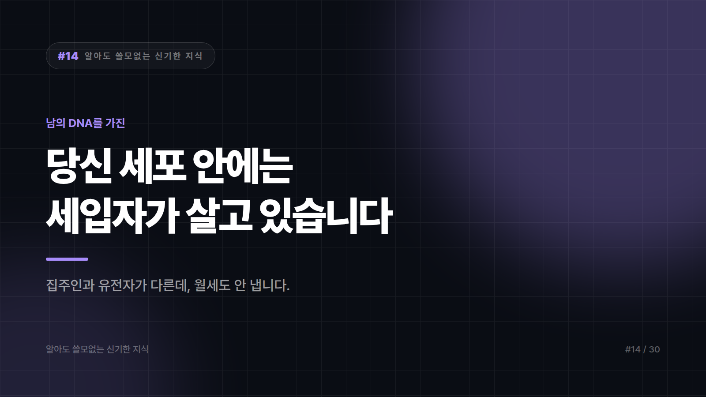

# 당신 세포 안에는 남의 DNA를 가진 세입자가 살고 있습니다

*시리즈: 알아도 쓸모없는 신기한 지식 | 14/30*

---

학교에서 이렇게 배웠을 겁니다. "미토콘드리아는 세포의 발전소입니다."

틀린 말은 아닙니다. 그런데 훨씬 이상한 부분을 안 가르쳐줬어요.

**미토콘드리아는 자기만의 DNA를 갖고 있습니다.**

당신의 DNA가 아닙니다. 세포핵에 들어 있는 그 유전자 세트와 별개로, 미토콘드리아는 따로 유전자를 챙겨두고 있어요.

세포 안에 다른 살림이 차려져 있는 겁니다.

## 얘는 원래 남이었습니다

지금 가장 널리 받아들여지는 설명은 이렇습니다.

아주 오래전, 어떤 큰 세포가 작은 세균 하나를 삼켰습니다. 그런데 소화를 못 시켰어요. 혹은 안 시켰거나요.

삼켜진 쪽은 산소를 써서 에너지를 뽑는 재주가 있었습니다. 삼킨 쪽은 그 에너지를 받아 썼고요.

그렇게 둘은 동거를 시작했습니다. 그리고 그 동거가 **끝나지 않았습니다.**

증거가 여럿 있습니다. 미토콘드리아는 세균처럼 고리 모양 DNA를 갖고 있고, 자기 단백질 공장을 따로 돌리고, 스스로 둘로 쪼개져 늘어납니다. 막도 이중이에요. 삼켜질 때 바깥막을 뒤집어쓴 흔적이라는 설명이 붙습니다.

세포가 분열할 때 미토콘드리아가 새로 만들어지는 게 아닙니다. 원래 있던 것이 **자기 방식대로 증식해서** 나뉘어 갑니다.

## 식물은 세입자를 하나 더 들였습니다

식물 세포에는 엽록체가 있죠.

엽록체도 똑같습니다. 자기 DNA가 있고, 이중막이고, 스스로 분열합니다.

그 조상은 광합성을 하던 세균, 그러니까 앞 편에 나온 시아노박테리아 계열로 봅니다.

정리하면 이렇게 됩니다. 식물 세포는 **세입자를 두 번 들인 세포**입니다. 에너지 담당 하나, 광합성 담당 하나요.

지구의 거의 모든 복잡한 생물은 남을 삼켰다가 실패한 사건 위에 지어져 있습니다.

## 근데 세입자가 짐을 거의 다 뺐습니다

여기서 반전입니다.

미토콘드리아가 독립 생명체처럼 들리지만, 사실은 전혀 독립적이지 않습니다.

동거하는 동안 미토콘드리아 유전자는 대부분 **세포핵 쪽으로 옮겨갔습니다.** 지금 미토콘드리아에 남아 있는 유전자는 아주 적어요. 나머지 부품은 핵이 만들어서 배달해 줍니다.

그러니까 얘는 세입자라기보다, 열쇠를 집주인에게 다 맡기고 방 한 칸만 쓰는 신세가 됐습니다. 혼자 떼어놓으면 못 삽니다.

재미있는 건 세균 시절의 흔적이 아직 남아 있다는 겁니다. 세균의 단백질 공장을 노리는 일부 항생제가 미토콘드리아에도 영향을 줄 수 있는지가 연구 대상이 될 정도로요.

## 그리고 이 세입자는 엄마만 물려줍니다

또 하나 특이한 점.

핵 속 유전자는 양쪽 부모에게서 절반씩 받습니다. 그런데 미토콘드리아 DNA는 기본적으로 **어머니 쪽만** 전해집니다.

정자에도 미토콘드리아는 있지만, 수정 과정에서 아버지 쪽 미토콘드리아는 거의 남지 않습니다. 드문 예외 보고가 있긴 하지만 원칙은 모계예요.

그래서 이 DNA를 거꾸로 따라가면 모든 사람의 모계 조상 한 명에 도달합니다. 흔히 '미토콘드리아 이브'라고 부르죠.

여기서 오해가 하나 있습니다. 이 사람이 **당시 지구의 유일한 여자였다는 뜻이 아닙니다.** 동시대에 사람은 많았고, 그중 모계 혈통이 지금까지 끊기지 않고 이어진 사람이 이 한 명이라는 뜻입니다. 계산 기준이 바뀌면 그 사람이 누구인지도 바뀝니다.

## 그래서 이걸 알면 뭐가 좋냐면

아무 쓸모 없습니다.

세입자한테 월세를 받을 수도 없고, 내보낼 수도 없습니다. 내보내면 같이 죽습니다.

다만 다음에 계단을 오르다 숨이 찰 때, 그 힘든 일을 대신 해주고 있는 건 엄밀히 말해 당신이 아니라 **아득한 옛날에 잘못 삼켜진 세균의 후손들**이라는 걸 알게 되셨습니다.

고맙다고 해도 듣지는 못합니다. 유전자를 거의 다 뺏겼거든요.

---

*다음 편: 개미는 동료가 죽었는지 냄새로 판단합니다. 그래서 속이기도 쉽습니다.*

---

