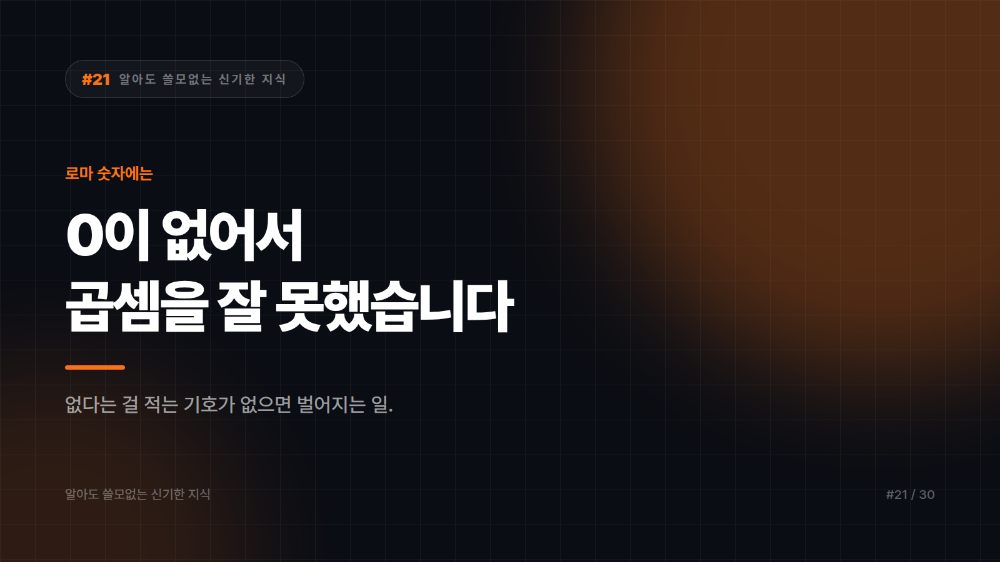

# 로마 숫자에는 0이 없습니다. 그래서 로마인은 곱셈을 잘 못했어요.

*시리즈: 알아도 쓸모없는 신기한 지식 | 21/30*

---

로마 숫자를 떠올려 보세요. I, V, X, L, C, D, M.

어디에도 0이 없습니다.

없어서 못 쓴 게 아닙니다. 필요가 없어서 없었어요. 로마 숫자에는 자릿수라는 개념 자체가 없었거든요.

그리고 그 차이 하나가 문명의 계산 속도를 몇백 년 갈라놨습니다.

## 자릿값이라는 발명

우리가 쓰는 숫자에서 205와 25는 완전히 다릅니다. 가운데 0이 "여기 십의 자리는 비어 있음"을 선언하기 때문이죠.

0은 "없음"을 뜻하는 게 아닙니다. "여기 자리가 있는데 비었다"를 뜻하죠. 이게 훨씬 이상한 개념이에요.

이 위치 기수법은 인도에서 다듬어져 아랍 세계를 거쳐 유럽으로 들어왔습니다. 우리가 그 숫자를 아라비아 숫자라고 부르면서도 정작 인도 기원인 건 그 경로 때문입니다.

## 그래서 로마인은 어떻게 계산했냐면

MDCCLXXVI 곱하기 XLIX를 해보세요.

못 합니다. 저도 못 합니다.

로마 숫자는 기록용이지 계산용이 아닙니다. 실제 계산은 주판 같은 도구로 하고, 결과만 로마 숫자로 적었어요.

지금도 로마 숫자가 살아남은 자리를 보면 전부 그렇습니다. 시계 문자판, 책 서문 쪽번호, 영화 제작연도, 왕의 이름. 계산할 일이 없는 곳에만 남아 있죠.

## 근데 여기서 반전이 있습니다

0이 자릿수 채우는 기호로 쓰이는 것과, 0 자체를 하나의 숫자로 인정하는 것은 완전히 다른 단계입니다.

0을 숫자로 받아들이면 골치 아픈 질문들이 따라옵니다. 0을 더하면? 0을 곱하면? 그리고 0으로 나누면?

마지막 질문에는 아직도 답이 없습니다. 정확히는 "정의하지 않는다"가 답이에요. 수학이 포기한 게 아니라, 어떤 값을 넣어도 모순이 생겨서 자리를 비워둔 겁니다.

숫자 하나 받아들이는 대가로 영원히 답 없는 구멍이 하나 생긴 셈이죠.

## 지금도 우리는 0을 어색해합니다

증거가 사방에 있습니다.

21세기는 2001년에 시작했습니다. 서기 연도에 0년이 없어서 한 해씩 밀리거든요. 그래서 2000년 1월 1일에 전 세계가 한 세기 일찍 파티를 했습니다.

유럽 건물의 지상층은 0층입니다. 그 위를 1층으로 세죠. 미국식은 지상층이 곧 1층이고요. 같은 건물 같은 버튼인데 숫자가 다릅니다.

컴퓨터도 0부터 셉니다. 프로그래밍에서 첫 번째 항목은 0번이에요. 이것 때문에 매일 지구 어딘가에서 버그가 태어납니다.

나이 세는 법도 갈립니다. 태어난 순간을 0살로 볼 것이냐 1살로 볼 것이냐. 문화권마다 답이 다릅니다.

인류는 0을 받아들인 지 한참 됐는데도 셈을 어디서 시작할지는 아직 합의를 못 봤습니다.

## 그래서 이걸 알면 뭐가 좋냐면

아무 쓸모 없습니다.

0의 역사를 안다고 계산이 빨라지지 않고, 21세기가 2001년에 시작했다는 걸 안다고 그때 한 파티가 취소되지도 않습니다. 이미 두 번 다 했으면 이득 아닌가 싶기도 하고요.

다만 다음에 엘리베이터에서 0층 버튼을 보게 되면, 그게 인류가 수천 년 걸려 발명한 개념이 벽에 붙어 있는 장면이라는 건 아시게 됐습니다.

누르면 그냥 1층 갑니다.

---

*다음 편: 기차가 생기기 전까지, 옆 동네는 시간이 달랐습니다.*

---

