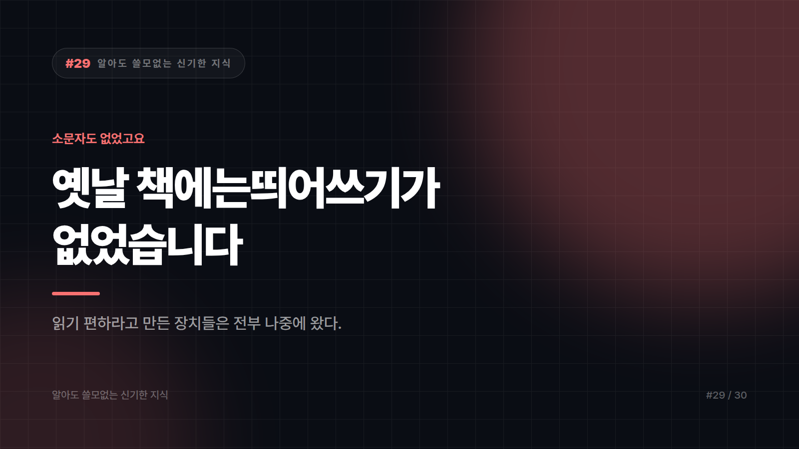

# 옛날 책에는띄어쓰기가없었습니다. 소문자도 없었고요.

*시리즈: 알아도 쓸모없는 신기한 지식 | 29/30*

---

이문장을읽는게불편하시죠.

고대 그리스와 로마의 문헌은 **대체로 저렇게 생겼습니다.**

단어 사이에 공백이 없습니다. 문장부호도 거의 없습니다. 그리고 글자는 전부 **대문자 한 종류**뿐이었어요. 지금 우리가 아는 소문자는 그때 존재하지 않았습니다.

즉 고대의 책은 이렇게 생긴 겁니다.

**ALLCAPSNOSPACESNOPUNCTUATION**

이걸 읽어야 했습니다. 몇 시간씩요.

## 그래서 읽기는 "소리 내는 일"이었습니다

공백이 없으면 어디서 단어가 끊기는지 눈으로 바로 알 수 없습니다. 그래서 소리를 내거나 입을 움직이면서 **덩어리를 귀로 찾아내는** 방식으로 읽었습니다.

지금 우리가 하는 눈으로만 쓱 훑는 독서는, 글자가 이미 잘게 잘려 있기 때문에 가능한 겁니다.

유명한 일화가 있습니다. 4세기 무렵의 한 기록에, 어떤 인물이 **입술도 움직이지 않고 조용히 글을 읽는 모습**을 보고 신기해했다는 대목이 나옵니다. 굳이 적어둘 만큼 인상적인 장면이었던 거죠.

여기서 조심할 게 있습니다. 이 일화는 "고대인은 묵독을 할 줄 몰랐다"는 결론으로 자주 확대되는데, **그 강한 주장은 과장입니다.** 묵독 사례를 보여주는 다른 기록들도 있고 학계에서도 반론이 많아요.

정확히는 이렇습니다. **묵독이 불가능했던 게 아니라 기본값이 아니었습니다.** 당시 글의 생김새가 소리 내 읽기에 훨씬 유리했을 뿐입니다.

## 공백을 넣은 건 외국어 쓰는 사람들이었습니다

단어 사이에 공백을 넣는 습관은 중세 유럽에서 퍼졌습니다.

널리 받아들여지는 설명은 이렇습니다. 라틴어가 **모국어가 아닌 지역의 필사자들**이 특히 적극적이었다는 것.

말이 됩니다. 모국어라면 소리를 내면서 감으로 끊을 수 있지만, 외국어면 그게 안 되거든요. 눈으로 경계를 볼 수 있어야 합니다.

그러니까 띄어쓰기는 **읽기 어려운 사람들을 위한 보조 장치**로 출발해서, 결국 모두의 표준이 됐습니다.

참고로 한글 표기에 띄어쓰기가 본격적으로 자리 잡은 것도 근대에 들어와서입니다. 그 전 문헌들은 붙여 쓰는 게 보통이었어요. 띄어쓰기는 문자만큼 오래된 발명이 아닙니다.

## 소문자는 발명품입니다

대문자만 있던 시절 글쓰기는 느렸습니다. 반듯한 글자를 하나하나 그려야 했으니까요.

빠르고 촘촘하게 쓸 수 있는 작은 글자체가 중세 초기에 정리되면서, 지금 우리가 아는 **소문자 체계**가 자리 잡습니다. 그러고 나서야 "문장 첫 글자는 크게, 나머지는 작게" 같은 규칙이 생길 수 있었죠.

대문자와 소문자가 한 문장 안에 공존하는 건 **두 시대의 글자체가 합쳐진 결과**입니다. 원래 한 세트였던 게 아니에요.

## 그 이름은 진짜 상자에서 왔습니다

영어로 대문자를 uppercase, 소문자를 lowercase라고 합니다.

case는 **상자**입니다. 활판 인쇄 시절, 활자를 담아두는 나무 칸막이 상자요.

작업자는 경사진 작업대에 상자 두 개를 놓고 썼습니다. 자주 쓰는 작은 글자는 손에 가까운 **아래 상자**에, 가끔 쓰는 큰 글자는 **위 상자**에.

그래서 위 상자 글자가 대문자, 아래 상자 글자가 소문자가 됐습니다.

활자 상자는 사라진 지 오래입니다. 이름은 그대로 남아서 지금 당신 키보드와 비밀번호 입력창에 붙어 있습니다. "대소문자를 구분합니다"라는 안내문은, 사실 **100년 전 인쇄소 작업대 배치**를 언급하고 있는 겁니다.

## 문장부호는 원래 호흡 표시였습니다

마침표와 쉼표도 처음부터 문법 기호가 아니었습니다.

**낭독할 때 어디서 쉴지** 표시하는 용도로 출발했습니다. 점을 높이 찍느냐 낮게 찍느냐로 쉬는 길이를 구분하는 식의 방식들이 쓰였고요.

지금처럼 종류와 용법이 정리된 건 인쇄술이 퍼지면서입니다. 같은 책을 수천 부 찍어내려면 규칙이 통일돼야 했으니까요.

그리고 여기 또 하나의 조심할 지점이 있습니다. 물음표나 느낌표의 모양이 특정 라틴어 단어의 글자들이 겹쳐져 만들어졌다는 설명이 인터넷에 아주 널리 퍼져 있는데, **확정된 정설이 아닙니다.** 그럴듯하고 외우기 좋아서 살아남은 이야기에 가깝습니다.

반면 **&**는 확실합니다. 라틴어로 "그리고"를 뜻하는 두 글자를 붙여 쓰다가 한 덩어리로 굳은 모양이에요. 글꼴에 따라서는 지금도 원래 두 글자가 눈에 보입니다. 한번 확대해서 보세요.

## 그래서 이걸 알면 뭐가 좋냐면

아무 쓸모 없습니다.

띄어쓰기의 역사를 안다고 맞춤법이 좋아지지 않고, uppercase가 상자였다는 걸 안다고 비밀번호가 기억나지도 않습니다. 어차피 특수문자에서 막힙니다.

다만 지금 이 문장을 눈으로만 슥 읽고 계시다면, 그게 **천 년 넘게 쌓인 편의 장치들 덕분**이라는 건 아시게 됐습니다.

공백 하나가 그렇게 대단한 발명일 줄은 몰랐죠.

---

*다음 편: 시리즈 마지막입니다. 트럼프 카드 52장에 얽힌 그 유명한 이야기, 확인해 보겠습니다.*

---

